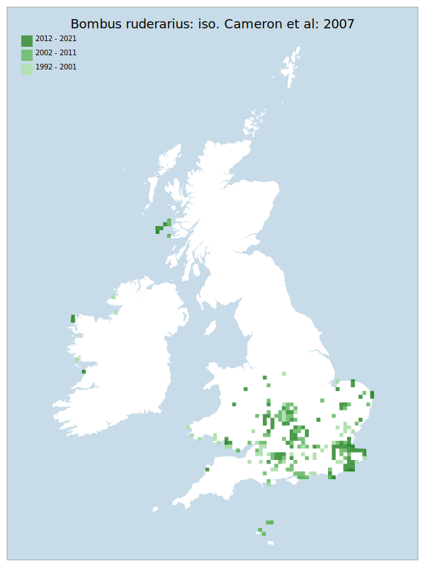

# Bombus ruderarius: iso. Cameron et al: 2007

## Provisional Red List status: VU
- A2 b,c

## Red List Justification
There is a notable lack of data in last 5 year period which cannot be adequately explained. There is always a risk of singular recorders not providing data, stopping recording etc, leading to shortfalls in data. However, a bumblebee experiencing a ~50% decline over a 10 year period is highly unusual. Systematic recording changes could explain this, but there are other warning signs. Two recent books (Bees of Sussex & Bees of Norfolk) note a significant decline in sightings. One potential reason is the loss of edge habitat, but this has not at all been confirmed. Contributing to difficulties is that the taxon is difficult to positively identify.
### Narrative
This is one of four much declined bumblebees of the Thoracobombus sub genus (of which only one is common and widespread), the others being B. muscorum, B. sylvarum and B. humilis. There is a notable lack of data in last 5-year period which cannot be adequately explained (and does not show the same northward or southward contraction indicated for other declined bumblebees). There is always a risk of singular recorders not providing data, stopping recording etc, leading to shortfalls in data. However, a bumblebee experiencing a ~50% decline in records over a 10-year period is highly unusual. In some cases, identification can cause difficulties, but as bumblebees are undoubtedly the best recorded genus of bees the decline is likely to be accurate and the VU assessment warranted.

The most threatening accepted population change estimate is -36.0% (discrete Extent of Occupancy), which exceeds the 30% decline required for qualification as VU under Criterion A. The EoO (224,800 km2) exceeds the 20,000 km2 VU threshold for criterion B1 and does not satisfy sufficient subcriteria to reach a threat status, and the AoO (1,564 km2) exceeds the 2,000 km2 VU threshold for criterion B2 but does not satisfy sufficient subcriteria to reach a threat status. For Criterion D2, the number of locations was greater than 5 and there is no plausible threat that could drive the taxon to CR or RE in a very short time. No information was available on population size to inform assessments against Criteria C and D1; nor were any life-history models available to inform an assessment against Criterion E.
### Quantified Attributes
|Attribute|Result|
|---|---|
|Synanthropy|No|
|Vagrancy|No|
|Colonisation|No|
|Nomenclature|No|

## National Rarity
Nationally Scarce (*NS*)

## National Presence
|Country|Presence
|---|:-:|
|England|Y|
|Scotland|Y|
|Wales|Y|

## Distribution map

## Red List QA Metrics
### Decade
| Slice | # Records | AoO (sq km) | dEoO (sq km) |BU%A |
|---|---|---|---|---|
|1992 - 2001|270|640|134342|83%|
|2002 - 2011|288|648|125322|78%|
|2012 - 2021|208|508|122700|76%|
### 5-year
| Slice | # Records | AoO (sq km) | dEoO (sq km) |BU%A |
|---|---|---|---|---|
|2002 - 2006|155|348|105163|65%|
|2007 - 2011|133|336|102852|64%|
|2012 - 2016|148|376|118869|74%|
|2017 - 2021|60|172|76148|47%|
### Criterion A2 (Statistical)
|Attribute|Assessment|Value|Accepted|Justification
|---|---|---|---|---|
|Raw record count|EN|-59%|No|Notable lack of data in last 5 year period seems excessively high|
|AoO|EN|-54%|No|Notable lack of data in last 5 year period seems excessively high|
|dEoO|VU|-36%|Yes||
|Bayesian|EN|14%|No|Lack of data in final 5 year period suspected to have over-inflated decline amount|
|Bayesian (Expert interpretation)|EN|*N/A*|No|Lack of data in final 5 year period suspected to have over-inflated decline amount|
### Criterion A2 (Expert Inference)
|Attribute|Assessment|Value|Accepted|Justification
|---|---|---|---|---|
|Internal review|VU|Identification confusion observed in dataset, suspected to have inflated values. Notable potential confusion in identification by inexperienced recorders. Bees of Sussex & Bees of Norfolk note a significant decline. Potential reason is the loss of scrub/grassland edge habitat which is used for nesting. Bumblebees in general are not typically low data volume taxa, so the lack of records between 2017 and 2021 is highly unusual.|Yes||
### Criterion A3 (Expert Inference)
|Attribute|Assessment|Value|Accepted|Justification
|---|---|---|---|---|
|Internal review|DD||Yes||
### Criterion B
|Criterion| Value|
|---|---|
|Locations|>10|
|Subcriteria|ii|
|Support||
#### B1
|Attribute|Assessment|Value|Accepted|Justification
|---|---|---|---|---|
|MCP|LC|224800|Yes||
#### B2
|Attribute|Assessment|Value|Accepted|Justification
|---|---|---|---|---|
|Tetrad|LC|1564|Yes||
### Criterion D2
|Attribute|Assessment|Value|Accepted|Justification
|---|---|---|---|---|
|D2|LC|*N/A*|Yes||
### Wider Review
|  |  |
|---|---|
|**Action**|Maintained|
|**Reviewed Status**|VU|
|**Justification**||

## National Rarity QA Metrics
|Attribute|Value|
|---|---|
|Hectads|224|
|Calculated|NF|
|Final|NS|
|Moderation support|The current distribution and maps show many locations plotted which are dubious.|

