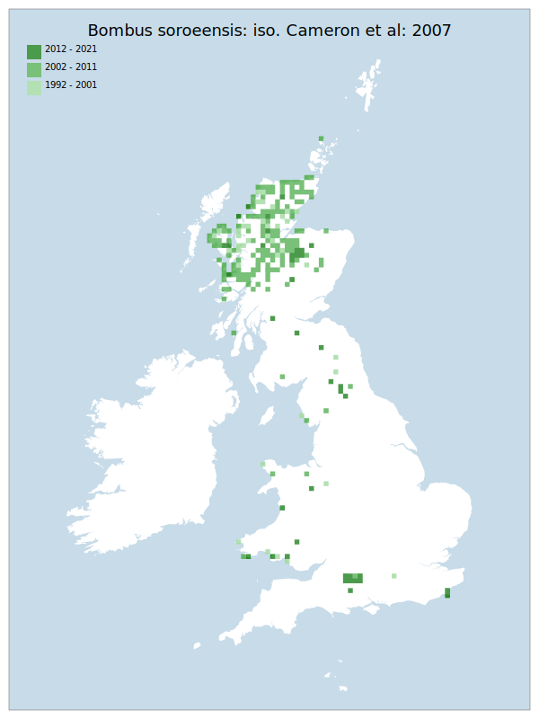

# Bombus soroeensis: iso. Cameron et al: 2007

## Provisional Red List status: LC
- A2 b,c
- A3 b
- D2

## Red List Justification
*N/A*
### Narrative
Although this bumblebee remains reasonably frequent in the Highlands of Scotland, this previously widespread species has become a rare bee in England and Wales. It remains at Salisbury Plain though has decreased and there are only 13 other scattered records for it, with most of those for Wales and northeast England. Much the decline has been historic, but there are also modern declines, with the pattern of decline seemingly continuing.

The most threatening accepted population change estimate is 9.0% (discrete Extent of Occurrence), which does not exceed the 30% decline required for qualification as VU under Criterion A. The EoO (295,550 km2) exceeds the 20,000 km2 VU threshold for criterion B1 and does not satisfy sufficient subcriteria to reach a threat status, and the AoO (1,704 km2) is below the 2,000 km2 VU threshold for criterion B2 but does not satisfy sufficient subcriteria to reach a threat status. For Criterion D2, the number of locations was greater than 5 and there is no plausible threat that could drive the taxon to CR or RE in a very short time. No information was available on population size to inform assessments against Criteria C and D1; nor were any life-history models available to inform an assessment against Criterion E.

This taxon was moderated from LC to NT during peer review, during which there was a majority agreement that the taxon should be given a higher threat status, with multiple correspondents noting that they are personally finding it harder to find recently.
### Quantified Attributes
|Attribute|Result|
|---|---|
|Synanthropy|No|
|Vagrancy|No|
|Colonisation|No|
|Nomenclature|No|

## National Rarity
Nationally Frequent (*NF*)

## National Presence
|Country|Presence
|---|:-:|
|England|Y|
|Scotland|Y|
|Wales|Y|

## Distribution map

## Red List QA Metrics
### Decade
| Slice | # Records | AoO (sq km) | dEoO (sq km) |BU%A |
|---|---|---|---|---|
|1992 - 2001|156|400|138208|66%|
|2002 - 2011|478|1156|163657|78%|
|2012 - 2021|144|292|129762|62%|
### 5-year
| Slice | # Records | AoO (sq km) | dEoO (sq km) |BU%A |
|---|---|---|---|---|
|2002 - 2006|399|1008|145591|69%|
|2007 - 2011|79|208|82266|39%|
|2012 - 2016|52|144|90459|43%|
|2017 - 2021|92|168|98233|46%|
### Criterion A2 (Statistical)
|Attribute|Assessment|Value|Accepted|Justification
|---|---|---|---|---|
|Raw record count|LC|77%|Yes||
|AoO|LC|17%|Yes||
|dEoO|LC|9%|Yes||
|Bayesian|LC|17%|No|Targeted survey effort has entirely distorted the model|
|Bayesian (Expert interpretation)|DD|*N/A*|Yes||
### Criterion A2 (Expert Inference)
|Attribute|Assessment|Value|Accepted|Justification
|---|---|---|---|---|
|Internal review|LC|Significant confusion with Bombus terrestris: iso. Cameron et al: 2007. Requires extensive areas of late flower, e.g. moorland. Potentially under-recorded.|Yes||
### Criterion A3 (Expert Inference)
|Attribute|Assessment|Value|Accepted|Justification
|---|---|---|---|---|
|Internal review|LC||Yes||
### Criterion B
|Criterion| Value|
|---|---|
|Locations|>10|
|Subcriteria||
|Support||
#### B1
|Attribute|Assessment|Value|Accepted|Justification
|---|---|---|---|---|
|MCP|LC|295550|||
#### B2
|Attribute|Assessment|Value|Accepted|Justification
|---|---|---|---|---|
|Tetrad|LC|1704|||
### Criterion D2
|Attribute|Assessment|Value|Accepted|Justification
|---|---|---|---|---|
|D2|LC|*N/A*|Yes||
### Wider Review
|  |  |
|---|---|
|**Action**|Moderated|
|**Reviewed Status**|NT|
|**Justification**|Reviewer consensus|

## National Rarity QA Metrics
|Attribute|Value|
|---|---|
|Hectads|248|
|Calculated|NF|
|Final|NF|
|Moderation support||

