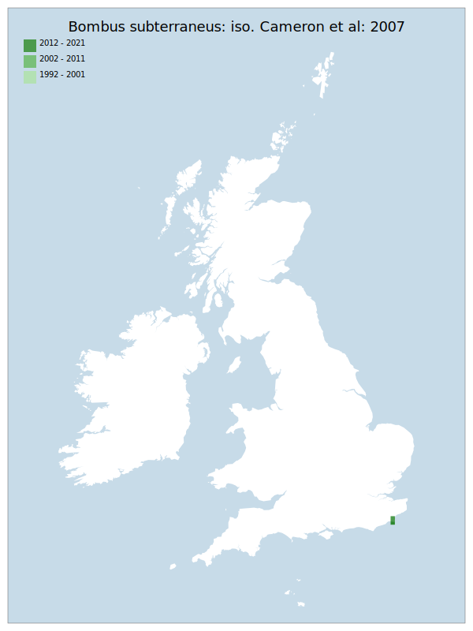

# Bombus subterraneus: iso. Cameron et al: 2007

## Provisional Red List status: RE
- A2 b

## Red List Justification
Previously declared regionally extinct, a reintroduction project was subsequently attempted. This project eventually released a number of queens into Dungeoness, but there is no evidence yet of success.
### Narrative
This species is closely related to B. distinguendus (females are markedly different but males can be challenging to separate) and could be considered a southern counterpart. A species of herb-rich grassland, strongly associated with pre-intensification farming practices, it was historically widespread especially south of the Severn to Wash line. The last confirmed records were from Dungeness in Kent (1988). A reintroduction project released 200 Swedish queens into Dungeness from 2012-16, but there was no evidence of success, despite targeted surveying to the present time (specimens initially identified as workers were later judged to be an atypical form of B. hortorum). It is known to be declining throughout much of Europe and is evaluated as RE for GB.

### Quantified Attributes
|Attribute|Result|
|---|---|
|Synanthropy|Synanthropic Colonist|
|Vagrancy|No|
|Colonisation|Peri-Assessment Colonist|
|Nomenclature|No|

## National Rarity
Nationally Extinct (*EX*)

## National Presence
|Country|Presence
|---|:-:|
|England|Y|
|Scotland|N|
|Wales|N|

## Distribution map

## Red List QA Metrics
### Decade
| Slice | # Records | AoO (sq km) | dEoO (sq km) |BU%A |
|---|---|---|---|---|
|1992 - 2001|0|0|0|0%|
|2002 - 2011|0|0|0|0%|
|2012 - 2021|21|16|7594|100%|
### 5-year
| Slice | # Records | AoO (sq km) | dEoO (sq km) |BU%A |
|---|---|---|---|---|
|2002 - 2006|0|0|0|0%|
|2007 - 2011|0|0|0|0%|
|2012 - 2016|21|16|7594|100%|
|2017 - 2021|0|0|0|0%|
### Criterion A2 (Statistical)
|Attribute|Assessment|Value|Accepted|Justification
|---|---|---|---|---|
|Raw record count|CE|-100%|No|Specific introduction project|
|AoO|CE|-100%|No|Specific introduction project|
|dEoO|CE|-100%|No|Specific introduction project|
|Bayesian|DD|*NaN*%|No|Specific introduction project|
|Bayesian (Expert interpretation)|DD|*N/A*|No||
### Criterion A2 (Expert Inference)
|Attribute|Assessment|Value|Accepted|Justification
|---|---|---|---|---|
|Internal review|RE|Was subject to an attempted reintroduction that failed to take.|Yes||
### Criterion A3 (Expert Inference)
|Attribute|Assessment|Value|Accepted|Justification
|---|---|---|---|---|
|Internal review|DD||No||
### Criterion B
|Criterion| Value|
|---|---|
|Locations|>10|
|Subcriteria||
|Support||
#### B1
|Attribute|Assessment|Value|Accepted|Justification
|---|---|---|---|---|
|MCP|LC|200|No|Specific introduction project|
#### B2
|Attribute|Assessment|Value|Accepted|Justification
|---|---|---|---|---|
|Tetrad|LC|16|No|Specific introduction project|
### Criterion D2
|Attribute|Assessment|Value|Accepted|Justification
|---|---|---|---|---|
|D2|RE|*N/A*|No||
### Wider Review
|  |  |
|---|---|
|**Action**|Maintained|
|**Reviewed Status**|RE|
|**Justification**||

## National Rarity QA Metrics
|Attribute|Value|
|---|---|
|Hectads|2|
|Calculated|NR|
|Final|EX|
|Moderation support||

