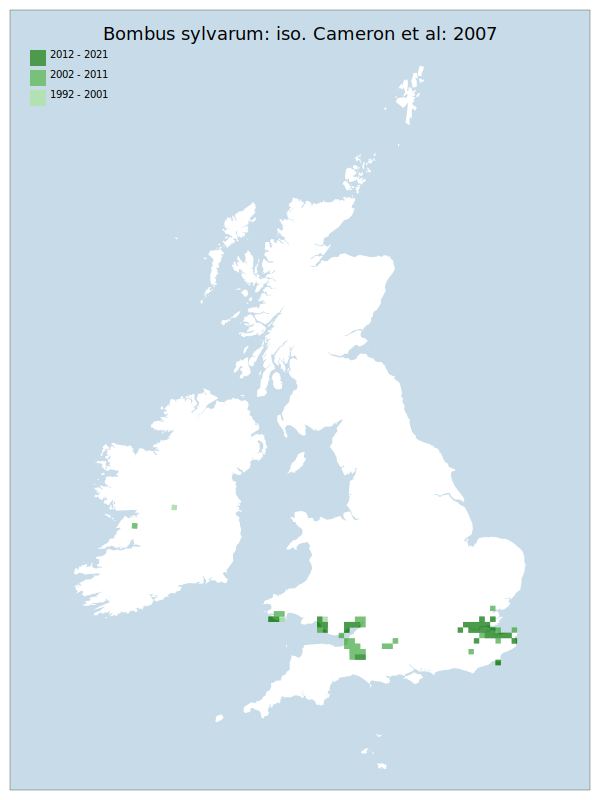

# Bombus sylvarum: iso. Cameron et al: 2007

## Provisional Red List status: VU
- B2 a,b, iii

## Red List Justification
Data from first half of the 10-year period is significantly skewed by a period of high recorder activity.

Continuing development pressure in the Thames corridor is reducing continuity of habitat, and the taxon does not seem to do well in fragmented habitat. Development is considered to have had a overall detrimental effect.

Newport sites are under considerable development pressure, as are numerous other currently occupied brown field sites. Future habitat fragmentation is anticipated, weakening the population's stability.
### Narrative
Although not related to B. distinguendus, the decline of this species – historically widespread throughout GB – is partly similar, at least in terms of the the loss of open, flower-rich habitat, though with a different geographic retraction. There are likely to be other factors in the decline of this species as it has retracted to seven areas in the southeast and southwest of England and South Wales. Continuing development pressure in the Thames corridor is reducing continuity of habitat, and the taxon does not seem to persist in fragmented habitat. Development is considered to have had an overall detrimental effect. Sites in South Wales are under considerable development pressure, as are numerous other currently occupied brown field sites. Future habitat fragmentation is anticipated, weakening the population's stability.

The most threatening accepted population change estimate is -8.0% (Bayesian occupancy), which does not exceed the 30% decline required for qualification as VU under Criterion A. Expert inference assessed this taxon as NT under 10 year decline and future projected decline, predominantly as a result of known development plans and pressures in extant habitat. The EoO (54,950 km2</sup.) exceeds the 20,000 km2</sup. VU threshold for criterion B1 and the AoO (1,020 km2</sup.) is below the 2,000 km2</sup. VU threshold for criterion B2. There are <= 5 locations, and continuing decline observed/projected in area, extent & quality of habitat. For Criterion D2, the number of locations was less than or equal to 5 and there is no plausible threat that could drive the taxon to CR or RE in a very short time. No information was available on population size to inform assessments against Criteria C and D1; nor were any life-history models available to inform an assessment against Criterion E.
### Quantified Attributes
|Attribute|Result|
|---|---|
|Synanthropy|No|
|Vagrancy|No|
|Colonisation|No|
|Nomenclature|No|

## National Rarity
Nationally Scarce (*NS*)

## National Presence
|Country|Presence
|---|:-:|
|England|Y|
|Scotland|N|
|Wales|Y|

## Distribution map

## Red List QA Metrics
### Decade
| Slice | # Records | AoO (sq km) | dEoO (sq km) |BU%A |
|---|---|---|---|---|
|1992 - 2001|279|268|47889|70%|
|2002 - 2011|583|672|59538|87%|
|2012 - 2021|795|512|57430|83%|
### 5-year
| Slice | # Records | AoO (sq km) | dEoO (sq km) |BU%A |
|---|---|---|---|---|
|2002 - 2006|260|392|54055|79%|
|2007 - 2011|323|404|45637|66%|
|2012 - 2016|523|388|43242|63%|
|2017 - 2021|272|248|49931|72%|
### Criterion A2 (Statistical)
|Attribute|Assessment|Value|Accepted|Justification
|---|---|---|---|---|
|Raw record count|VU|-48%|No|Data from first half significantly skewed by a period of high recorder activity|
|AoO|VU|-36%|No|Data from first half significantly skewed by a period of high recorder activity|
|dEoO|LC|15%|No|Data from first half significantly skewed by a period of high recorder activity|
|Bayesian|LC|4%|Yes||
|Bayesian (Expert interpretation)|LC|*N/A*|Yes||
### Criterion A2 (Expert Inference)
|Attribute|Assessment|Value|Accepted|Justification
|---|---|---|---|---|
|Internal review|NT|Continuing development pressure in the Thames corridor is reducing continuity of habitat, and the taxon does not seem to do well in fragmented habitat. Development is considered to have had a overall detrimental effect.|Yes||
### Criterion A3 (Expert Inference)
|Attribute|Assessment|Value|Accepted|Justification
|---|---|---|---|---|
|Internal review|NT|Newport sites are under considerable development pressure, as are numerous other currently occupied brown field sites. Future habitat fragmentation is anticipated.|Yes||
### Criterion B
|Criterion| Value|
|---|---|
|Locations|<=5|
|Subcriteria|iii|
|Support||
#### B1
|Attribute|Assessment|Value|Accepted|Justification
|---|---|---|---|---|
|MCP|LC|54950|Yes||
#### B2
|Attribute|Assessment|Value|Accepted|Justification
|---|---|---|---|---|
|Tetrad|VU|1020|Yes||
### Criterion D2
|Attribute|Assessment|Value|Accepted|Justification
|---|---|---|---|---|
|D2|LC|*N/A*|Yes||
### Wider Review
|  |  |
|---|---|
|**Action**|Maintained|
|**Reviewed Status**|VU|
|**Justification**||

## National Rarity QA Metrics
|Attribute|Value|
|---|---|
|Hectads|74|
|Calculated|NS|
|Final|NS|
|Moderation support||

