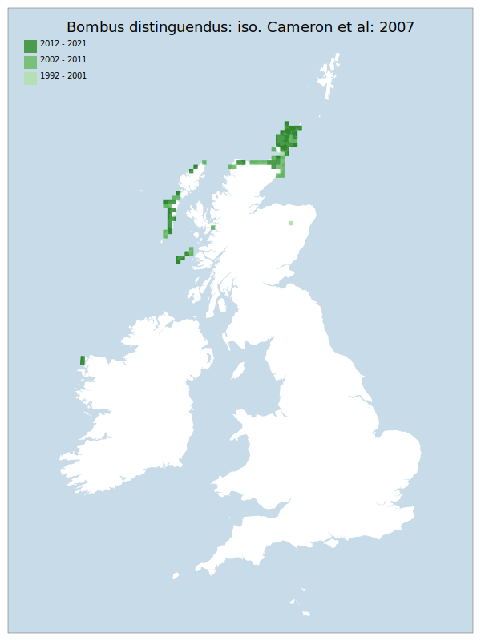

# Bombus distinguendus: iso. Cameron et al: 2007

## Provisional Red List status: VU
- B2 a,b, iii

## Red List Justification
The majority of habitat is at current sea level. Rises to high water marks will destroy significant amounts of this habitat. If this destruction happens as part of a major event, this taxon has limited ability to adapt or recolonise at many sites.
### Quantified Attributes
|Attribute|Result|
|---|---|
|Synanthropy|No|
|Vagrancy|No|
|Colonisation|No|
|Nomenclature|No|

## National Rarity
Nationally Scarce (*NS*)

## National Presence
|Country|Presence
|---|:-:|
|England|N|
|Scotland|Y|
|Wales|N|

## Distribution map

## Red List QA Metrics
### Decade
| Slice | # Records | AoO (sq km) | dEoO (sq km) |BU%A |
|---|---|---|---|---|
|1992 - 2001|284|464|57373|71%|
|2002 - 2011|607|912|72800|90%|
|2012 - 2021|309|516|60893|75%|
### 5-year
| Slice | # Records | AoO (sq km) | dEoO (sq km) |BU%A |
|---|---|---|---|---|
|2002 - 2006|198|368|64261|80%|
|2007 - 2011|409|736|65692|81%|
|2012 - 2016|177|320|46715|58%|
|2017 - 2021|132|312|52343|65%|
### Criterion A2 (Statistical)
|Attribute|Assessment|Value|Accepted|Justification
|---|---|---|---|---|
|Raw record count|LC|-25%|Yes||
|AoO|LC|-3%|Yes||
|dEoO|LC|12%|Yes||
|Bayesian|LC|4%|Yes||
|Bayesian (Expert interpretation)|LC|*N/A*|Yes||
### Criterion A2 (Expert Inference)
|Attribute|Assessment|Value|Accepted|Justification
|---|---|---|---|---|
|Internal review|LC|Population/distribution is stable|Yes||
### Criterion A3 (Expert Inference)
|Attribute|Assessment|Value|Accepted|Justification
|---|---|---|---|---|
|Internal review|NT|Majority of habitat is at current sea level. Rises to high water marks will destroy significant amounts of this habitat.|Yes||
### Criterion B
|Criterion| Value|
|---|---|
|Locations|<=5|
|Subcriteria|iii|
|Support||
#### B1
|Attribute|Assessment|Value|Accepted|Justification
|---|---|---|---|---|
|MCP|LC|69700|Yes||
#### B2
|Attribute|Assessment|Value|Accepted|Justification
|---|---|---|---|---|
|Tetrad|VU|1356|Yes||
### Criterion D2
|Attribute|Assessment|Value|Accepted|Justification
|---|---|---|---|---|
|D2|LC|*N/A*|Yes||
### Wider Review
|  |  |
|---|---|
|**Action**|Maintained|
|**Reviewed Status**|VU|
|**Justification**||

## National Rarity QA Metrics
|Attribute|Value|
|---|---|
|Hectads|84|
|Calculated|NS|
|Final|NS|
|Moderation support||

