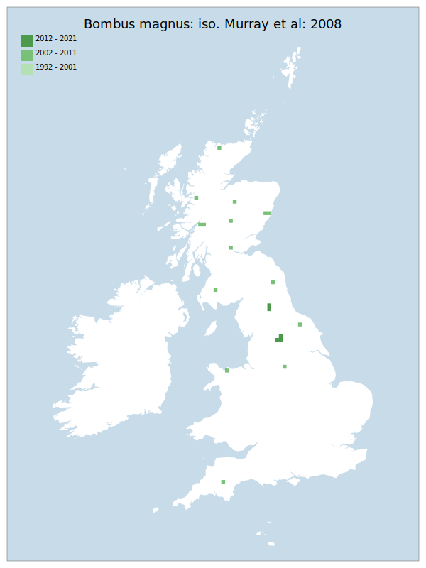

# Bombus magnus: iso. Murray et al: 2008

## Provisional Red List status: DD
- A2 b
- A3 b
- D2

## Red List Justification
*N/A*
### Quantified Attributes
|Attribute|Result|
|---|---|
|Synanthropy|No|
|Vagrancy|No|
|Colonisation|No|
|Nomenclature|Early-assessment change|

## National Rarity
Insufficient Data (*ID*)

## National Presence
|Country|Presence
|---|:-:|
|England|Y|
|Scotland|Y|
|Wales|Y|

## Distribution map

## Red List QA Metrics
### Decade
| Slice | # Records | AoO (sq km) | dEoO (sq km) |BU%A |
|---|---|---|---|---|
|1992 - 2001|0|0|0|0%|
|2002 - 2011|15|60|83710|88%|
|2012 - 2021|7|28|15327|16%|
### 5-year
| Slice | # Records | AoO (sq km) | dEoO (sq km) |BU%A |
|---|---|---|---|---|
|2002 - 2006|0|0|0|0%|
|2007 - 2011|15|60|83710|88%|
|2012 - 2016|0|0|0|0%|
|2017 - 2021|7|28|15327|16%|
### Criterion A2 (Statistical)
|Attribute|Assessment|Value|Accepted|Justification
|---|---|---|---|---|
|Raw record count|LC|?%|No|Low data|
|AoO|LC|?%|No|Low data|
|dEoO|LC|?%|No|Low data|
|Bayesian|DD|*NaN*%|Yes||
|Bayesian (Expert interpretation)|DD|*N/A*|Yes||
### Criterion A2 (Expert Inference)
|Attribute|Assessment|Value|Accepted|Justification
|---|---|---|---|---|
|Internal review|DD|Subject of a fairly recent split, which so far can only be reliably determined across the range by genetic or chemical analysis.|Yes||
### Criterion A3 (Expert Inference)
|Attribute|Assessment|Value|Accepted|Justification
|---|---|---|---|---|
|Internal review|DD||Yes||
### Criterion B
|Criterion| Value|
|---|---|
|Locations|>10|
|Subcriteria||
|Support||
#### B1
|Attribute|Assessment|Value|Accepted|Justification
|---|---|---|---|---|
|MCP|LC|142150|No|Low data|
#### B2
|Attribute|Assessment|Value|Accepted|Justification
|---|---|---|---|---|
|Tetrad|LC|88|No|Low data|
### Criterion D2
|Attribute|Assessment|Value|Accepted|Justification
|---|---|---|---|---|
|D2|DD|*N/A*|Yes||
### Wider Review
|  |  |
|---|---|
|**Action**|Maintained|
|**Reviewed Status**|DD|
|**Justification**|Preliminary research suggests that this species is still very difficult to separate from the B. lucorum/cryptarum/magnus complex. We still lack enough data to be able to arrive at a substantiated status.|

## National Rarity QA Metrics
|Attribute|Value|
|---|---|
|Hectads|20|
|Calculated|NS|
|Final|ID|
|Moderation support|Subject of a fairly recent split, which so far can only be reliably determined across the range by genetic or chemical analysis.|

