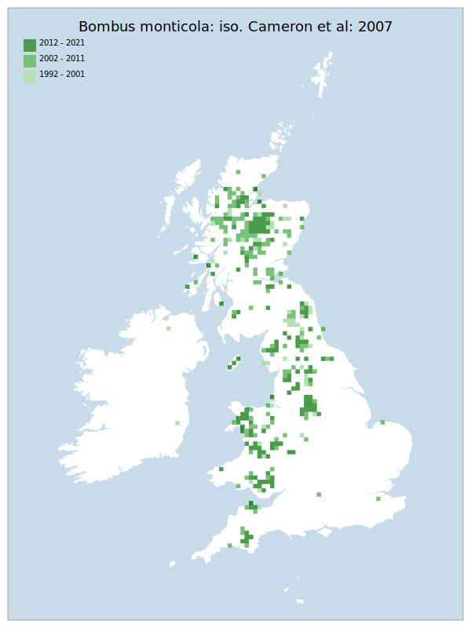

# Bombus monticola: iso. Cameron et al: 2007

## Provisional Red List status: NT
- A3 b
c

## Red List Justification
Restricted to highlands (~ >400m height). Climate change is anticipated to have a negative effect on significant amounts of habitat, with no opportunity for recovery elsewhere
### Quantified Attributes
|Attribute|Result|
|---|---|
|Synanthropy|No|
|Vagrancy|No|
|Colonisation|No|
|Nomenclature|No|

## National Rarity
Nationally Frequent (*NF*)

## National Presence
|Country|Presence
|---|:-:|
|England|Y|
|Scotland|Y|
|Wales|Y|

## Distribution map

## Red List QA Metrics
### Decade
| Slice | # Records | AoO (sq km) | dEoO (sq km) |BU%A |
|---|---|---|---|---|
|1992 - 2001|344|924|160994|66%|
|2002 - 2011|741|1588|222910|91%|
|2012 - 2021|483|1144|187047|76%|
### 5-year
| Slice | # Records | AoO (sq km) | dEoO (sq km) |BU%A |
|---|---|---|---|---|
|2002 - 2006|476|884|187162|76%|
|2007 - 2011|265|836|178121|73%|
|2012 - 2016|265|644|149791|61%|
|2017 - 2021|218|596|161611|66%|
### Criterion A2 (Statistical)
|Attribute|Assessment|Value|Accepted|Justification
|---|---|---|---|---|
|Raw record count|LC|-18%|Yes||
|AoO|LC|-7%|Yes||
|dEoO|LC|8%|Yes||
|Bayesian|LC|16%|Yes||
|Bayesian (Expert interpretation)|LC|*N/A*|Yes||
### Criterion A2 (Expert Inference)
|Attribute|Assessment|Value|Accepted|Justification
|---|---|---|---|---|
|Internal review|LC||Yes||
### Criterion A3 (Expert Inference)
|Attribute|Assessment|Value|Accepted|Justification
|---|---|---|---|---|
|Internal review|NT|Restricted to highlands (~ >400m height). Climate change is anticipated to have a negative effect on significant amounts of habitat, with no opportunity for recovery elsewhere|Yes||
### Criterion B
|Criterion| Value|
|---|---|
|Locations|>10|
|Subcriteria||
|Support||
#### B1
|Attribute|Assessment|Value|Accepted|Justification
|---|---|---|---|---|
|MCP|LC|273650|Yes||
#### B2
|Attribute|Assessment|Value|Accepted|Justification
|---|---|---|---|---|
|Tetrad|LC|3152|Yes||
### Criterion D2
|Attribute|Assessment|Value|Accepted|Justification
|---|---|---|---|---|
|D2|LC|*N/A*|Yes||
### Wider Review
|  |  |
|---|---|
|**Action**|Maintained|
|**Reviewed Status**|NT|
|**Justification**||

## National Rarity QA Metrics
|Attribute|Value|
|---|---|
|Hectads|387|
|Calculated|NF|
|Final|NF|
|Moderation support||

