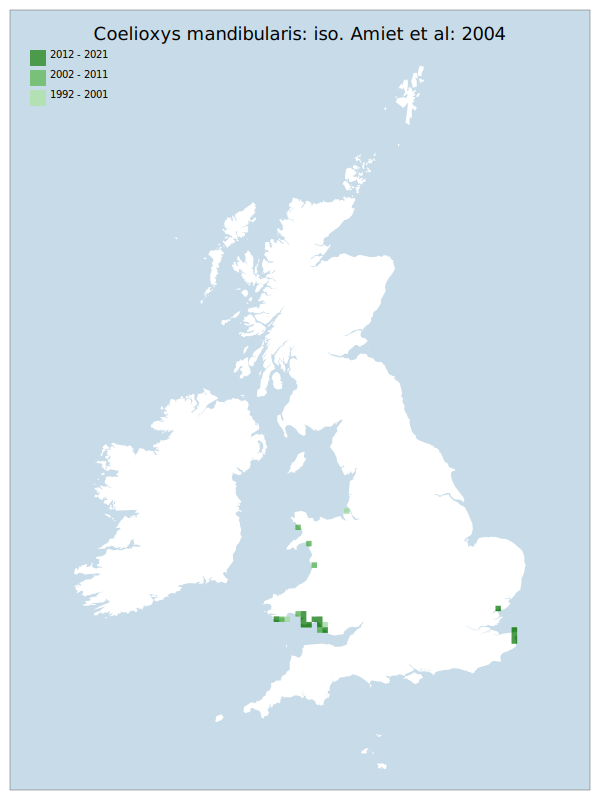

# Coelioxys mandibularis: iso. Amiet et al: 2004

## Provisional Red List status: EN
- B2ab(iii)

## Red List Justification
The majority of the population exists in a narrow strip of dune, which is at risk of damage during storm events.

### Narrative
This solitary bee – parasitic on Megachile species – is restricted to the coast of Wales and southeast of England (where it is rare). Most of the population exists along relatively narrow strips of the fore dune zone on the west coast, which is at particular risk of damage during storm events.

"Insufficient data exists to arrive at a statistical result under Criterion A. Expert inference places the taxon at LC under criterion A. The EoO (69,350 km²) exceeds the 20,000 km² VU threshold for criterion B1 and does not satisfy sufficient subcriteria to reach a threat status, and the AoO (172 km²) is below the 500 km² EN threshold for criterion B2. There are assessed to be fewer or equal to 5 locations (EN) and there is continuing decline observed & projected to the area/extent/quality of habitat. The end result is an assessment of EN under B. For Criterion D2, the number of locations are <= 5 but there is no plausible threat that could drive the taxon to CR or RE in a very short time. No information was available on population size to inform assessments against Criteria C and D1; nor were any life-history models available to inform an assessment against Criterion E.

During peer review, this taxon was moderated from EN to VU upon direct feedback from modern surveying of the know sites. This feedback specifically mentions an expansion of the known habitat which relaxes the pressure enough to move the number of sites from <= 5 to <=10 (VU)."

### Quantified Attributes
|Attribute|Result|
|---|---|
|Synanthropy|No|
|Vagrancy|No|
|Colonisation|No|
|Nomenclature|No|

## National Rarity
Nationally Scarce (*NS*)

## National Presence
|Country|Presence
|---|:-:|
|England|Y|
|Scotland|N|
|Wales|Y|

## Distribution map

## Red List QA Metrics
### Decade
| Slice | # Records | AoO (sq km) | dEoO (sq km) |BU%A |
|---|---|---|---|---|
|1992 - 2001|45|92|36215|72%|
|2002 - 2011|36|88|38142|76%|
|2012 - 2021|46|92|29466|58%|

### 5-year
| Slice | # Records | AoO (sq km) | dEoO (sq km) |BU%A |
|---|---|---|---|---|
|2002 - 2006|20|48|25937|51%|
|2007 - 2011|16|52|32926|65%|
|2012 - 2016|29|64|23631|47%|
|2017 - 2021|17|32|22815|45%|

### Criterion A2 (Statistical)
|Attribute|Assessment|Value|Accepted|Justification
|---|---|---|---|---|
|Raw record count|VU|-41%|No|Insufficient data|
|AoO|EN|-50%|No|Insufficient data|
|dEoO|LC|-3%|No|Insufficient data|
|Bayesian|LC|2%|No|Insufficient data|
|Bayesian (Expert interpretation)|DD|*N/A*|Yes||

### Criterion A2 (Expert Inference)
|Attribute|Assessment|Value|Accepted|Justification
|---|---|---|---|---|
|Internal review|DD||Yes||

### Criterion A3 (Expert Inference)
|Attribute|Assessment|Value|Accepted|Justification
|---|---|---|---|---|
|Internal review|DD||Yes||

### Criterion B
|Criterion| Value|
|---|---|
|Locations|<=5|
|Subcriteria|iii|
|Support|Majority of population exists in a narrow strip of dune, which is at risk of damage during storm events.|

#### B1
|Attribute|Assessment|Value|Accepted|Justification
|---|---|---|---|---|
|MCP|LC|69350|Yes||

#### B2
|Attribute|Assessment|Value|Accepted|Justification
|---|---|---|---|---|
|Tetrad|EN|172|Yes||

### Criterion D2
|Attribute|Assessment|Value|Accepted|Justification
|---|---|---|---|---|
|D2|LC|*N/A*|Yes||

### Wider Review
|  |  |
|---|---|
|**Action**|Moderated|
|**Reviewed Status**|VU|
|**Justification**|Wider review panel has demonstrated evidence of presence in other dune systems.|

## National Rarity QA Metrics
|Attribute|Value|
|---|---|
|Hectads|23|
|Calculated|NS|
|Final|NS|
|Moderation support||
