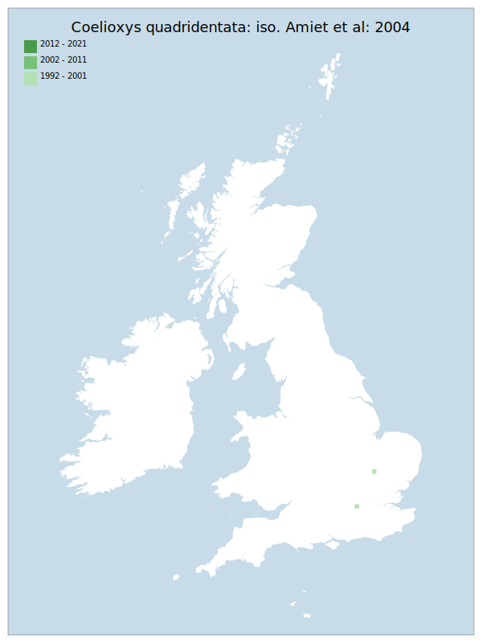

# Coelioxys quadridentata: iso. Amiet et al: 2004

## Provisional Red List status: DD
- A2bc
- A3b
- D2

## Red List Justification
*N/A*

### Narrative
The significant decline in distribution of this parasitic bee (over the last 100 years) is noted and agreed with. However, the Red List does not provide the ability to assess this taxon as such. The species is now so rare that it is difficult to obtain data to statistically justify any trend under the Red List criteria. There is also the potential for significant misidentification in older data, with many keys of that era containing significant errors.

Insufficient data were available to reach a supportable conclusion on the threat status for this taxon.

### Quantified Attributes
|Attribute|Result|
|---|---|
|Synanthropy|No|
|Vagrancy|No|
|Colonisation|No|
|Nomenclature|No|

## National Rarity
Insufficient Data (*ID*)

## National Presence
|Country|Presence
|---|:-:|
|England|Y|
|Scotland|N|
|Wales|N|

## Distribution map

## Red List QA Metrics
### Decade
| Slice | # Records | AoO (sq km) | dEoO (sq km) |BU%A |
|---|---|---|---|---|
|1992 - 2001|2|8|13331|100%|
|2002 - 2011|0|0|0|0%|
|2012 - 2021|0|0|0|0%|

### 5-year
| Slice | # Records | AoO (sq km) | dEoO (sq km) |BU%A |
|---|---|---|---|---|
|2002 - 2006|0|0|0|0%|
|2007 - 2011|0|0|0|0%|
|2012 - 2016|0|0|0|0%|
|2017 - 2021|0|0|0|0%|

### Criterion A2 (Statistical)
|Attribute|Assessment|Value|Accepted|Justification
|---|---|---|---|---|
|Raw record count|LC|?%|No|Insufficient data|
|AoO|LC|?%|No|Insufficient data|
|dEoO|LC|?%|No|Insufficient data|
|Bayesian|DD|*NaN*%|Yes||
|Bayesian (Expert interpretation)|DD|*N/A*|Yes||

### Criterion A2 (Expert Inference)
|Attribute|Assessment|Value|Accepted|Justification
|---|---|---|---|---|
|Internal review|DD||Yes||

### Criterion A3 (Expert Inference)
|Attribute|Assessment|Value|Accepted|Justification
|---|---|---|---|---|
|Internal review|DD||Yes||

### Criterion B
|Criterion| Value|
|---|---|
|Locations|>10|
|Subcriteria||
|Support||

#### B1
|Attribute|Assessment|Value|Accepted|Justification
|---|---|---|---|---|
|MCP|LC|1300|No|Insufficient data|

#### B2
|Attribute|Assessment|Value|Accepted|Justification
|---|---|---|---|---|
|Tetrad|LC|8|No|Insufficient data|

### Criterion D2
|Attribute|Assessment|Value|Accepted|Justification
|---|---|---|---|---|
|D2|DD|*N/A*|Yes||

### Wider Review
|  |  |
|---|---|
|**Action**|Maintained|
|**Reviewed Status**|DD|
|**Justification**|Significant decline over 100+ years noted and agreed with, but the Red List does not provide the ability to assess this taxon as such. This is something which is now so rare that it is difficult to obtain data to statistically justify any trend under the Red List criteria. There is also the potential for significant misidentification in older data, with many keys of that era containing significant errors.|

## National Rarity QA Metrics
|Attribute|Value|
|---|---|
|Hectads|2|
|Calculated|NR|
|Final|ID|
|Moderation support||
