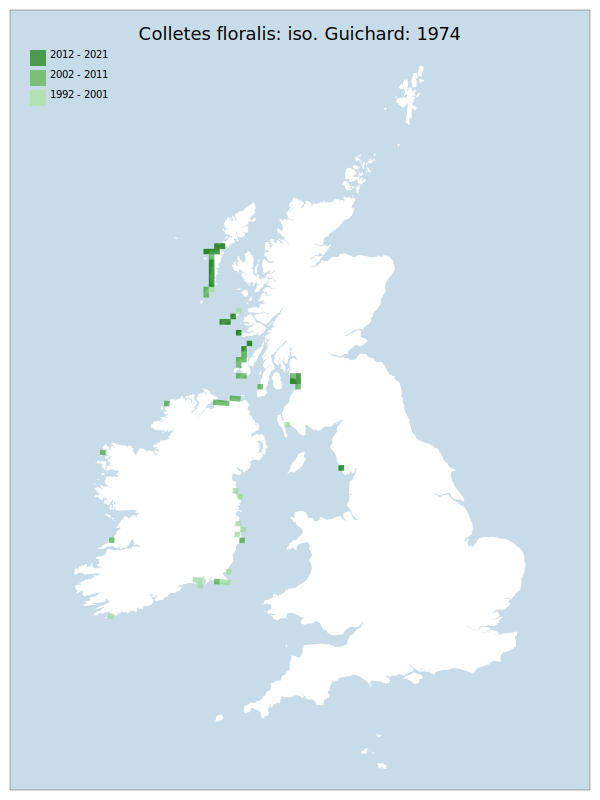

# Colletes floralis: iso. Guichard: 1974

## Provisional Red List status: VU
- B2 a,b, i
ii
iii
iv
v

## Red List Justification
Occupying all available habitat. Most sea-level dune systems used are vulnerable to a single Atlantic storm system. Climate change predictions tend to predict a higher intensity and frequency of Atlantic storm systems. These storms have significant potential to cause substantial damage to the existing population and available habitat.

Also a boreal taxon, which may respond negatively to climate change.
### Narrative
This distinctly northern solitary bee only has modern GB records for Cumbria (where it haslways been very rare) and the west coast of Scotland (especially on the islands). The associated habitats are coastal sand dunes and, in the Western Isles, the machair (a maritime grassland typical of the Hebrides, comprising a rich flowering sward established on wind-blown shell sand). Most sea-level dune systems used are vulnerable to a single Atlantic storm system. Climate change predictions tend towards a higher intensity and frequency of Atlantic storm systems. These storms have significant potential to cause substantial damage to the existing population and available habitat. This taxon is montane in southern areas of Europe and may respond negatively to climate change.

No statistical assessment was possible under Criterion A due insufficient data. Expert inference assessed this taxon as NT under future threat on the basis of vulnerability to a single Atlantic storm system, combined with significant potential for a negative response to a warming climate. The EoO (36,350 km²) exceeds the 20,000 km² VU threshold for criterion B1 and the AoO (340 km²) is below the 500 km² EN threshold for criterion B2. There are fewer or equal to 10 locations, and continuing/projected decline in extent of occurrence, area of occupancy, number of locations/subpopulations, number of individuals, and area,extent & quality of habitat. For Criterion D2, the number of locations was greater than 5, and there is a plausible threat of rapid habitat loss that could drive the taxon to CR or RE in a very short time. No information was available on population size to inform assessments against Criteria C and D1; nor were any life-history models available to inform an assessment against Criterion E.
### Quantified Attributes
|Attribute|Result|
|---|---|
|Synanthropy|No|
|Vagrancy|No|
|Colonisation|No|
|Nomenclature|No|

## National Rarity
Nationally Scarce (*NS*)

## National Presence
|Country|Presence
|---|:-:|
|England|Y|
|Scotland|Y|
|Wales|N|

## Distribution map

## Red List QA Metrics
### Decade
| Slice | # Records | AoO (sq km) | dEoO (sq km) |BU%A |
|---|---|---|---|---|
|1992 - 2001|46|96|41208|69%|
|2002 - 2011|214|212|50755|85%|
|2012 - 2021|63|148|43460|72%|
### 5-year
| Slice | # Records | AoO (sq km) | dEoO (sq km) |BU%A |
|---|---|---|---|---|
|2002 - 2006|65|132|41115|68%|
|2007 - 2011|149|128|39652|66%|
|2012 - 2016|51|120|39869|66%|
|2017 - 2021|12|36|18288|30%|
### Criterion A2 (Statistical)
|Attribute|Assessment|Value|Accepted|Justification
|---|---|---|---|---|
|Raw record count|EN|-76%|No|Low sampling effort considered reason for change|
|AoO|EN|-70%|No|Low sampling effort considered reason for change|
|dEoO|EN|-54%|No|Low sampling effort considered reason for change|
|Bayesian|LC|2%|No||
|Bayesian (Expert interpretation)|DD|*N/A*|Yes||
### Criterion A2 (Expert Inference)
|Attribute|Assessment|Value|Accepted|Justification
|---|---|---|---|---|
|Internal review|LC||Yes||
### Criterion A3 (Expert Inference)
|Attribute|Assessment|Value|Accepted|Justification
|---|---|---|---|---|
|Internal review|NT|Occupying all available habitat. Most sea-level dune systems used are vulnerable to a single Atlantic storm system. Climate change predictions tend to predict a higher intensity and frequency of Atlantic storm systems. These storms have significant potential to cause substantial damage to the existing population and available habitat.

Also a boreal taxon, which may respond negatively to climate change.|Yes||
### Criterion B
|Criterion| Value|
|---|---|
|Locations|<=10|
|Subcriteria|i, ii, iii, iv, v|
|Support|Occupying all available habitat. Most sea-level dune systems used are vulnerable to a single Atlantic storm system. Climate change predictions tend to predict a higher intensity and frequency of Atlantic storm systems. These storms have significant potential to cause substantial damage to the existing population and available habitat.|
#### B1
|Attribute|Assessment|Value|Accepted|Justification
|---|---|---|---|---|
|MCP|LC|36350|Yes||
#### B2
|Attribute|Assessment|Value|Accepted|Justification
|---|---|---|---|---|
|Tetrad|VU|340|Yes||
### Criterion D2
|Attribute|Assessment|Value|Accepted|Justification
|---|---|---|---|---|
|D2|LC|*N/A*|Yes||
### Wider Review
|  |  |
|---|---|
|**Action**|Maintained|
|**Reviewed Status**|VU|
|**Justification**||

## National Rarity QA Metrics
|Attribute|Value|
|---|---|
|Hectads|36|
|Calculated|NS|
|Final|NS|
|Moderation support||

