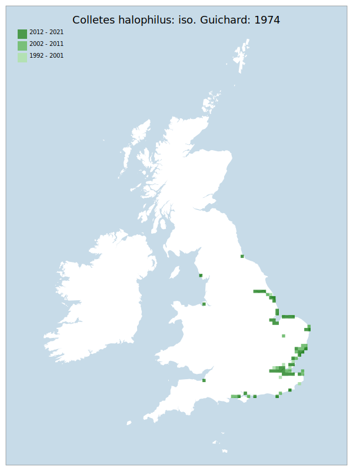

# Colletes halophilus: iso. Guichard: 1974

## Provisional Red List status: NT
- A3 c

## Red List Justification
All sites live at sea level, with minimal ability to rapidly adapt. Magnitude of impact will depend on the sea level mitigation measures, particularly in managed retreats of sea wall defences.
### Narrative
This is a coastal bee (associated strongly with Aster tripolium) with almost the entirety of records historically for the east coast (Humber) to Hampshire. Despite a very recent range expansion to Avon, Cheshire (Wirral) and South Cumbria, all sites are at sea level, with minimal ability to rapidly adapt with sea level rise and storm events. The magnitude of impact will depend on the sea level mitigation measures, particularly in managed retreats of sea wall defences, though the UK nonetheless holds most of the European population of this species.

The most threatening accepted population change estimate is 12.0% (Bayesian occupancy model), which does not exceed the 30% decline required for qualification as VU under Criterion A. Expert inference assessed this taxon at NT, on the combined basis of the future threat of sea level change and the fact that the assessment area contains the majority of the European population of this taxon. The EoO (77,600 km2) exceeds the 20,000 km2 VU threshold for criterion B1 and does not satisfy sufficient subcriteria to reach a threat status, and the AoO (648 km2) is below the 2,000 km2 VU threshold for criterion B2. and does not satisfy sufficient subcriteria to reach a threat status. For Criterion D2, the number of locations was greater than 5 and there is no plausible threat that could drive the taxon to CR or RE in a very short time. No information was available on population size to inform assessments against Criteria C and D1; nor were any life-history models available to inform an assessment against Criterion E.
### Quantified Attributes
|Attribute|Result|
|---|---|
|Synanthropy|No|
|Vagrancy|No|
|Colonisation|No|
|Nomenclature|No|

## National Rarity
Nationally Scarce (*NS*)

## National Presence
|Country|Presence
|---|:-:|
|England|Y|
|Scotland|N|
|Wales|N|

## Distribution map

## Red List QA Metrics
### Decade
| Slice | # Records | AoO (sq km) | dEoO (sq km) |BU%A |
|---|---|---|---|---|
|1992 - 2001|60|124|54913|65%|
|2002 - 2011|160|344|68854|82%|
|2012 - 2021|143|320|76781|91%|
### 5-year
| Slice | # Records | AoO (sq km) | dEoO (sq km) |BU%A |
|---|---|---|---|---|
|2002 - 2006|59|124|52173|62%|
|2007 - 2011|101|244|64226|76%|
|2012 - 2016|56|144|52763|63%|
|2017 - 2021|87|216|70227|83%|
### Criterion A2 (Statistical)
|Attribute|Assessment|Value|Accepted|Justification
|---|---|---|---|---|
|Raw record count|LC|55%|Yes||
|AoO|LC|50%|Yes||
|dEoO|LC|33%|Yes||
|Bayesian|LC|5%|Yes||
|Bayesian (Expert interpretation)|LC|*N/A*|Yes||
### Criterion A2 (Expert Inference)
|Attribute|Assessment|Value|Accepted|Justification
|---|---|---|---|---|
|Internal review|LC||Yes||
### Criterion A3 (Expert Inference)
|Attribute|Assessment|Value|Accepted|Justification
|---|---|---|---|---|
|Internal review|NT|All sites live at sea level, with minimal ability to rapidly adapt. Magnitude of impact will depend on the mitigation measures.|Yes||
### Criterion B
|Criterion| Value|
|---|---|
|Locations|>10|
|Subcriteria|i, ii, iv, iii, v|
|Support|All sites live at sea level, with minimal ability to rapidly adapt|
#### B1
|Attribute|Assessment|Value|Accepted|Justification
|---|---|---|---|---|
|MCP|LC|77600|Yes||
#### B2
|Attribute|Assessment|Value|Accepted|Justification
|---|---|---|---|---|
|Tetrad|LC|648|Yes||
### Criterion D2
|Attribute|Assessment|Value|Accepted|Justification
|---|---|---|---|---|
|D2|LC|*N/A*|Yes||
### Wider Review
|  |  |
|---|---|
|**Action**|Maintained|
|**Reviewed Status**|NT|
|**Justification**|Reviewers match the A2 Expert Inference of LC, but the status of NT is based on the status of the saltmarsh habitat and coastal squeeze over a 100 year period. This aspect is picked up by one reviewer, who wishes to elevate the status based on this fact. As a compromise, the status of NT has been maintained.|

## National Rarity QA Metrics
|Attribute|Value|
|---|---|
|Hectads|79|
|Calculated|NS|
|Final|NS|
|Moderation support||

