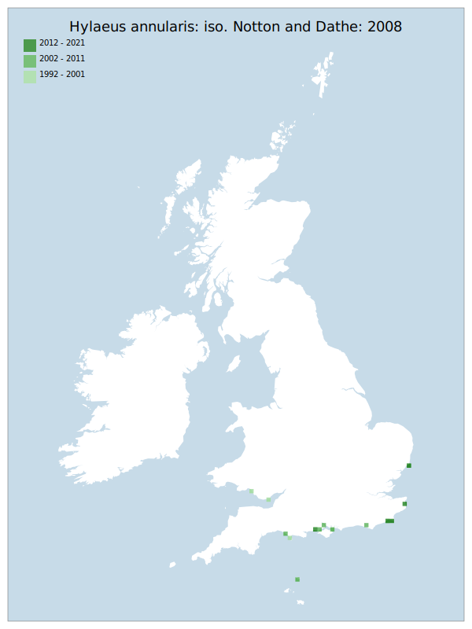

# Hylaeus annularis: iso. Notton and Dathe: 2008

## Provisional Red List status: VU
- B2 a,b, iii
ii
i

## Red List Justification
*N/A*
### Narrative
This genus of small solitary bees are usually stem nesters, though H. annularis has also been reported as nesting in the ground. A species confined to coastal dunes and shingle, modern records extend along the English coast from East Anglia to Dorset, with modern records for South Wales. Inland records are very old – the species has had a complex peri-assessment nomenclatural change so old records may be suspect.

Insufficient data were available to assess this taxon under Criterion A. The EoO (44,600 km²) exceeds the 20,000 km² VU threshold for criterion B1 and does not satisfy sufficient subcriteria to reach a threat status. The AoO (68 km²) is below the 500 km² EN threshold for criterion B2 but the number of locations is fewer than or equal to 10, which only satisfies the criteria for VU. Sufficient subcriteria for B2 were satisfied (continuing decline to: area of occupancy, extent of occupancy, area, extent and/or quality of habitat) to complete the assessment of this taxon as VU under B2 . For Criterion D2, the number of locations was greater than 5 and there is no plausible threat that could drive the taxon to CR or RE in a very short time. No information was available on population size to inform assessments against Criteria C and D1; nor were any life-history models available to inform an assessment against Criterion E.
### Quantified Attributes
|Attribute|Result|
|---|---|
|Synanthropy|No|
|Vagrancy|No|
|Colonisation|No|
|Nomenclature|Early-assessment change|

## National Rarity
Insufficient Data (*ID*)

## National Presence
|Country|Presence
|---|:-:|
|England|Y|
|Scotland|N|
|Wales|Y|

## Distribution map

## Red List QA Metrics
### Decade
| Slice | # Records | AoO (sq km) | dEoO (sq km) |BU%A |
|---|---|---|---|---|
|1992 - 2001|11|24|26235|51%|
|2002 - 2011|13|36|27374|53%|
|2012 - 2021|7|20|25385|49%|
### 5-year
| Slice | # Records | AoO (sq km) | dEoO (sq km) |BU%A |
|---|---|---|---|---|
|2002 - 2006|0|0|0|0%|
|2007 - 2011|13|36|27374|53%|
|2012 - 2016|3|12|20082|39%|
|2017 - 2021|4|8|11102|21%|
### Criterion A2 (Statistical)
|Attribute|Assessment|Value|Accepted|Justification
|---|---|---|---|---|
|Raw record count|LC|33%|No|Insufficient data|
|AoO|VU|-33%|No|Insufficient data|
|dEoO|VU|-45%|No|Insufficient data|
|Bayesian|DD|*NaN*%|Yes||
|Bayesian (Expert interpretation)|DD|*N/A*|Yes||
### Criterion A2 (Expert Inference)
|Attribute|Assessment|Value|Accepted|Justification
|---|---|---|---|---|
|Internal review|DD|Very little data as a result of complex nomenclatural change|Yes||
### Criterion A3 (Expert Inference)
|Attribute|Assessment|Value|Accepted|Justification
|---|---|---|---|---|
|Internal review|DD||Yes||
### Criterion B
|Criterion| Value|
|---|---|
|Locations|<=10|
|Subcriteria|iii, ii, i|
|Support|Vulnerable to storm damage, coastal development and coastal engineering.|
#### B1
|Attribute|Assessment|Value|Accepted|Justification
|---|---|---|---|---|
|MCP|LC|44600|Yes|Insufficient data|
#### B2
|Attribute|Assessment|Value|Accepted|Justification
|---|---|---|---|---|
|Tetrad|VU|68|Yes|Insufficient data|
### Criterion D2
|Attribute|Assessment|Value|Accepted|Justification
|---|---|---|---|---|
|D2|DD|*N/A*|Yes||
### Wider Review
|  |  |
|---|---|
|**Action**|Re-assessed|
|**Reviewed Status**|VU|
|**Justification**||

## National Rarity QA Metrics
|Attribute|Value|
|---|---|
|Hectads|13|
|Calculated|NR|
|Final|ID|
|Moderation support||

