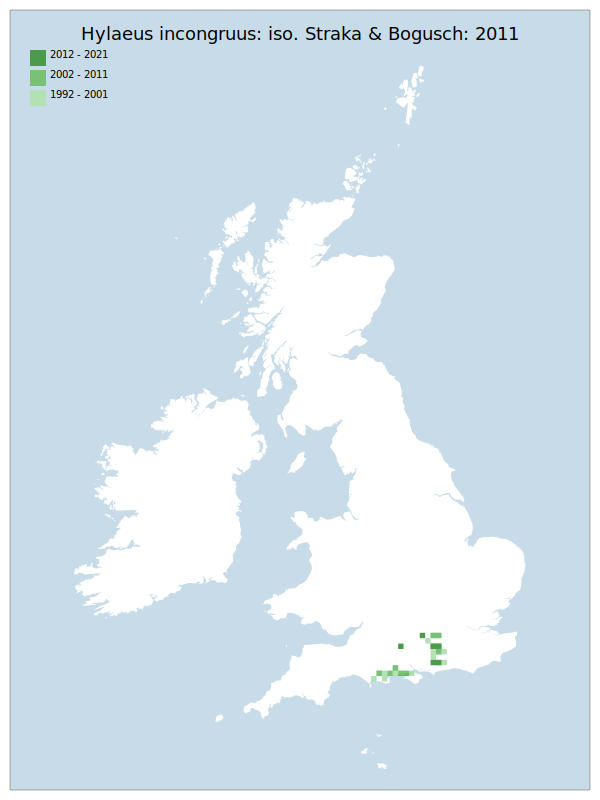

# Hylaeus incongruus: iso. Straka & Bogusch: 2011

## Provisional Red List status: DD
- A2 b,c
- A3 b
- D2

## Red List Justification
*N/A*
### Narrative
An early assessment change (2011), prior to which this solitary bee was considered a sub species of *H. confusus*. This dead wood / stem nesting bee is confined to southern England. Generally, it is a rare bee, though occasionally numerous in favoured heathland sites (especially in areas close to scrub or scattered trees) and has also been recorded from Open Woodland.

Whilst initially assessed as DD due to the lack of data caused by nomenclatural change, this taxon was moderated to NT by peer review.
### Quantified Attributes
|Attribute|Result|
|---|---|
|Synanthropy|No|
|Vagrancy|No|
|Colonisation|No|
|Nomenclature|Early-assessment change|

## National Rarity
Nationally Scarce (*NS*)

## National Presence
|Country|Presence
|---|:-:|
|England|Y|
|Scotland|N|
|Wales|N|

## Distribution map

## Red List QA Metrics
### Decade
| Slice | # Records | AoO (sq km) | dEoO (sq km) |BU%A |
|---|---|---|---|---|
|1992 - 2001|42|124|24931|92%|
|2002 - 2011|14|40|20916|77%|
|2012 - 2021|8|24|15484|57%|
### 5-year
| Slice | # Records | AoO (sq km) | dEoO (sq km) |BU%A |
|---|---|---|---|---|
|2002 - 2006|4|12|14288|52%|
|2007 - 2011|10|28|18893|70%|
|2012 - 2016|6|16|10061|37%|
|2017 - 2021|2|8|12287|45%|
### Criterion A2 (Statistical)
|Attribute|Assessment|Value|Accepted|Justification
|---|---|---|---|---|
|Raw record count|EN|-67%|No|Insufficient data|
|AoO|EN|-50%|No|Insufficient data|
|dEoO|LC|22%|No|Insufficient data|
|Bayesian|DD|*NaN*%|Yes||
|Bayesian (Expert interpretation)|DD|*N/A*|Yes||
### Criterion A2 (Expert Inference)
|Attribute|Assessment|Value|Accepted|Justification
|---|---|---|---|---|
|Internal review|DD|Very hard to ID. Extreme identification difficulties. Name change was direct, not a split.|Yes||
### Criterion A3 (Expert Inference)
|Attribute|Assessment|Value|Accepted|Justification
|---|---|---|---|---|
|Internal review|DD||Yes||
### Criterion B
|Criterion| Value|
|---|---|
|Locations|>10|
|Subcriteria||
|Support||
#### B1
|Attribute|Assessment|Value|Accepted|Justification
|---|---|---|---|---|
|MCP|LC|7900|No|Insufficient data|
#### B2
|Attribute|Assessment|Value|Accepted|Justification
|---|---|---|---|---|
|Tetrad|LC|168|No|Insufficient data|
### Criterion D2
|Attribute|Assessment|Value|Accepted|Justification
|---|---|---|---|---|
|D2|DD|*N/A*|Yes||
### Wider Review
|  |  |
|---|---|
|**Action**|Moderated|
|**Reviewed Status**|NT|
|**Justification**|Moderated on basis of expert inference from wider review|

## National Rarity QA Metrics
|Attribute|Value|
|---|---|
|Hectads|24|
|Calculated|NS|
|Final|NS|
|Moderation support||

