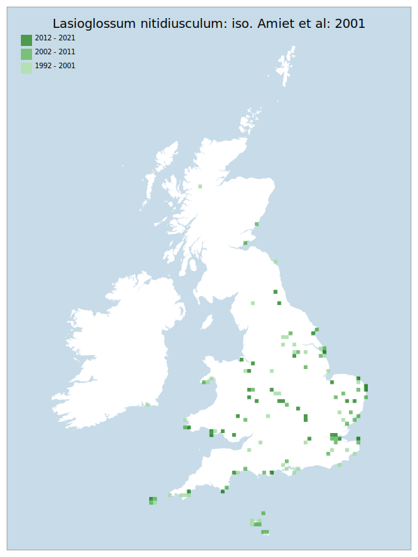

# Lasioglossum nitidiusculum: iso. Amiet et al: 2001

## Provisional Red List status: NT
- A2bc
- A3bc

## Red List Justification
Suspected disappearance from south eastern England, with reason unknown. Can be found in abundance in Scotland.

Potential negative response to climate change predictions.

### Narrative
Historically well recorded and widely distributed in England (especially southern England from Cornwall to Kent, with other sites in Wales and Isles of Scilly), there has been a substantial decline in records of this solitary bee in the past few decades, especially in the southeast of England where it now appears to be rare. Modern records for northeast England and Scotland suggest the species is reacting to climactic changes.

The most threatening accepted population change estimate is 32.0% (raw record count), which does not exceed the 30% decline required for qualification as VU under Criterion A. However, expert inference assesses this taxon at NT based on suspected decline from the south of England due to climate changes. These changes are also expected to continue in the future, and were unanimously agreed upon during peer review. The EoO (307,350 km²) exceeds the 20,000 km² VU threshold for criterion B1 and does not satisfy sufficient subcriteria to reach a threat status, and the AoO (632 km²) is below the 2,000 km² VU threshold for criterion B2 but does not satisfy sufficient subcriteria to reach a threat status. For Criterion D2, the number of locations was greater than 5 and there is no plausible threat that could drive the taxon to CR or RE in a very short time. No information was available on population size to inform assessments against Criteria C and D1; nor were any life-history models available to inform an assessment against Criterion E.

### Quantified Attributes
|Attribute|Result|
|---|---|
|Synanthropy|No|
|Vagrancy|No|
|Colonisation|No|
|Nomenclature|No|

## National Rarity
Nationally Frequent (*NF*)

## National Presence
|Country|Presence
|---|:-:|
|England|Y|
|Scotland|Y|
|Wales|Y|

## Distribution map

## Red List QA Metrics
### Decade
| Slice | # Records | AoO (sq km) | dEoO (sq km) |BU%A |
|---|---|---|---|---|
|1992 - 2001|111|308|176314|73%|
|2002 - 2011|85|196|150857|63%|
|2012 - 2021|65|184|144761|60%|

### 5-year
| Slice | # Records | AoO (sq km) | dEoO (sq km) |BU%A |
|---|---|---|---|---|
|2002 - 2006|56|120|95153|39%|
|2007 - 2011|29|88|94244|39%|
|2012 - 2016|28|68|74382|31%|
|2017 - 2021|37|120|116517|48%|

### Criterion A2 (Statistical)
|Attribute|Assessment|Value|Accepted|Justification
|---|---|---|---|---|
|Raw record count|LC|32%|Yes||
|AoO|LC|76%|Yes||
|dEoO|LC|57%|Yes||
|Bayesian|LC|7%|Yes||
|Bayesian (Expert interpretation)|LC|*N/A*|Yes||

### Criterion A2 (Expert Inference)
|Attribute|Assessment|Value|Accepted|Justification
|---|---|---|---|---|
|Internal review|NT|Suspected disappearance from south eastern England, with reason unknown. Can be found in abundance in Scotland.|Yes||

### Criterion A3 (Expert Inference)
|Attribute|Assessment|Value|Accepted|Justification
|---|---|---|---|---|
|Internal review|NT|Potential negative response to climate change.|Yes||

### Criterion B
|Criterion| Value|
|---|---|
|Locations|>10|
|Subcriteria||
|Support||

#### B1
|Attribute|Assessment|Value|Accepted|Justification
|---|---|---|---|---|
|MCP|LC|307350|Yes||

#### B2
|Attribute|Assessment|Value|Accepted|Justification
|---|---|---|---|---|
|Tetrad|LC|632|Yes||

### Criterion D2
|Attribute|Assessment|Value|Accepted|Justification
|---|---|---|---|---|
|D2|LC|*N/A*|Yes||

### Wider Review
|  |  |
|---|---|
|**Action**|Maintained|
|**Reviewed Status**|NT|
|**Justification**||

## National Rarity QA Metrics
|Attribute|Value|
|---|---|
|Hectads|128|
|Calculated|NF|
|Final|NF|
|Moderation support||
