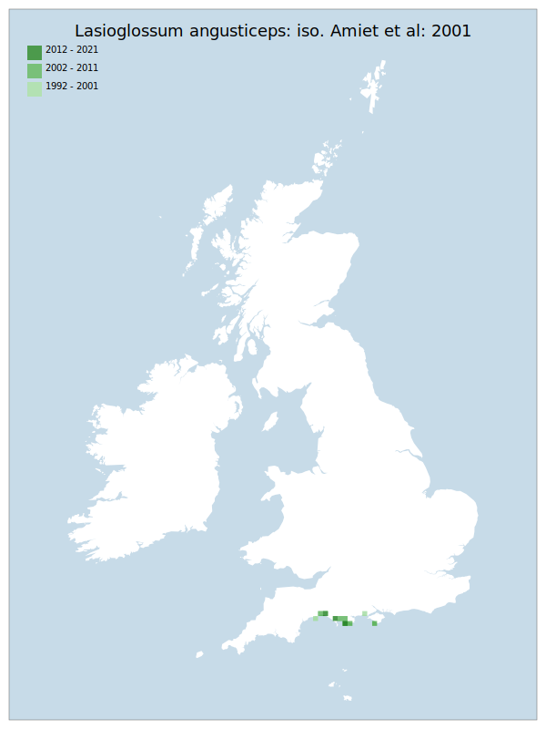

# Lasioglossum angusticeps: iso. Amiet et al: 2001

## Provisional Red List status: NT
- A2 b,c
- B1 a,b, 
- B2 a,b, 
- D2

## Red List Justification
Taxon is NT in the European Red List. Also, the cliff habitat has the potential for eutrophication due to leaching or slumping of substrate above nesting aggregations.
### Quantified Attributes
|Attribute|Result|
|---|---|
|Synanthropy|No|
|Vagrancy|No|
|Colonisation|No|
|Nomenclature|No|

## National Rarity
Nationally Rare (*NR*)

## National Presence
|Country|Presence
|---|:-:|
|England|Y|
|Scotland|N|
|Wales|N|

## Distribution map

## Red List QA Metrics
### Decade
| Slice | # Records | AoO (sq km) | dEoO (sq km) |BU%A |
|---|---|---|---|---|
|1992 - 2001|10|32|16261|83%|
|2002 - 2011|6|24|16988|87%|
|2012 - 2021|3|8|10666|54%|
### 5-year
| Slice | # Records | AoO (sq km) | dEoO (sq km) |BU%A |
|---|---|---|---|---|
|2002 - 2006|6|24|16988|87%|
|2007 - 2011|0|0|0|0%|
|2012 - 2016|2|8|10666|54%|
|2017 - 2021|1|4|6694|34%|
### Criterion A2 (Statistical)
|Attribute|Assessment|Value|Accepted|Justification
|---|---|---|---|---|
|Raw record count|EN|-50%|No|Insufficient data|
|AoO|EN|-50%|No|Insufficient data|
|dEoO|VU|-37%|No|Insufficient data|
|Bayesian|DD|*NaN*%|Yes||
|Bayesian (Expert interpretation)|DD|*N/A*|Yes||
### Criterion A2 (Expert Inference)
|Attribute|Assessment|Value|Accepted|Justification
|---|---|---|---|---|
|Internal review|LC||Yes||
### Criterion A3 (Expert Inference)
|Attribute|Assessment|Value|Accepted|Justification
|---|---|---|---|---|
|Internal review|DD||Yes||
### Criterion B
|Criterion| Value|
|---|---|
|Locations|<=5|
|Subcriteria||
|Support||
#### B1
|Attribute|Assessment|Value|Accepted|Justification
|---|---|---|---|---|
|MCP|LC|3350|Yes||
#### B2
|Attribute|Assessment|Value|Accepted|Justification
|---|---|---|---|---|
|Tetrad|LC|48|Yes||
### Criterion D2
|Attribute|Assessment|Value|Accepted|Justification
|---|---|---|---|---|
|D2|LC|*N/A*|Yes||
### Wider Review
|  |  |
|---|---|
|**Action**|Maintained|
|**Reviewed Status**|NT|
|**Justification**|Moderation has already been used. Discussions could not arrive at a definition of a threat by which criterion B could be utilised, leaving this as NT.|

## National Rarity QA Metrics
|Attribute|Value|
|---|---|
|Hectads|10|
|Calculated|NR|
|Final|NR|
|Moderation support||

