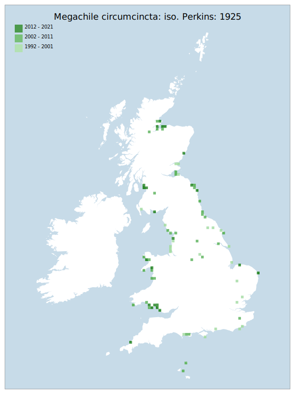

# Megachile circumcincta: iso. Perkins: 1925

## Provisional Red List status: VU
- A2 b,c

## Red List Justification
Observed far less frequently during surveys, notably in VC 59. Has not been reliably observed in the south of England. Southern records in the BWARS database require active checking to be certain, which involves needing to re-check physical specimens. Many records do not conform to known autecological information, which is suspected to be the result of difficulty in identification rather than a shift in knowledge. Many Red List assessment methods were declared as unusable, due to the uncertainty in the data.

 Overall, suspected >80% decline in observation in south eastern England.
### Narrative
Historically this was a widespread if localised species, found throughout GB. It has heavily declined in most of southern and central England, where it was found on lowland heaths. The last record for Surrey was 1973 and the last record for Surrey was 1974 - overall, suspected >80% decline in observation in southeastern England. Although populations on the Scottish and Welsh coasts seem more stable, it is much declined on the coasts of northwest England (Cheshire, Lancashire and Cumbria).

The are insufficient data to perform statistical assessment under Criterion A. Expert inference assesses this taxon as VU (>= 30% decline over 10 years) .The EoO (264,450 km2) exceeds the 20,000 km2 VU threshold for criterion B1 and does not satisfy sufficient subcriteria to reach a threat status, and the AoO was not considered statistically reliable due to extremely low volume of data. For Criterion D2, the number of locations was greater than 5 and there is no plausible threat that could drive the taxon to CR or RE in a very short time. No information was available on population size to inform assessments against Criteria C and D1; nor were any life-history models available to inform an assessment against Criterion E.
### Quantified Attributes
|Attribute|Result|
|---|---|
|Synanthropy|No|
|Vagrancy|No|
|Colonisation|No|
|Nomenclature|No|

## National Rarity
Nationally Scarce (*NS*)

## National Presence
|Country|Presence
|---|:-:|
|England|Y|
|Scotland|Y|
|Wales|Y|

## Distribution map

## Red List QA Metrics
### Decade
| Slice | # Records | AoO (sq km) | dEoO (sq km) |BU%A |
|---|---|---|---|---|
|1992 - 2001|73|196|158123|67%|
|2002 - 2011|100|228|146354|62%|
|2012 - 2021|60|132|96985|41%|
### 5-year
| Slice | # Records | AoO (sq km) | dEoO (sq km) |BU%A |
|---|---|---|---|---|
|2002 - 2006|62|116|74717|31%|
|2007 - 2011|38|116|120217|51%|
|2012 - 2016|36|84|65617|28%|
|2017 - 2021|24|56|66445|28%|
### Criterion A2 (Statistical)
|Attribute|Assessment|Value|Accepted|Justification
|---|---|---|---|---|
|Raw record count|VU|-33%|No|Insufficient data|
|AoO|VU|-33%|No|Insufficient data|
|dEoO|LC|1%|No|Insufficient data|
|Bayesian|LC|10%|No|Insufficient data|
|Bayesian (Expert interpretation)|DD|*N/A*|Yes||
### Criterion A2 (Expert Inference)
|Attribute|Assessment|Value|Accepted|Justification
|---|---|---|---|---|
|Internal review|VU|Observed far less frequently during surveys, notably in VC 59. Has not been reliably observed in the south of England. Southern data points in the BWARS database require active checking to be certain. Overall, suspected >80% decline in observation in south eastern England.|Yes||
### Criterion A3 (Expert Inference)
|Attribute|Assessment|Value|Accepted|Justification
|---|---|---|---|---|
|Internal review|DD||Yes||
### Criterion B
|Criterion| Value|
|---|---|
|Locations|>10|
|Subcriteria||
|Support||
#### B1
|Attribute|Assessment|Value|Accepted|Justification
|---|---|---|---|---|
|MCP|LC|264450|Yes||
#### B2
|Attribute|Assessment|Value|Accepted|Justification
|---|---|---|---|---|
|Tetrad|LC|496|No|Significant errors suspected in recorded data have distorted this metric past the point where it can be used.|
### Criterion D2
|Attribute|Assessment|Value|Accepted|Justification
|---|---|---|---|---|
|D2|LC|*N/A*|Yes||
### Wider Review
|  |  |
|---|---|
|**Action**|Maintained|
|**Reviewed Status**|VU|
|**Justification**||

## National Rarity QA Metrics
|Attribute|Value|
|---|---|
|Hectads|89|
|Calculated|NS|
|Final|NS|
|Moderation support||

