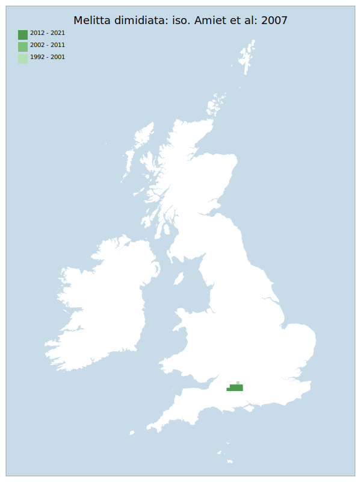

# Melitta dimidiata: iso. Amiet et al: 2007

## Provisional Red List status: NT
- A2bc
- B1ab
- B2ab
- D2

## Red List Justification
Found only in Salisbury Plain military ranges, associated only with the wild variant of the host plant. According to field experience, the cultivar does not suit this taxon. Taxon is also NT in the European Red List.

### Narrative
Modern records are confined to scattered sites on the three principal Army Ranges on Salisbury Plain. This solitary bee is monolectic (specifically associated) with Onobrychis viciifolia. Although the distribution of the associated plant – boosted considerably by introduced agricultural cultivars - is quite widespread in England (especially on chalk grassland), the species does not forage from cultivated varieties. The taxon is also NT on the European Red List.

The most threatening accepted population change estimate is 36.0% (discrete Extent of Occurrence), which does not exceed the 30% decline required for qualification as VU under Criterion A. The EoO (1,050 km²) exceeds the 5,000 km² EN threshold for criterion B1 and does not satisfy sufficient subcriteria to reach a threat status, and the AoO (96 km²) is below the 500 km² EN threshold for criterion B2 and does not satisfy sufficient subcriteria to reach a threat status. For Criterion D2, the number of locations was greater than 5 and there is no plausible threat that could drive the taxon to CR or RE in a very short time. No information was available on population size to inform assessments against Criteria C and D1; nor were any life-history models available to inform an assessment against Criterion E.

This taxon has been moderated to NT due to its status of NT on the European Red List and the strict location requirement. Military training sites may also see distinct changes to flora and disturbance regimes under correct global conditions.

### Quantified Attributes
|Attribute|Result|
|---|---|
|Synanthropy|No|
|Vagrancy|No|
|Colonisation|No|
|Nomenclature|No|

## National Rarity
Nationally Rare (*NR*)

## National Presence
|Country|Presence
|---|:-:|
|England|Y|
|Scotland|N|
|Wales|N|

## Distribution map

## Red List QA Metrics
### Decade
| Slice | # Records | AoO (sq km) | dEoO (sq km) |BU%A |
|---|---|---|---|---|
|1992 - 2001|71|72|11084|100%|
|2002 - 2011|38|48|10071|90%|
|2012 - 2021|34|36|10294|92%|

### 5-year
| Slice | # Records | AoO (sq km) | dEoO (sq km) |BU%A |
|---|---|---|---|---|
|2002 - 2006|29|44|10071|90%|
|2007 - 2011|9|20|9780|88%|
|2012 - 2016|10|8|7594|68%|
|2017 - 2021|24|36|10294|92%|

### Criterion A2 (Statistical)
|Attribute|Assessment|Value|Accepted|Justification
|---|---|---|---|---|
|Raw record count|LC|140%|Yes||
|AoO|LC|350%|Yes||
|dEoO|LC|36%|Yes||
|Bayesian|LC|0%|Yes||
|Bayesian (Expert interpretation)|LC|*N/A*|Yes||

### Criterion A2 (Expert Inference)
|Attribute|Assessment|Value|Accepted|Justification
|---|---|---|---|---|
|Internal review|LC||Yes||

### Criterion A3 (Expert Inference)
|Attribute|Assessment|Value|Accepted|Justification
|---|---|---|---|---|
|Internal review|DD||Yes||

### Criterion B
|Criterion| Value|
|---|---|
|Locations|>10|
|Subcriteria||
|Support||

#### B1
|Attribute|Assessment|Value|Accepted|Justification
|---|---|---|---|---|
|MCP|LC|1050|Yes||

#### B2
|Attribute|Assessment|Value|Accepted|Justification
|---|---|---|---|---|
|Tetrad|LC|96|Yes||

### Criterion D2
|Attribute|Assessment|Value|Accepted|Justification
|---|---|---|---|---|
|D2|LC|*N/A*|Yes||

### Wider Review
|  |  |
|---|---|
|**Action**|Maintained|
|**Reviewed Status**|NT|
|**Justification**||

## National Rarity QA Metrics
|Attribute|Value|
|---|---|
|Hectads|8|
|Calculated|NR|
|Final|NR|
|Moderation support||
