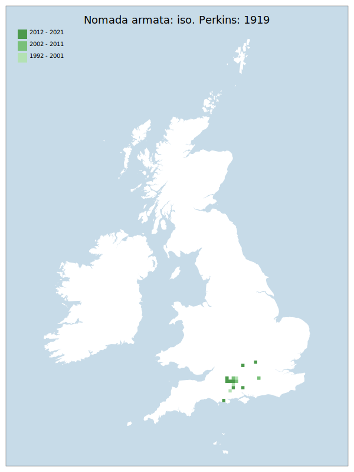

# Nomada armata: iso. Perkins: 1919

## Provisional Red List status: LC
- A2 b
- B1 a,b, 
- B2 a,b, 
- D2

## Red List Justification
*N/A*
### Narrative
This parasitic solitary bee is associated with one of the larger bees which forages from “scabious” plants – Andrena hattorfiana.  Although considerably less common than the host species, the host has become more common, and populations of N. armata appear to be joining up. Despite no evidence of heavy decline, there have been less observations of the species amongst specialists and moderation has been agreed on a status of NT.

No statistical assessment was possible under Criterion A due insufficient data. Expert inference assessed this taxon as LC. The EoO (8,950 km2</sup.) is below the 20,000 km2</sup. VU threshold for criterion B1 and the AoO (84 km2</sup.) is below the 500 km2</sup. EN threshold for criterion B2. However, the taxon inhabits greater than 10 sites and so does not qualify for a threat status under B. For Criterion D2, the number of locations was greater than 10, and there is no plausible threat of rapid habitat loss that could drive the taxon to CR or RE in a very short time. No information was available on population size to inform assessments against Criteria C and D1; nor were any life-history models available to inform an assessment against Criterion E.

This taxon was moderated from LC to NT during peer review by a strong majority of responses.
### Quantified Attributes
|Attribute|Result|
|---|---|
|Synanthropy|No|
|Vagrancy|No|
|Colonisation|No|
|Nomenclature|No|

## National Rarity
Nationally Rare (*NR*)

## National Presence
|Country|Presence
|---|:-:|
|England|Y|
|Scotland|N|
|Wales|N|

## Distribution map

## Red List QA Metrics
### Decade
| Slice | # Records | AoO (sq km) | dEoO (sq km) |BU%A |
|---|---|---|---|---|
|1992 - 2001|25|36|18303|64%|
|2002 - 2011|27|36|15840|56%|
|2012 - 2021|26|32|25445|90%|
### 5-year
| Slice | # Records | AoO (sq km) | dEoO (sq km) |BU%A |
|---|---|---|---|---|
|2002 - 2006|17|36|15840|56%|
|2007 - 2011|10|4|6694|23%|
|2012 - 2016|10|16|17913|63%|
|2017 - 2021|16|28|20435|72%|
### Criterion A2 (Statistical)
|Attribute|Assessment|Value|Accepted|Justification
|---|---|---|---|---|
|Raw record count|LC|60%|No|Insufficient data|
|AoO|LC|75%|No|Insufficient data|
|dEoO|LC|14%|No|Insufficient data|
|Bayesian|LC|0%|No|Insufficient data|
|Bayesian (Expert interpretation)|DD|*N/A*|Yes||
### Criterion A2 (Expert Inference)
|Attribute|Assessment|Value|Accepted|Justification
|---|---|---|---|---|
|Internal review|LC|Host has become more common and populations appear to be joining up. No evidence of any decline.|Yes||
### Criterion A3 (Expert Inference)
|Attribute|Assessment|Value|Accepted|Justification
|---|---|---|---|---|
|Internal review|DD||Yes||
### Criterion B
|Criterion| Value|
|---|---|
|Locations|>10|
|Subcriteria||
|Support||
#### B1
|Attribute|Assessment|Value|Accepted|Justification
|---|---|---|---|---|
|MCP|LC|8950|Yes||
#### B2
|Attribute|Assessment|Value|Accepted|Justification
|---|---|---|---|---|
|Tetrad|LC|84|Yes||
### Criterion D2
|Attribute|Assessment|Value|Accepted|Justification
|---|---|---|---|---|
|D2|LC|*N/A*|Yes||
### Wider Review
|  |  |
|---|---|
|**Action**|Moderated|
|**Reviewed Status**|NT|
|**Justification**|Moderated to NT based on expert consensus|

## National Rarity QA Metrics
|Attribute|Value|
|---|---|
|Hectads|13|
|Calculated|NR|
|Final|NR|
|Moderation support||

