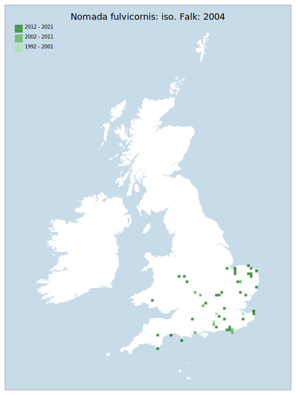

# Nomada fulvicornis: iso. Falk: 2004

## Provisional Red List status: LC
- A2bc

## Red List Justification
*N/A*

### Narrative

The most threatening accepted population decline was inferred at 0% using expert inference (A2). This does not exceed the 30% decline required for qualification as VU. The EoO was not accepted, the AoO was not accepted. For Criterion D2, the number of locations was greater than 5 and there is no plausible threat that could drive the taxon to CR or RE in a very short time. No information was available on population size to inform assessments against Criteria C and D1; nor were any life-history models available to inform an assessment against Criterion E.

### Quantified Attributes
|Attribute|Result|
|---|---|
|Synanthropy|No|
|Vagrancy|No|
|Colonisation|No|
|Nomenclature|Early-assessment change|

## National Rarity
Insufficient Data (*ID*)

## National Presence
|Country|Presence
|---|:-:|
|England|Y|
|Scotland|N|
|Wales|Y|

## Distribution map

## Red List QA Metrics
### Decade
| Slice | # Records | AoO (sq km) | dEoO (sq km) |BU%A |
|---|---|---|---|---|
|1992 - 2001|3|12|16243|14%|
|2002 - 2011|20|64|50146|44%|
|2012 - 2021|59|172|103760|92%|

### 5-year
| Slice | # Records | AoO (sq km) | dEoO (sq km) |BU%A |
|---|---|---|---|---|
|2002 - 2006|6|24|24457|21%|
|2007 - 2011|14|48|48840|43%|
|2012 - 2016|7|24|38812|34%|
|2017 - 2021|52|156|102823|91%|

### Criterion A2 (Statistical)
|Attribute|Assessment|Value|Accepted|Justification
|---|---|---|---|---|
|Raw record count|LC|643%|No|Nomenclatural split|
|AoO|LC|550%|No|Nomenclatural split|
|dEoO|LC|165%|No|Nomenclatural split|
|Bayesian|LC|4%|No|Nomenclatural split|
|Bayesian (Expert interpretation)|DD|*N/A*|Yes||

### Criterion A2 (Expert Inference)
|Attribute|Assessment|Value|Accepted|Justification
|---|---|---|---|---|
|Internal review|LC||Yes||

### Criterion A3 (Expert Inference)
|Attribute|Assessment|Value|Accepted|Justification
|---|---|---|---|---|
|Internal review|DD||Yes||

### Criterion B
|Criterion| Value|
|---|---|
|Locations|>10|
|Subcriteria||
|Support||

#### B1
|Attribute|Assessment|Value|Accepted|Justification
|---|---|---|---|---|
|MCP|LC|94700|No|Nomenclatural split|

#### B2
|Attribute|Assessment|Value|Accepted|Justification
|---|---|---|---|---|
|Tetrad|LC|244|No|Nomenclatural split|

### Criterion D2
|Attribute|Assessment|Value|Accepted|Justification
|---|---|---|---|---|
|D2|DD|*N/A*|Yes||

### Wider Review
|  |  |
|---|---|
|**Action**|Re-assessed|
|**Reviewed Status**|LC|
|**Justification**|Separation needs to be definite, not inferred, to meet standards. Taxon can however be assessed under Expert Inference (A2).|

## National Rarity QA Metrics
|Attribute|Value|
|---|---|
|Hectads|51|
|Calculated|NS|
|Final|ID|
|Moderation support||
