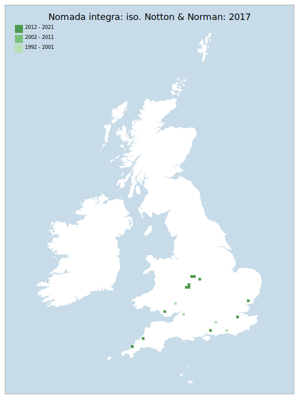

# Nomada integra: iso. Notton & Norman: 2017

## Provisional Red List status: LC
- A2bc

## Red List Justification
*N/A*

### Narrative
Although provisionally assigned a status of LC, there is not enough data from which to derive any meaningful statistically-based assessment due to the peri-assessment change in nomenclature and subsequent split of this species from N. facilis.

Insufficient data were available to reach a supportable conclusion on the threat status for this taxon.

### Quantified Attributes
|Attribute|Result|
|---|---|
|Synanthropy|No|
|Vagrancy|No|
|Colonisation|No|
|Nomenclature|Peri-assessment change|

## National Rarity
Insufficient Data (*ID*)

## National Presence
|Country|Presence
|---|:-:|
|England|Y|
|Scotland|N|
|Wales|Y|

## Distribution map

## Red List QA Metrics
### Decade
| Slice | # Records | AoO (sq km) | dEoO (sq km) |BU%A |
|---|---|---|---|---|
|1992 - 2001|4|16|22204|34%|
|2002 - 2011|4|16|10184|16%|
|2012 - 2021|15|44|49209|77%|

### 5-year
| Slice | # Records | AoO (sq km) | dEoO (sq km) |BU%A |
|---|---|---|---|---|
|2002 - 2006|2|8|7594|11%|
|2007 - 2011|2|8|6694|10%|
|2012 - 2016|2|8|8753|13%|
|2017 - 2021|13|40|47430|74%|

### Criterion A2 (Statistical)
|Attribute|Assessment|Value|Accepted|Justification
|---|---|---|---|---|
|Raw record count|LC|550%|No|Nomenclatural split|
|AoO|LC|400%|No|Nomenclatural split|
|dEoO|LC|442%|No|Nomenclatural split|
|Bayesian|DD|*NaN*%|Yes||
|Bayesian (Expert interpretation)|DD|*N/A*|Yes||

### Criterion A2 (Expert Inference)
|Attribute|Assessment|Value|Accepted|Justification
|---|---|---|---|---|
|Internal review|LC||Yes||

### Criterion A3 (Expert Inference)
|Attribute|Assessment|Value|Accepted|Justification
|---|---|---|---|---|
|Internal review|DD||Yes||

### Criterion B
|Criterion| Value|
|---|---|
|Locations|>10|
|Subcriteria||
|Support||

#### B1
|Attribute|Assessment|Value|Accepted|Justification
|---|---|---|---|---|
|MCP|LC|61700|No|Nomenclatural split|

#### B2
|Attribute|Assessment|Value|Accepted|Justification
|---|---|---|---|---|
|Tetrad|LC|68|No|Nomenclatural split|

### Criterion D2
|Attribute|Assessment|Value|Accepted|Justification
|---|---|---|---|---|
|D2|DD|*N/A*|Yes||

### Wider Review
|  |  |
|---|---|
|**Action**|Re-assessed|
|**Reviewed Status**|DD|
|**Justification**|There is not enough data which has reached a reliable point to arrive at any statistically-based assessment. Re-assessed using Expert Inference|

## National Rarity QA Metrics
|Attribute|Value|
|---|---|
|Hectads|15|
|Calculated|NR|
|Final|ID|
|Moderation support||
