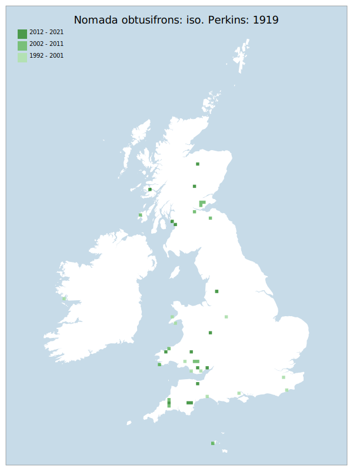

# Nomada obtusifrons: iso. Perkins: 1919

## Provisional Red List status: NT
- A2b
- A3b
- D2

## Red List Justification
*N/A*

### Narrative
Although historically widely distributed throughout Britain and Ireland, though generally scarce and very local, this parasitic bee has declined steadily over the twentieth century. Modern records are restricted to the west (England and Wales) and Scotland, and the NT assessment matches that for the host, Andrena coitana.

No assessment was possible under Criteria A , B, or D due insufficient data. No information was available on population size to inform assessments against Criteria C and D1; nor were any life-history models available to inform an assessment against Criterion E.

This taxon was moderated from DD to NT on the basis of the status of its host taxa  (*Andrena tarsata*: iso. Perkins: 1919 and *Andrena coitana*: iso. Perkins: 1919) being assessed at NT. As per the rulings made for this assessment, no taxon may be less threatened that the least-threatened dependency.

### Quantified Attributes
|Attribute|Result|
|---|---|
|Synanthropy|No|
|Vagrancy|No|
|Colonisation|No|
|Nomenclature|No|

## National Rarity
Nationally Scarce (*NS*)

## National Presence
|Country|Presence
|---|:-:|
|England|Y|
|Scotland|Y|
|Wales|Y|

## Distribution map

## Red List QA Metrics
### Decade
| Slice | # Records | AoO (sq km) | dEoO (sq km) |BU%A |
|---|---|---|---|---|
|1992 - 2001|21|56|59564|46%|
|2002 - 2011|15|52|52013|40%|
|2012 - 2021|19|64|71150|55%|

### 5-year
| Slice | # Records | AoO (sq km) | dEoO (sq km) |BU%A |
|---|---|---|---|---|
|2002 - 2006|7|24|27729|21%|
|2007 - 2011|8|28|30978|23%|
|2012 - 2016|8|28|34793|26%|
|2017 - 2021|11|40|43276|33%|

### Criterion A2 (Statistical)
|Attribute|Assessment|Value|Accepted|Justification
|---|---|---|---|---|
|Raw record count|LC|38%|No|Insufficient data|
|AoO|LC|43%|No|Insufficient data|
|dEoO|LC|24%|No|Insufficient data|
|Bayesian|DD|*NaN*%|Yes||
|Bayesian (Expert interpretation)|DD|*N/A*|Yes||

### Criterion A2 (Expert Inference)
|Attribute|Assessment|Value|Accepted|Justification
|---|---|---|---|---|
|Internal review|DD|Scarcity of data prevents assessment|Yes||

### Criterion A3 (Expert Inference)
|Attribute|Assessment|Value|Accepted|Justification
|---|---|---|---|---|
|Internal review|DD||Yes||

### Criterion B
|Criterion| Value|
|---|---|
|Locations|>10|
|Subcriteria||
|Support||

#### B1
|Attribute|Assessment|Value|Accepted|Justification
|---|---|---|---|---|
|MCP|LC|221850|No|Insufficient data|

#### B2
|Attribute|Assessment|Value|Accepted|Justification
|---|---|---|---|---|
|Tetrad|LC|156|No|Insufficient data|

### Criterion D2
|Attribute|Assessment|Value|Accepted|Justification
|---|---|---|---|---|
|D2|DD|*N/A*|Yes||

### Wider Review
|  |  |
|---|---|
|**Action**|Maintained|
|**Reviewed Status**|NT|
|**Justification**||

## National Rarity QA Metrics
|Attribute|Value|
|---|---|
|Hectads|36|
|Calculated|NS|
|Final|NS|
|Moderation support||
