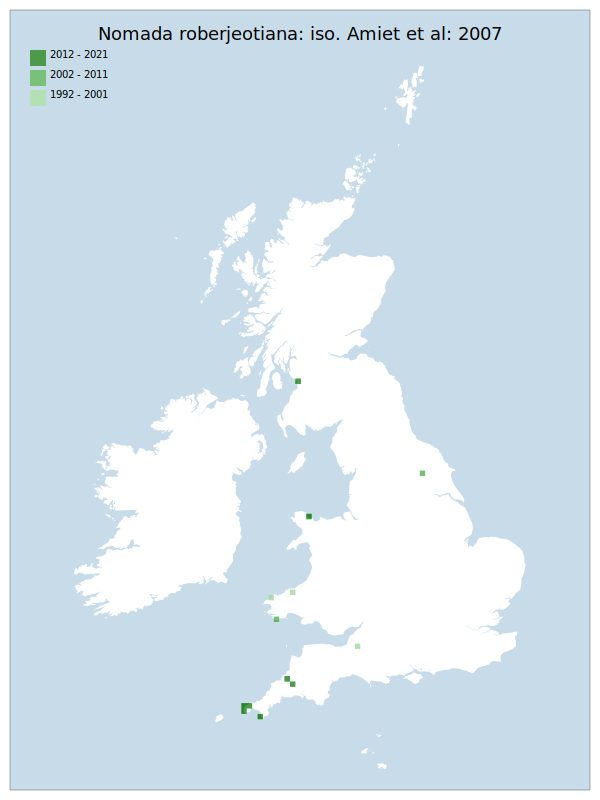

# Nomada roberjeotiana: iso. Amiet et al: 2007

## Provisional Red List status: NT
- A2b
- A3b
- D2

## Red List Justification
*N/A*

### Narrative
This parasitic bee – associated strictly with Andrena tarsata – has always been rarely recorded and although it appears to be much scarcer than its host, it is possibly under-recorded in certain areas. The threats to the taxon mirror those that apply to the host which is also assessed as NT.

No assessment was possible under Criteria A , B, or D due insufficient data. No information was available on population size to inform assessments against Criteria C and D1; nor were any life-history models available to inform an assessment against Criterion E.

This taxon was moderated from DD to NT on the basis of the status of its sole host (*Andrena tarsata*: iso. Perkins: 1919) being assessed at NT. As per the rulings made for this assessment, no taxon may be less threatened that the least-threatened dependency.

### Quantified Attributes
|Attribute|Result|
|---|---|
|Synanthropy|No|
|Vagrancy|No|
|Colonisation|No|
|Nomenclature|No|

## National Rarity
Nationally Rare (*NR*)

## National Presence
|Country|Presence
|---|:-:|
|England|Y|
|Scotland|Y|
|Wales|Y|

## Distribution map

## Red List QA Metrics
### Decade
| Slice | # Records | AoO (sq km) | dEoO (sq km) |BU%A |
|---|---|---|---|---|
|1992 - 2001|5|16|23736|40%|
|2002 - 2011|9|16|26777|45%|
|2012 - 2021|32|44|31615|53%|

### 5-year
| Slice | # Records | AoO (sq km) | dEoO (sq km) |BU%A |
|---|---|---|---|---|
|2002 - 2006|4|8|13388|22%|
|2007 - 2011|5|16|26777|45%|
|2012 - 2016|18|40|29532|50%|
|2017 - 2021|14|16|17304|29%|

### Criterion A2 (Statistical)
|Attribute|Assessment|Value|Accepted|Justification
|---|---|---|---|---|
|Raw record count|LC|-22%|No|Insufficient data|
|AoO|EN|-60%|No|Insufficient data|
|dEoO|VU|-41%|No|Insufficient data|
|Bayesian|DD|*NaN*%|Yes||
|Bayesian (Expert interpretation)|DD|*N/A*|Yes||

### Criterion A2 (Expert Inference)
|Attribute|Assessment|Value|Accepted|Justification
|---|---|---|---|---|
|Internal review|DD|Localised and very under-recorded. No threats known, but efforts hampered by low detection of taxon.|Yes||

### Criterion A3 (Expert Inference)
|Attribute|Assessment|Value|Accepted|Justification
|---|---|---|---|---|
|Internal review|DD||Yes||

### Criterion B
|Criterion| Value|
|---|---|
|Locations|>10|
|Subcriteria||
|Support||

#### B1
|Attribute|Assessment|Value|Accepted|Justification
|---|---|---|---|---|
|MCP|LC|118000|No|Insufficient data|

#### B2
|Attribute|Assessment|Value|Accepted|Justification
|---|---|---|---|---|
|Tetrad|LC|68|No|Insufficient data|

### Criterion D2
|Attribute|Assessment|Value|Accepted|Justification
|---|---|---|---|---|
|D2|DD|*N/A*|Yes||

### Wider Review
|  |  |
|---|---|
|**Action**|Maintained|
|**Reviewed Status**|NT|
|**Justification**||

## National Rarity QA Metrics
|Attribute|Value|
|---|---|
|Hectads|13|
|Calculated|NR|
|Final|NR|
|Moderation support||
