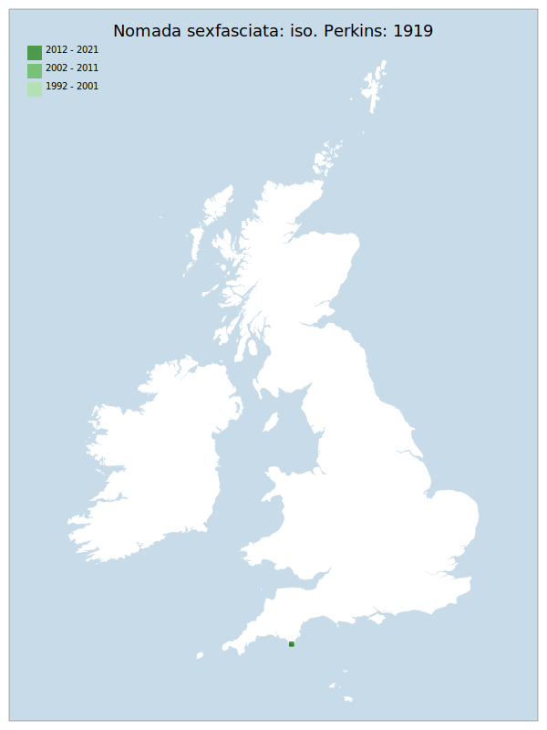

# Nomada sexfasciata: iso. Perkins: 1919

## Provisional Red List status: CR
- B1ab(i,ii,iii,iv)
- B2ab(i,ii,iii,iv)

## Red List Justification
This parasitic taxon is currently assumed to be isolated due to a combination of host availability fragmentation, and the small size of the only known parasitised colony. The colony is unable to reach a size where random chance reaches a point where dispersal results in the finding a new host colony, which is itself a very sparse resource.

The main part of this taxon's available host population is close to sea level. Increased wave action and sea level rise will degrade this area. The host has, in the past, moved outside of this area, but not frequently.

### Narrative
This is a parasitic bee which targets the Eucera genus, of which only 1 species – E. longicornis - is extant and although very localised and fragmented is assessed as LC. In contrast, this species - formerly recorded from several counties in southern England – is now restricted to one site in South Devon. It is currently assumed to be isolated due to a combination of host availability fragmentation, and the small size of the only known parasitised colony. The colony is unable to reach a size where random chance reaches a point where dispersal results in the finding of a new host colony. In addition, the main part of this taxon's available host population is close to sea level. Increased wave action and sea level rise will degrade this area.

The are insufficient data to statistically assess this taxon under Criterion A. Expert inference assessed this taxon as LC under Criterion A. The EoO (100 km²) is below the 5,000 km² EN threshold for criterion B1 and the AoO (8 km²) is below the 10 km² CR threshold for criterion B2. There is one location, and continuing decline observed or projected in the area of occupancy, extent of occupancy, extent/area/quality of habitat, and number of individuals. For Criterion D2, the number of locations was less than 5 and there are plausible threats that could drive the taxon to CR or RE in a very short time. No information was available on population size to inform assessments against Criteria C and D1; nor were any life-history models available to inform an assessment against Criterion E.

### Quantified Attributes
|Attribute|Result|
|---|---|
|Synanthropy|No|
|Vagrancy|No|
|Colonisation|No|
|Nomenclature|No|

## National Rarity
Nationally Rare (*NR*)

## National Presence
|Country|Presence
|---|:-:|
|England|Y|
|Scotland|N|
|Wales|N|

## Distribution map

## Red List QA Metrics
### Decade
| Slice | # Records | AoO (sq km) | dEoO (sq km) |BU%A |
|---|---|---|---|---|
|1992 - 2001|2|4|6694|100%|
|2002 - 2011|4|8|6694|100%|
|2012 - 2021|3|4|6694|100%|

### 5-year
| Slice | # Records | AoO (sq km) | dEoO (sq km) |BU%A |
|---|---|---|---|---|
|2002 - 2006|4|8|6694|100%|
|2007 - 2011|0|0|0|0%|
|2012 - 2016|2|4|6694|100%|
|2017 - 2021|1|4|6694|100%|

### Criterion A2 (Statistical)
|Attribute|Assessment|Value|Accepted|Justification
|---|---|---|---|---|
|Raw record count|EN|-50%|No|Insufficient data|
|AoO|LC|0%|No|Insufficient data|
|dEoO|LC|0%|No|Insufficient data|
|Bayesian|DD|*NaN*%|Yes||
|Bayesian (Expert interpretation)|DD|*N/A*|Yes||

### Criterion A2 (Expert Inference)
|Attribute|Assessment|Value|Accepted|Justification
|---|---|---|---|---|
|Internal review|LC|Population is isolated from any other population of its host. The host is expanding, but it is not obvious that the host will manage to reconnect to the parasite.|Yes||

### Criterion A3 (Expert Inference)
|Attribute|Assessment|Value|Accepted|Justification
|---|---|---|---|---|
|Internal review|NT|Main part of host population is close to sea level. Increased wave action and sea level rise will degrade this. Host has, in the past, moved outside of this area, but not frequently. Population of Nomada is potentially entirely isolated from other populations of the host.|Yes||

### Criterion B
|Criterion| Value|
|---|---|
|Locations|<=1|
|Subcriteria|i, ii, iii, iv|
|Support|Main part of host population is close to sea level. Increased wave action and sea level rise will degrade this. Host has, in the past, moved outside of this area, but not frequently. Population of Nomada is potentially entirely isolated from other populations of the host.|

#### B1
|Attribute|Assessment|Value|Accepted|Justification
|---|---|---|---|---|
|MCP|CR|100|Yes||

#### B2
|Attribute|Assessment|Value|Accepted|Justification
|---|---|---|---|---|
|Tetrad|CR|8|Yes||

### Criterion D2
|Attribute|Assessment|Value|Accepted|Justification
|---|---|---|---|---|
|D2|VU|*N/A*|Yes||

### Wider Review
|  |  |
|---|---|
|**Action**|Maintained|
|**Reviewed Status**|CR|
|**Justification**||

## National Rarity QA Metrics
|Attribute|Value|
|---|---|
|Hectads|1|
|Calculated|NR|
|Final|NR|
|Moderation support||
