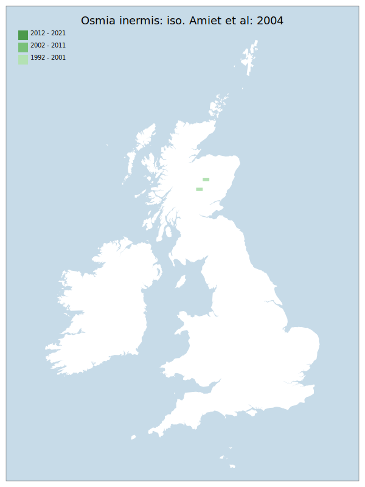

# Osmia inermis: iso. Amiet et al: 2004

## Provisional Red List status: EN
- D2

## Red List Justification
Taxon requires specific targeted survey effort and unusual patterns to find. No such survey has happened in the 10 year period. Due to the paucity of data and lack of knowledge, it was not possible to place this taxon any higher threat status than VU.

Taking into account wider knowledge, which has no place to be captured under the available rules, the threat status to this taxon should be much higher. Even when subjected to targeted survey effort, records were scarce. Existing locations were at risk of conversion to commercial pine forest or inappropriate grazing. No recent survey effort has been undertaken. The pressures from the last targeted work are considered to have been maintained. This species is therefore considered to be under far higher threat than can be captured within the Red List methodology.
### Narrative
This megachilid bee is very rare, being confined to the central Scottish Highlands on base-rich pasture with legumes and woodland edge habitat with Bugle and Bilberry. This taxon requires specific targeted survey effort. No such survey has happened in the 10-year assessment period. Due to the paucity of data and lack of knowledge, it was not possible to place this taxon in any higher threat status than VU. Taking into account wider knowledge, which has no place to be captured under the available rules, the threat status to this taxon should be much higher. Even when subjected to targeted survey effort, records have been scarce. Existing locations were at risk of conversion to commercial pine forest or subject to inappropriate grazing. The pressures from the last targeted work are considered to have been maintained. This species is therefore considered to be under far higher threat than can be captured within the Red List methodology.

There are insufficient data to statistically assess this taxon under Criterion A, B, or D. Expert inference assess this taxon as NT under the basis of future threat from climate change. No information was available on population size to inform assessments against Criteria C and D1; nor were any life-history models available to inform an assessment against Criterion E.

This taxon has been moderated from VU to EN on the basis of peri and post assessment repeat, targeting survey efforts failing to provide as much data as was expected under higher scrutiny. Existing locations were assessed to be continuing to decline in suitability, with no significant change from the previous assessment, leading to further threat of habitat loss.
### Quantified Attributes
|Attribute|Result|
|---|---|
|Synanthropy|No|
|Vagrancy|No|
|Colonisation|No|
|Nomenclature|No|

## National Rarity
Nationally Rare (*NR*)

## National Presence
|Country|Presence
|---|:-:|
|England|Y|
|Scotland|Y|
|Wales|N|

## Distribution map

## Red List QA Metrics
### Decade
| Slice | # Records | AoO (sq km) | dEoO (sq km) |BU%A |
|---|---|---|---|---|
|1992 - 2001|9|24|11168|62%|
|2002 - 2011|1|4|6694|37%|
|2012 - 2021|0|0|0|0%|
### 5-year
| Slice | # Records | AoO (sq km) | dEoO (sq km) |BU%A |
|---|---|---|---|---|
|2002 - 2006|1|4|6694|37%|
|2007 - 2011|0|0|0|0%|
|2012 - 2016|0|0|0|0%|
|2017 - 2021|0|0|0|0%|
### Criterion A2 (Statistical)
|Attribute|Assessment|Value|Accepted|Justification
|---|---|---|---|---|
|Raw record count|LC|?%|No|Insufficient data|
|AoO|LC|?%|No|Insufficient data|
|dEoO|LC|?%|No|Insufficient data|
|Bayesian|DD|*NaN*%|Yes||
|Bayesian (Expert interpretation)|DD|*N/A*|Yes||
### Criterion A2 (Expert Inference)
|Attribute|Assessment|Value|Accepted|Justification
|---|---|---|---|---|
|Internal review|DD|Requires specific targeted survey effort and unusual patterns to find. No such survey has happened in the 10 year period.|Yes||
### Criterion A3 (Expert Inference)
|Attribute|Assessment|Value|Accepted|Justification
|---|---|---|---|---|
|Internal review|NT|An arctic/montaine species. Global warming is predicted to be detrimental to this taxon.|Yes||
### Criterion B
|Criterion| Value|
|---|---|
|Locations|<=5|
|Subcriteria||
|Support||
#### B1
|Attribute|Assessment|Value|Accepted|Justification
|---|---|---|---|---|
|MCP|LC|21300|No|Insufficient data|
#### B2
|Attribute|Assessment|Value|Accepted|Justification
|---|---|---|---|---|
|Tetrad|LC|28|No|Insufficient data|
### Criterion D2
|Attribute|Assessment|Value|Accepted|Justification
|---|---|---|---|---|
|D2|VU|*N/A*|Yes||
### Wider Review
|  |  |
|---|---|
|**Action**|Maintained|
|**Reviewed Status**|EN|
|**Justification**||

## National Rarity QA Metrics
|Attribute|Value|
|---|---|
|Hectads|6|
|Calculated|NR|
|Final|NR|
|Moderation support||

