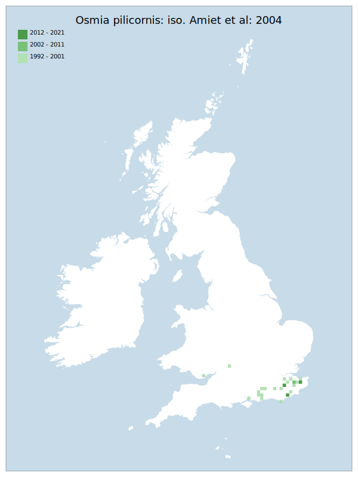

# Osmia pilicornis: iso. Amiet et al: 2004

## Provisional Red List status: EN
- A2 b,c

## Red List Justification
Taxon has been subjected to targeted survey effort, yet cannot be re-found in many previous sites. Forestry management practices used to provide a range of suitable nesting habitats, but these practices have changed. Deadwood and stumps are now routinely destroyed via mechanical management, removing nesting opportunities. Has similar habitat requirements to the small pearl-bordered fritillaries.
### Narrative
This megachilid bee nest in dead wood, often in open woodland (especially on chalky soils). Lack of traditional coppice management and over-zealous woodland management has reduced suitable habitat, and the range of the species has retracted substantially from numerous sites south of the Severn – Wash line to very few sites in Kent and Sussex during the assessment period. The taxon has been subjected to targeted survey effort yet cannot be re-found on many previous sites. Forestry management practices used to provide a range of suitable nesting habitats, but these practices have changed. Deadwood and stumps are now routinely destroyed via mechanical management, removing nesting opportunities. 

There are insufficient data to perform statistical assessment under Criterion A. Expert inference assessed this taxon as EN (minimum 50% population decline over the entire assessed region). The EoO (23,000 km2) exceeds the 20,000 km2 VU threshold for criterion B1 and does not satisfy sufficient subcriteria to reach a threat status. The AoO 140 km2) is below the 500 km2 EN threshold for criterion B2. There are assessed to be fewer or equal to 10 locations (VU) and there is continuing decline observed & projected to the area, extent/quality of habitat. For Criterion D2, the number of locations was greater than 5 and there is no plausible threat that could drive the taxon to CR or RE in a very short time. No information was available on population size to inform assessments against Criteria C and D1; nor were any life-history models available to inform an assessment against Criterion E.
### Quantified Attributes
|Attribute|Result|
|---|---|
|Synanthropy|No|
|Vagrancy|No|
|Colonisation|No|
|Nomenclature|No|

## National Rarity
Nationally Scarce (*NS*)

## National Presence
|Country|Presence
|---|:-:|
|England|Y|
|Scotland|N|
|Wales|Y|

## Distribution map

## Red List QA Metrics
### Decade
| Slice | # Records | AoO (sq km) | dEoO (sq km) |BU%A |
|---|---|---|---|---|
|1992 - 2001|57|128|42033|100%|
|2002 - 2011|7|16|9549|22%|
|2012 - 2021|13|16|13587|32%|
### 5-year
| Slice | # Records | AoO (sq km) | dEoO (sq km) |BU%A |
|---|---|---|---|---|
|2002 - 2006|5|16|9549|22%|
|2007 - 2011|2|4|6694|15%|
|2012 - 2016|9|12|13587|32%|
|2017 - 2021|4|8|6694|15%|
### Criterion A2 (Statistical)
|Attribute|Assessment|Value|Accepted|Justification
|---|---|---|---|---|
|Raw record count|EN|-56%|No|Insufficient data|
|AoO|VU|-33%|No|Insufficient data|
|dEoO|EN|-51%|No|Insufficient data|
|Bayesian|DD|*NaN*%|Yes||
|Bayesian (Expert interpretation)|DD|*N/A*|Yes||
### Criterion A2 (Expert Inference)
|Attribute|Assessment|Value|Accepted|Justification
|---|---|---|---|---|
|Internal review|EN|Has been subjected to targeted survey effort, yet taxon cannot be re-found in many previous sites. Forestry management practices used to provide a range of suitable nesting habitats. These practices have changed. Deadwood and stumps are now routinely destroyed via mechanical management, removing nesting opportunities. Has similar habitat requirements to the small pearl-bordered fritillaries.|Yes||
### Criterion A3 (Expert Inference)
|Attribute|Assessment|Value|Accepted|Justification
|---|---|---|---|---|
|Internal review|DD||Yes||
### Criterion B
|Criterion| Value|
|---|---|
|Locations|<=10|
|Subcriteria|iii|
|Support|Forestry management practices used to provide a range of suitable nesting habitats. These practices have changed. Deadwood and stumps are now routinely destroyed via mechanical management, removing nesting opportunities.|
#### B1
|Attribute|Assessment|Value|Accepted|Justification
|---|---|---|---|---|
|MCP|LC|23000|Yes||
#### B2
|Attribute|Assessment|Value|Accepted|Justification
|---|---|---|---|---|
|Tetrad|VU|140|Yes||
### Criterion D2
|Attribute|Assessment|Value|Accepted|Justification
|---|---|---|---|---|
|D2|LC|*N/A*|Yes||
### Wider Review
|  |  |
|---|---|
|**Action**|Maintained|
|**Reviewed Status**|EN|
|**Justification**||

## National Rarity QA Metrics
|Attribute|Value|
|---|---|
|Hectads|23|
|Calculated|NS|
|Final|NS|
|Moderation support||

