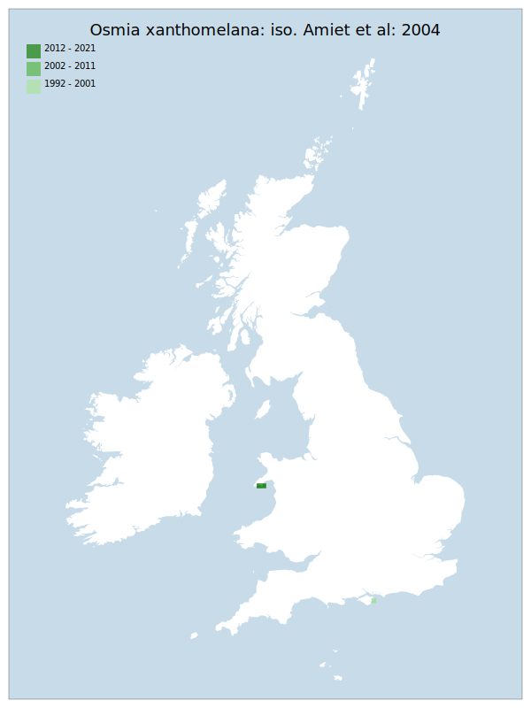

# Osmia xanthomelana: iso. Amiet et al: 2004

## Provisional Red List status: CR
- B2ab(i,ii,iii,iv)

## Red List Justification
The singular existing colony is at risk of localised storm surges damaging the nesting site. Pastures above the nesting location cliffs are being improved, resulting in enrichment of the area,, again damaging the nesting site. These measures result in the taxon reaching EN status.

The Isle of Wight population cannot be found, reducing the known viable locations to one. Farming practices place additional pressure upon the remaining known site, specifically regarding availability of suitable floral resource. For these reasons, this taxon is elevated to CR.

### Narrative
Historically (pre-1950’s) this distinctive megachilid bee was recorded from 28 scattered localities from the south coast of England to Tyneside. Following the loss of the Isle of Wight colony in the early assessment period, there remains a singular existing colony in North Wales which is at risk of localised storm surges damaging the nesting site. Pastures above the nesting location cliffs are being improved, resulting in enrichment of the area and reducing forage resource. These measures result in the taxon reaching EN status. The Isle of Wight population cannot be found, reducing the known viable locations to one. Farming practices place additional pressure upon the remaining known site, specifically regarding availability of suitable floral resource. For these reasons, this taxon is elevated to CR.

There is insufficient data to assess this taxon under Criterion A - likely due to the rarity of the taxon more than a lack of sampling power. The EoO (6,100 km²) is below the 20,000 km² VU threshold for criterion B1 and the AoO (20 km²) is below the 500 km² EN threshold for criterion B2. There are assessed to be fewer or equal to 5 locations (VU) and there is continuing decline observed & projected to area of occupancy, extent of occupancy, the area/ extent/quality of habitat, and number of locations and subpopulations. For Criterion D2, the number of locations was fewer or equal to 5, and there is a plausible threat that could drive the taxon to CR or RE in a very short time. No information was available on population size to inform assessments against Criteria C and D1; nor were any life-history models available to inform an assessment against Criterion E.

Following assessment, this taxon was subject to significant targeted survey efforts to attempt to re-find the Isle of Wight population. This population's existence was the deciding factor between EN and CR during assessment. The population could not be re-found over multiple visits and review of specimens, with the assessment that this subpopulation is likely extinct. Accordingly, this taxon has been elevated to CR.

### Quantified Attributes
|Attribute|Result|
|---|---|
|Synanthropy|No|
|Vagrancy|No|
|Colonisation|No|
|Nomenclature|No|

## National Rarity
Nationally Rare (*NR*)

## National Presence
|Country|Presence
|---|:-:|
|England|Y|
|Scotland|N|
|Wales|Y|

## Distribution map

## Red List QA Metrics
### Decade
| Slice | # Records | AoO (sq km) | dEoO (sq km) |BU%A |
|---|---|---|---|---|
|1992 - 2001|65|20|14288|100%|
|2002 - 2011|17|8|6694|46%|
|2012 - 2021|9|8|7594|53%|

### 5-year
| Slice | # Records | AoO (sq km) | dEoO (sq km) |BU%A |
|---|---|---|---|---|
|2002 - 2006|12|8|6694|46%|
|2007 - 2011|5|4|6694|46%|
|2012 - 2016|7|8|7594|53%|
|2017 - 2021|2|8|7594|53%|

### Criterion A2 (Statistical)
|Attribute|Assessment|Value|Accepted|Justification
|---|---|---|---|---|
|Raw record count|EN|-71%|No|Insufficient data|
|AoO|LC|0%|No|Insufficient data|
|dEoO|LC|0%|No|Insufficient data|
|Bayesian|LC|0%|No|Insufficient data|
|Bayesian (Expert interpretation)|DD|*N/A*|Yes||

### Criterion A2 (Expert Inference)
|Attribute|Assessment|Value|Accepted|Justification
|---|---|---|---|---|
|Internal review|DD||Yes||

### Criterion A3 (Expert Inference)
|Attribute|Assessment|Value|Accepted|Justification
|---|---|---|---|---|
|Internal review|NT|Singular existing colony is at risk of localised storm surges. Pastures above the nesting location cliffs are being improved, resulting in enrichment of area.|Yes||

### Criterion B
|Criterion| Value|
|---|---|
|Locations|<=5|
|Subcriteria|i, ii, iii, iv|
|Support|Significant habitat loss. Isle of Wight population cannot be refound. Welsh population is on unstable cliffs, where there is not a large enough population to maintain stability. Pastures above the nesting location cliffs are being improved, resulting in enrichment of area.|

#### B1
|Attribute|Assessment|Value|Accepted|Justification
|---|---|---|---|---|
|MCP|VU|6100|Yes||

#### B2
|Attribute|Assessment|Value|Accepted|Justification
|---|---|---|---|---|
|Tetrad|EN|20|Yes||

### Criterion D2
|Attribute|Assessment|Value|Accepted|Justification
|---|---|---|---|---|
|D2|VU|*N/A*|Yes||

### Wider Review
|  |  |
|---|---|
|**Action**|Maintained|
|**Reviewed Status**|CR|
|**Justification**||

## National Rarity QA Metrics
|Attribute|Value|
|---|---|
|Hectads|3|
|Calculated|NR|
|Final|NR|
|Moderation support||
