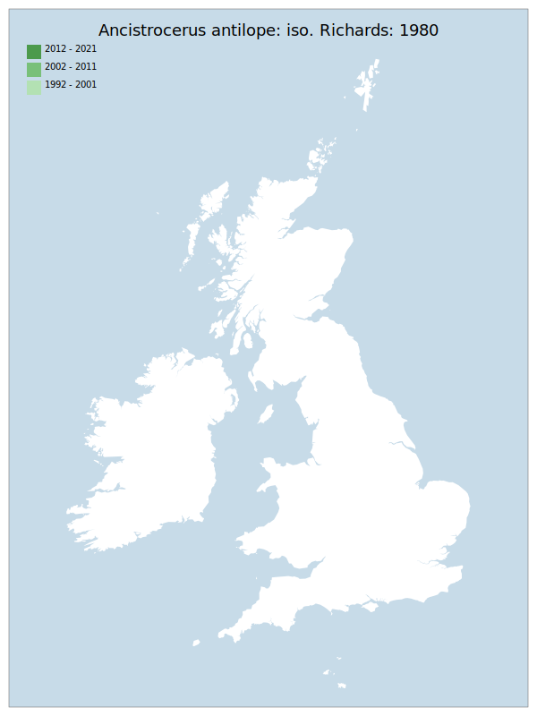

# Ancistrocerus antilope: iso. Richards: 1980

## Provisional Red List status: RE
- A2

## Red List Justification
*N/A*

### Narrative
Always a widespread but rarely recorded species in GB, the last confirmed record of this eumenine wasp pre-dates the current Red-list assessment period (17/06/1989). There is a reported specimen from Greenwich Peninsula Ecology Park from surveys conducted by David Notton for British Museum for Natural History (BMNH; 2016-17 – Steven Falk internal review comment). David Notton passed all Vespidae specimens to Michael Archer for determination, then deposited them in the BNHM collection. The specimen can’t be traced (Gavin Broad, Senior Curator at BNHM, pers. comm. and Jaswinder Boparai, volunteer curator at BNHM pers. comm.). This, combined with targeted, unsuccessful survey effort in other areas during the Red List period, leads to evaluation as RE.

### Quantified Attributes
|Attribute|Result|
|---|---|
|Synanthropy|No|
|Vagrancy|No|
|Colonisation|No|
|Nomenclature|No|

## National Rarity
Nationally Extinct (*EX*)

## Distribution map

## Red List QA Metrics
### Decade
| Slice | # Records | AoO (sq km) | dEoO (sq km) |BU%A |
|---|---|---|---|---|
|1992 - 2001||||%|
|2002 - 2011||||%|
|2012 - 2021||||%|

### 5-year
| Slice | # Records | AoO (sq km) | dEoO (sq km) |BU%A |
|---|---|---|---|---|
|2002 - 2006||||%|
|2007 - 2011||||%|
|2012 - 2016||||%|
|2017 - 2021||||%|

### Criterion A2 (Statistical)
|Attribute|Assessment|Value|Accepted|Justification
|---|---|---|---|---|
|Raw record count|DD|%|Yes||
|AoO|DD|%|Yes||
|dEoO|DD|%|Yes||
|Bayesian|DD|*NaN*%|Yes||
|Bayesian (Expert interpretation)|DD|*N/A*|Yes||

### Criterion A2 (Expert Inference)
|Attribute|Assessment|Value|Accepted|Justification
|---|---|---|---|---|
|Internal review|RE|Last seen 1989-06-17. Has been subject to targeted survey effort 1989 - modern.|Yes||

### Criterion A3 (Expert Inference)
|Attribute|Assessment|Value|Accepted|Justification
|---|---|---|---|---|
|Internal review|DD||Yes||

### Criterion B
|Criterion| Value|
|---|---|
|Locations||
|Subcriteria||
|Support||

#### B1
|Attribute|Assessment|Value|Accepted|Justification
|---|---|---|---|---|
|MCP|DD||Yes||

#### B2
|Attribute|Assessment|Value|Accepted|Justification
|---|---|---|---|---|
|Tetrad|DD||Yes||

### Criterion D2
|Attribute|Assessment|Value|Accepted|Justification
|---|---|---|---|---|
|D2|DD|*N/A*|Yes||

### Wider Review
|  |  |
|---|---|
|**Action**|Maintained|
|**Reviewed Status**|RE|
|**Justification**||

## National Rarity QA Metrics
|Attribute|Value|
|---|---|
|Hectads||
|Calculated||
|Final|EX|
|Moderation support||
