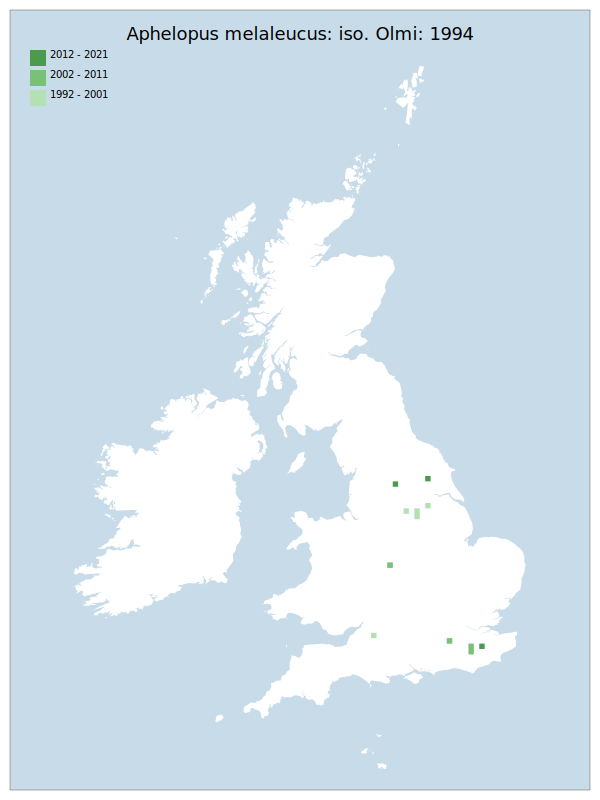

---
    parent: wasp
    ---

    # Aphelopus melaleucus: iso. Olmi: 1994

## Provisional Red List status: LC
- B1 a,b, 
- B2 a,b, 
- D2

## Red List Justification
*N/A*
### Narrative
This species has been recorded from Devon to Kent and north to Cheshire and Co. Durham in England, Wales (Denbighshire, Swansea) and is widespread in Scotland from Dumfries & Galloway to Highlands. A parasitoid/predator on Leaf Hoppers Typhloybinae (Cicadellidae (Leafhoppers) and hosts from GB include Alnetoidea almeti (Dahlbom), Dryocyha carri (Edwards), Edwardsiana avellanae (Edwards), E. flavescens (Fabricius), E. geometrica (Schanck), E. hippocastoni (Edwards), E. rosae (Linnaeus), Fagocyba crueata ((Herrich-Schäffer), Ossiannilssonola callosa (Thon),Riautiana ulmi (Linnaeus), Typhlocyba quercus (Fabricius) and Typhlocyba crataegi (Douglas).

Insufficient data were available to reach a supportable conclusion on the threat status for this taxon.
### Quantified Attributes
|Attribute|Result|
|---|---|
|Synanthropy|No|
|Vagrancy|No|
|Colonisation|No|
|Nomenclature|No|

## National Rarity
Nationally Rare (*NR*)

## National Presence
|Country|Presence
|---|:-:|
|England|Y|
|Scotland|N|
|Wales|N|

## Distribution map

## Red List QA Metrics
### Decade
| Slice | # Records | AoO (sq km) | dEoO (sq km) |BU%A |
|---|---|---|---|---|
|1992 - 2001|5|20|17848|39%|
|2002 - 2011|5|16|17851|39%|
|2012 - 2021|4|12|18557|41%|
### 5-year
| Slice | # Records | AoO (sq km) | dEoO (sq km) |BU%A |
|---|---|---|---|---|
|2002 - 2006|5|16|17851|39%|
|2007 - 2011|0|0|0|0%|
|2012 - 2016|2|8|11863|26%|
|2017 - 2021|2|4|6694|14%|
### Criterion A2 (Statistical)
|Attribute|Assessment|Value|Accepted|Justification
|---|---|---|---|---|
|Raw record count|LC|0%|No|Insufficient data|
|AoO|EN|-50%|No|Insufficient data|
|dEoO|VU|-44%|No|Insufficient data|
|Bayesian|DD|*NaN*%|Yes||
|Bayesian (Expert interpretation)|DD|*N/A*|Yes||
### Criterion A2 (Expert Inference)
|Attribute|Assessment|Value|Accepted|Justification
|---|---|---|---|---|
|Internal review|DD||Yes||
### Criterion A3 (Expert Inference)
|Attribute|Assessment|Value|Accepted|Justification
|---|---|---|---|---|
|Internal review|DD||Yes||
### Criterion B
|Criterion| Value|
|---|---|
|Locations|>10|
|Subcriteria||
|Support||
#### B1
|Attribute|Assessment|Value|Accepted|Justification
|---|---|---|---|---|
|MCP|LC|44700|Yes||
#### B2
|Attribute|Assessment|Value|Accepted|Justification
|---|---|---|---|---|
|Tetrad|LC|48|Yes||
### Criterion D2
|Attribute|Assessment|Value|Accepted|Justification
|---|---|---|---|---|
|D2|LC|*N/A*|Yes||
### Wider Review
|  |  |
|---|---|
|**Action**|Re-assessed|
|**Reviewed Status**|DD|
|**Justification**|Records of this genus are sporadic and tend to follow the activity of individual recorders / identifiers rather than any true distribution. Details of biology and ecology are imperfectly known.|

## National Rarity QA Metrics
|Attribute|Value|
|---|---|
|Hectads|12|
|Calculated|NR|
|Final|NR|
|Moderation support||

