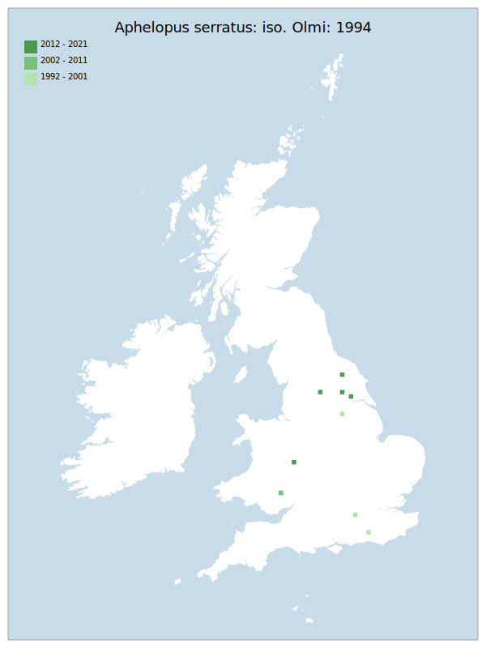

# Aphelopus serratus: iso. Olmi: 1994

## Provisional Red List status: LC
- B1ab
- B2ab
- D2

## Red List Justification
*N/A*

### Narrative
Although more widely recorded than other species of the genus (records from Sussex to Kent and north to Lancashire and Yorkshire plus Scotland - Dumfries & Galloway, Lanarkshire, Highlands) most records pre-date the assessment period. Biology has been well studied with host in GB from Typhloybinae, Cicadellidae (leaf hoppers). Recorded hosts for England are Alebra albastriella (Fallén), Kybos smaragdulus (Fallén), Alnetoidia alneti (Dahlbom), Eupterycyba jacunda (Herrich-Schäffer), Fagocyba cruenta (Herrich-Schäffer), Lindllergina aurovittata (Douglas), Ribautiana tenerrima (Herrich-Schäffer), Typhlocyba quercus (Fabricius).

Insufficient data were available to reach a supportable conclusion on the threat status for this taxon.

### Quantified Attributes
|Attribute|Result|
|---|---|
|Synanthropy|No|
|Vagrancy|No|
|Colonisation|No|
|Nomenclature|No|

## National Rarity
Insufficient Data (*ID*)

## National Presence
|Country|Presence
|---|:-:|
|England|Y|
|Scotland|N|
|Wales|Y|

## Distribution map

## Red List QA Metrics
### Decade
| Slice | # Records | AoO (sq km) | dEoO (sq km) |BU%A |
|---|---|---|---|---|
|1992 - 2001|4|16|17796|44%|
|2002 - 2011|1|4|6694|16%|
|2012 - 2021|4|16|18920|47%|

### 5-year
| Slice | # Records | AoO (sq km) | dEoO (sq km) |BU%A |
|---|---|---|---|---|
|2002 - 2006|1|4|6694|16%|
|2007 - 2011|0|0|0|0%|
|2012 - 2016|1|4|6694|16%|
|2017 - 2021|3|12|16923|42%|

### Criterion A2 (Statistical)
|Attribute|Assessment|Value|Accepted|Justification
|---|---|---|---|---|
|Raw record count|LC|200%|No|Insufficient data|
|AoO|LC|200%|No|Insufficient data|
|dEoO|LC|153%|No|Insufficient data|
|Bayesian|DD|*NaN*%|Yes||
|Bayesian (Expert interpretation)|DD|*N/A*|Yes||

### Criterion A2 (Expert Inference)
|Attribute|Assessment|Value|Accepted|Justification
|---|---|---|---|---|
|Internal review|DD||Yes||

### Criterion A3 (Expert Inference)
|Attribute|Assessment|Value|Accepted|Justification
|---|---|---|---|---|
|Internal review|DD||Yes||

### Criterion B
|Criterion| Value|
|---|---|
|Locations|>10|
|Subcriteria||
|Support||

#### B1
|Attribute|Assessment|Value|Accepted|Justification
|---|---|---|---|---|
|MCP|LC|41950|Yes||

#### B2
|Attribute|Assessment|Value|Accepted|Justification
|---|---|---|---|---|
|Tetrad|LC|36|Yes||

### Criterion D2
|Attribute|Assessment|Value|Accepted|Justification
|---|---|---|---|---|
|D2|LC|*N/A*|Yes||

### Wider Review
|  |  |
|---|---|
|**Action**|Re-assessed|
|**Reviewed Status**|DD|
|**Justification**|Records of this genus are sporadic and tend to follow the activity of individual recorders / identifiers rather than any true distribution. Details of biology and ecology are imperfectly known.|

## National Rarity QA Metrics
|Attribute|Value|
|---|---|
|Hectads|8|
|Calculated|NR|
|Final|ID|
|Moderation support||
