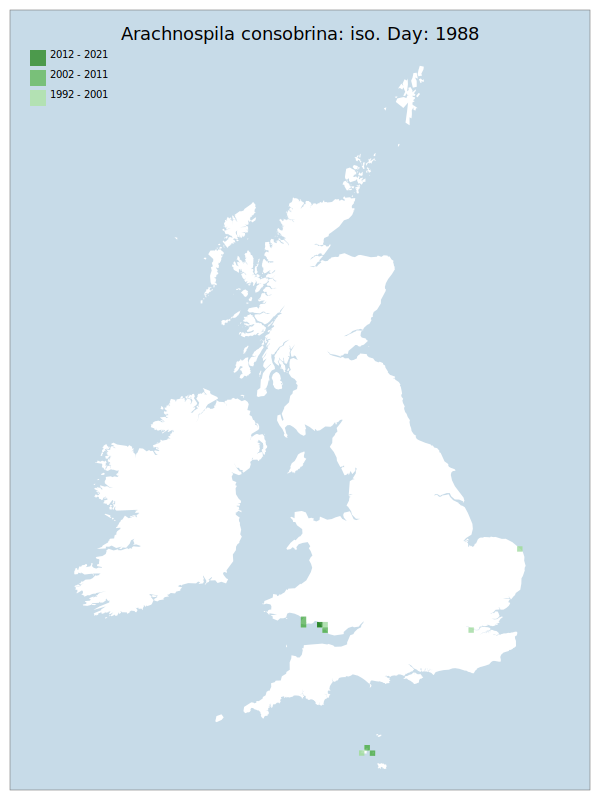

---
    parent: wasp
    ---

    # Arachnospila consobrina: iso. Day: 1988

## Provisional Red List status: EN
- B2 a,b, iii

## Red List Justification
The majority of the known population exists in one small area which is vulnerable to a single storm surge.
### Narrative
This fossorial (ground digging) spider-hunting wasp has always been very localised on the coastal areas of GB. There are old records for the east and southeast coast, but the v. few modern records are very localised in South Wales - most of the known population exists in one small area which is vulnerable to a single storm surge and as such it has been assessed as VU.

No assessment was possible under Criterion A due insufficient data. The EoO (32,650 km²) exceeds the 20,000 km² VU threshold for criterion B1 and the AoO (36 km²) is below the 500 km² EN threshold for criterion B2. There are fewer or equal to 5 locations, and continuing/projected decline in extent of occurrence, area of occupancy, number of locations/subpopulations, number of individuals, and area, extent & quality of habitat. For Criterion D2, the number of locations was equal to or fewer than 5, and there is a plausible threat of rapid habitat loss that could drive the taxon to CR or RE in a very short time. No information was available on population size to inform assessments against Criteria C and D1; nor were any life-history models available to inform an assessment against Criterion E.
### Quantified Attributes
|Attribute|Result|
|---|---|
|Synanthropy|No|
|Vagrancy|No|
|Colonisation|No|
|Nomenclature|No|

## National Rarity
Nationally Rare (*NR*)

## National Presence
|Country|Presence
|---|:-:|
|England|Y|
|Scotland|N|
|Wales|Y|

## Distribution map

## Red List QA Metrics
### Decade
| Slice | # Records | AoO (sq km) | dEoO (sq km) |BU%A |
|---|---|---|---|---|
|1992 - 2001|11|28|24349|97%|
|2002 - 2011|3|12|11157|44%|
|2012 - 2021|1|4|6694|26%|
### 5-year
| Slice | # Records | AoO (sq km) | dEoO (sq km) |BU%A |
|---|---|---|---|---|
|2002 - 2006|3|12|11157|44%|
|2007 - 2011|0|0|0|0%|
|2012 - 2016|0|0|0|0%|
|2017 - 2021|1|4|6694|26%|
### Criterion A2 (Statistical)
|Attribute|Assessment|Value|Accepted|Justification
|---|---|---|---|---|
|Raw record count|LC|?%|No|Insufficient data|
|AoO|LC|?%|No|Insufficient data|
|dEoO|LC|?%|No|Insufficient data|
|Bayesian|DD|*NaN*%|Yes||
|Bayesian (Expert interpretation)|DD|*N/A*|Yes||
### Criterion A2 (Expert Inference)
|Attribute|Assessment|Value|Accepted|Justification
|---|---|---|---|---|
|Internal review|DD||Yes||
### Criterion A3 (Expert Inference)
|Attribute|Assessment|Value|Accepted|Justification
|---|---|---|---|---|
|Internal review|DD||Yes||
### Criterion B
|Criterion| Value|
|---|---|
|Locations|<=5|
|Subcriteria|iii|
|Support|Majority of known population exists in one small area which is vulnerable to a single storm surge|
#### B1
|Attribute|Assessment|Value|Accepted|Justification
|---|---|---|---|---|
|MCP|LC|32650|Yes||
#### B2
|Attribute|Assessment|Value|Accepted|Justification
|---|---|---|---|---|
|Tetrad|EN|36|Yes||
### Criterion D2
|Attribute|Assessment|Value|Accepted|Justification
|---|---|---|---|---|
|D2|VU|*N/A*|Yes||
### Wider Review
|  |  |
|---|---|
|**Action**|Moderated|
|**Reviewed Status**|VU|
|**Justification**||

## National Rarity QA Metrics
|Attribute|Value|
|---|---|
|Hectads|7|
|Calculated|NR|
|Final|NR|
|Moderation support||

