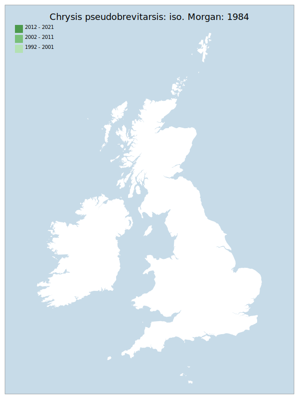

---
    parent: wasp
    ---

    # Chrysis pseudobrevitarsis: iso. Morgan: 1984

## Provisional Red List status: RE
- A2 

## Red List Justification
*N/A*
### Narrative
This “Ruby-tailed wasp” has much in common with Chrysis longula, being very sparingly recorded (Devon, Surrey, Kent and Northamptonshire), sharing the same, main eumenine host (the RE Ancistrocerus antilope – with another partial host of the same sub-family, Euodynerus quadrifasciatus considered extremely rare) and being one of only two relatively large species in the genus (in the UK). It was last recorded, with A. antilope, in 1989 (Steven Falk - internal review – location not stated). As it was always v. restricted and seldom found – and has not been found since – it seems reasonable to evaluate as RE.

### Quantified Attributes
|Attribute|Result|
|---|---|
|Synanthropy|No|
|Vagrancy|No|
|Colonisation|No|
|Nomenclature|No|

## National Rarity
Nationally Extinct (*EX*)

## Distribution map

## Red List QA Metrics
### Decade
| Slice | # Records | AoO (sq km) | dEoO (sq km) |BU%A |
|---|---|---|---|---|
|1992 - 2001||||%|
|2002 - 2011||||%|
|2012 - 2021||||%|
### 5-year
| Slice | # Records | AoO (sq km) | dEoO (sq km) |BU%A |
|---|---|---|---|---|
|2002 - 2006||||%|
|2007 - 2011||||%|
|2012 - 2016||||%|
|2017 - 2021||||%|
### Criterion A2 (Statistical)
|Attribute|Assessment|Value|Accepted|Justification
|---|---|---|---|---|
|Raw record count|DD|%|Yes||
|AoO|DD|%|Yes||
|dEoO|DD|%|Yes||
|Bayesian|DD|*NaN*%|Yes||
|Bayesian (Expert interpretation)|DD|*N/A*|Yes||
### Criterion A2 (Expert Inference)
|Attribute|Assessment|Value|Accepted|Justification
|---|---|---|---|---|
|Internal review|RE|Last seen in 1989-06-17. Has been subject to targeted survey effort 1989 - modern. Partial host (Ancistrocerus antilope: iso. Richards: 1980) is also considered RE. Other partial host (Euodynerus quadrifasciatus: iso. Early: 2018) is considered extremely rare (DD & nationally rare).|Yes||
### Criterion A3 (Expert Inference)
|Attribute|Assessment|Value|Accepted|Justification
|---|---|---|---|---|
|Internal review|DD||Yes||
### Criterion B
|Criterion| Value|
|---|---|
|Locations||
|Subcriteria||
|Support||
#### B1
|Attribute|Assessment|Value|Accepted|Justification
|---|---|---|---|---|
|MCP|DD||Yes||
#### B2
|Attribute|Assessment|Value|Accepted|Justification
|---|---|---|---|---|
|Tetrad|DD||Yes||
### Criterion D2
|Attribute|Assessment|Value|Accepted|Justification
|---|---|---|---|---|
|D2|DD|*N/A*|Yes||
### Wider Review
|  |  |
|---|---|
|**Action**|Maintained|
|**Reviewed Status**|RE|
|**Justification**||

## National Rarity QA Metrics
|Attribute|Value|
|---|---|
|Hectads||
|Calculated||
|Final|EX|
|Moderation support||

