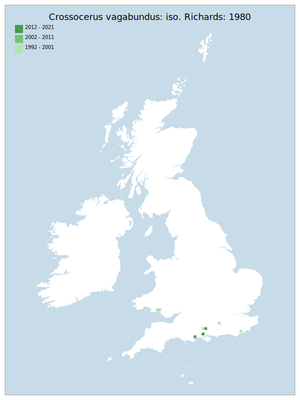

# Crossocerus vagabundus: iso. Richards: 1980

## Provisional Red List status: VU
- B1ab(iii)
- B2ab(iii)

## Red List Justification
Removal of standing dead wood is having negative impact on this taxon.

### Narrative
This dead wood nesting, cranefly hunting solitary wasp was historically scarce – recorded sparingly across southern England, from Dorset to North Lincolnshire – though with modern records restricted to South Hampshire, Surrey and South Wales. Although removal of standing dead wood is undoubtedly having a negative impact on this taxon there are likely to be other (yet unknown) factors involved in it’s decline.

No assessment was possible under Criterion A due insufficient data. The EoO (15, 800 km²) is below the 20,000 km² VU threshold for criterion B1 and the AoO (40 km²) is below the 500 km² EN threshold for criterion B2. There are fewer or equal to 5 locations (VU), and there is observed or projected decline in the area, extent & quality of habitat. For Criterion D2, the number of locations was fewer or equal to 5, but there is no plausible threat of rapid habitat loss that could drive the taxon to CR or RE in a very short time. No information was available on population size to inform assessments against Criteria C and D1; nor were any life-history models available to inform an assessment against Criterion E.

### Quantified Attributes
|Attribute|Result|
|---|---|
|Synanthropy|No|
|Vagrancy|No|
|Colonisation|No|
|Nomenclature|No|

## National Rarity
Nationally Rare (*NR*)

## National Presence
|Country|Presence
|---|:-:|
|England|Y|
|Scotland|N|
|Wales|Y|

## Distribution map

## Red List QA Metrics
### Decade
| Slice | # Records | AoO (sq km) | dEoO (sq km) |BU%A |
|---|---|---|---|---|
|1992 - 2001|13|28|27938|90%|
|2002 - 2011|4|8|6694|21%|
|2012 - 2021|10|12|11605|37%|

### 5-year
| Slice | # Records | AoO (sq km) | dEoO (sq km) |BU%A |
|---|---|---|---|---|
|2002 - 2006|0|0|0|0%|
|2007 - 2011|4|8|6694|21%|
|2012 - 2016|2|4|6694|21%|
|2017 - 2021|8|8|8753|28%|

### Criterion A2 (Statistical)
|Attribute|Assessment|Value|Accepted|Justification
|---|---|---|---|---|
|Raw record count|LC|300%|No|Insufficient data|
|AoO|LC|100%|No|Insufficient data|
|dEoO|LC|31%|No|Insufficient data|
|Bayesian|DD|*NaN*%|Yes||
|Bayesian (Expert interpretation)|DD|*N/A*|Yes||

### Criterion A2 (Expert Inference)
|Attribute|Assessment|Value|Accepted|Justification
|---|---|---|---|---|
|Internal review|DD||Yes||

### Criterion A3 (Expert Inference)
|Attribute|Assessment|Value|Accepted|Justification
|---|---|---|---|---|
|Internal review|DD||Yes||

### Criterion B
|Criterion| Value|
|---|---|
|Locations|<=10|
|Subcriteria|iii|
|Support|Removal of standing dead wood is having negative impact on this taxon|

#### B1
|Attribute|Assessment|Value|Accepted|Justification
|---|---|---|---|---|
|MCP|VU|15800|Yes||

#### B2
|Attribute|Assessment|Value|Accepted|Justification
|---|---|---|---|---|
|Tetrad|VU|40|Yes||

### Criterion D2
|Attribute|Assessment|Value|Accepted|Justification
|---|---|---|---|---|
|D2|LC|*N/A*|Yes||

### Wider Review
|  |  |
|---|---|
|**Action**|Maintained|
|**Reviewed Status**|VU|
|**Justification**||

## National Rarity QA Metrics
|Attribute|Value|
|---|---|
|Hectads|8|
|Calculated|NR|
|Final|NR|
|Moderation support||
