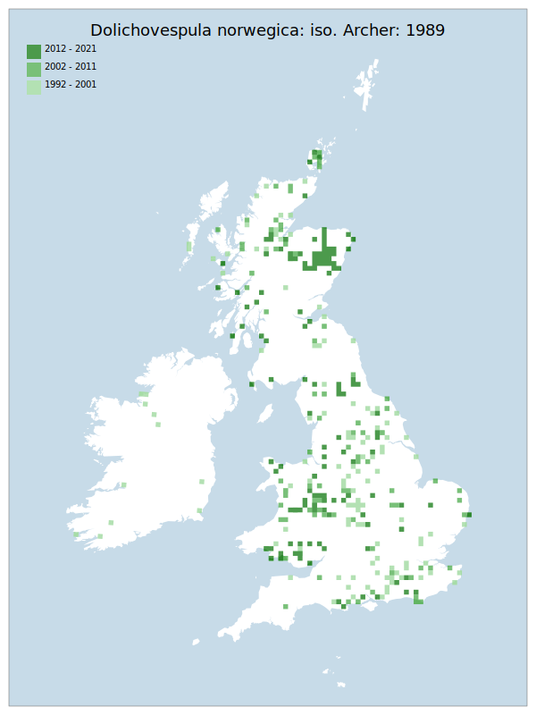

# Dolichovespula norwegica: iso. Archer: 1989

## Provisional Red List status: NT
- A2 b,c

## Red List Justification
Targeted survey effort in NE Scotland distort figures.

Observed declines in abundance during survey work, particularly in southern England, but also stretching to Lancashire.
### Narrative
This social wasp, closely associated with heathland / moorland (less so coastal areas), has heavily declined in recent decades in southern England (particularly) and central England. Targeted surveying has been carried out in northeast Scotland where it appears to be stable or even increasing, in contrast to the situation for the remainder of GB.

The data are too volatile to be used for statistical assessment under Criterion A, primarily as a result of targeted survey effort in Scotland causing significant distortion in volume of data. Expert inference assessed this taxon as NT due to patterns of recent, ongoing decline observed in recent data that the Red List has no standardised provision to capture. These patterns of decline were observed in both the BWARS and iRecord datasets, with surprising clarity. The EoO (342,900 km^2) exceeds the 20,000 km^2 VU threshold for criterion B1 and does not satisfy sufficient subcriteria to reach a threat status, and the AoO (1,936 km^2) is below the 2,000 km^2 VU threshold for criterion B2 but does not satisfy sufficient subcriteria to reach a threat status. For Criterion D2, the number of locations was greater than 5 and there is no plausible threat that could drive the taxon to CR or RE in a very short time. No information was available on population size to inform assessments against Criteria C and D1; nor were any life-history models available to inform an assessment against Criterion E.
### Quantified Attributes
|Attribute|Result|
|---|---|
|Synanthropy|No|
|Vagrancy|No|
|Colonisation|No|
|Nomenclature|No|

## National Rarity
Nationally Frequent (*NF*)

## National Presence
|Country|Presence
|---|:-:|
|England|Y|
|Scotland|Y|
|Wales|Y|

## Distribution map

## Red List QA Metrics
### Decade
| Slice | # Records | AoO (sq km) | dEoO (sq km) |BU%A |
|---|---|---|---|---|
|1992 - 2001|246|680|263073|76%|
|2002 - 2011|187|492|257041|75%|
|2012 - 2021|305|832|249926|73%|
### 5-year
| Slice | # Records | AoO (sq km) | dEoO (sq km) |BU%A |
|---|---|---|---|---|
|2002 - 2006|107|252|192639|56%|
|2007 - 2011|80|256|176419|51%|
|2012 - 2016|81|208|143507|41%|
|2017 - 2021|224|636|216668|63%|
### Criterion A2 (Statistical)
|Attribute|Assessment|Value|Accepted|Justification
|---|---|---|---|---|
|Raw record count|LC|177%|No|Targeted survey effort in NE Scotland distorts figures|
|AoO|LC|206%|No|Targeted survey effort in NE Scotland distorts figures|
|dEoO|LC|51%|No|Targeted survey effort in NE Scotland distorts figures|
|Bayesian|LC|29%|No|Targeted survey effort in NE Scotland distorts figures|
|Bayesian (Expert interpretation)|DD|*N/A*|No|Targeted survey effort in NE Scotland distorts figures|
### Criterion A2 (Expert Inference)
|Attribute|Assessment|Value|Accepted|Justification
|---|---|---|---|---|
|Internal review|NT|Observed declines during survey work, particularly in southern England, also stretching to Lancashire.|Yes||
### Criterion A3 (Expert Inference)
|Attribute|Assessment|Value|Accepted|Justification
|---|---|---|---|---|
|Internal review|DD||Yes||
### Criterion B
|Criterion| Value|
|---|---|
|Locations|>10|
|Subcriteria||
|Support||
#### B1
|Attribute|Assessment|Value|Accepted|Justification
|---|---|---|---|---|
|MCP|LC|342900|Yes||
#### B2
|Attribute|Assessment|Value|Accepted|Justification
|---|---|---|---|---|
|Tetrad|LC|1936|Yes||
### Criterion D2
|Attribute|Assessment|Value|Accepted|Justification
|---|---|---|---|---|
|D2|LC|*N/A*|Yes||
### Wider Review
|  |  |
|---|---|
|**Action**|Maintained|
|**Reviewed Status**|NT|
|**Justification**|Multiple sources have noted this to have declined over large areas. The decline is less than that of D. sylvestris, but iRecord data also reflects a lower volume of data in the area south of the Severn-Wash line.|

## National Rarity QA Metrics
|Attribute|Value|
|---|---|
|Hectads|362|
|Calculated|NF|
|Final|NF|
|Moderation support||

