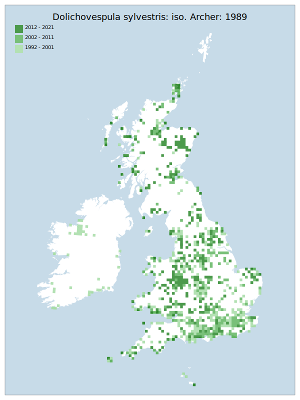

# Dolichovespula sylvestris: iso. Archer: 1989

## Provisional Red List status: NT
- A2bc

## Red List Justification
Data in the second time slice (2017-2021) is heavily biased by the addition of a number of records from north-east Scotland. These records are the result of a singular entomologist going on holiday.

In the same period, the area south of the Severn-Wash line has experienced a major loss in both number of records and number of tetrads. Given that this southern area has the greatest number and frequency of surveys, the absence is likely to be true.

### Narrative
Throughout the last decade, this social wasp (of no habitat affinity – habitats used include gardens) has dramatically decreased in southeast England (particularly) and elsewhere in GB, with its modern distribution considerably more fragmented. Given that the southern area of England has the greatest number and frequency of surveys, the absence is likely to be true. The reason for decline is unknown but could include climate instability.

The most threatening accepted population change estimate is -2.0% (tetrad area), which does not exceed the 30% decline required for qualification as VU under Criterion A. Expert inference assessed this taxon as VU due to patterns of recent, ongoing decline observed in recent data that the Red List has no standardised provision to capture. These patterns of decline were observed in both the BWARS and iRecord datasets, with surprising clarity. The EoO (438,800 km²) exceeds the 20,000 km² VU threshold for criterion B1 and does not satisfy sufficient subcriteria to reach a threat status, and the AoO (5,976 km²) exceeds the 2,000 km² VU threshold for criterion B2 and does not satisfy sufficient subcriteria to reach a threat status. For Criterion D2, the number of locations was greater than 5 and there is no plausible threat that could drive the taxon to CR or RE in a very short time. No information was available on population size to inform assessments against Criteria C and D1; nor were any life-history models available to inform an assessment against Criterion E.

### Quantified Attributes
|Attribute|Result|
|---|---|
|Synanthropy|No|
|Vagrancy|No|
|Colonisation|No|
|Nomenclature|No|

## National Rarity
Nationally Frequent (*NF*)

## National Presence
|Country|Presence
|---|:-:|
|England|Y|
|Scotland|Y|
|Wales|Y|

## Distribution map

## Red List QA Metrics
### Decade
| Slice | # Records | AoO (sq km) | dEoO (sq km) |BU%A |
|---|---|---|---|---|
|1992 - 2001|1259|2824|344775|84%|
|2002 - 2011|851|1980|339898|83%|
|2012 - 2021|665|1752|354274|86%|

### 5-year
| Slice | # Records | AoO (sq km) | dEoO (sq km) |BU%A |
|---|---|---|---|---|
|2002 - 2006|450|1140|296167|72%|
|2007 - 2011|401|980|261407|63%|
|2012 - 2016|292|860|298124|72%|
|2017 - 2021|373|972|293069|71%|

### Criterion A2 (Statistical)
|Attribute|Assessment|Value|Accepted|Justification
|---|---|---|---|---|
|Raw record count|LC|28%|Yes||
|AoO|LC|13%|Yes||
|dEoO|LC|-2%|Yes||
|Bayesian|LC|47%|No||
|Bayesian (Expert interpretation)|DD|*N/A*|Yes||

### Criterion A2 (Expert Inference)
|Attribute|Assessment|Value|Accepted|Justification
|---|---|---|---|---|
|Internal review|NT|Data in the second time slice (2017-2021) is heavily biased by the addition of a number of records from north-east Scotland. In the same period, the area south of the Severn-Wash line has experienced a major loss in both number of records and number of tetrads. Given that this southern area has the greatest number and frequency of surveys, the absence is likely to be true.|Yes||

### Criterion A3 (Expert Inference)
|Attribute|Assessment|Value|Accepted|Justification
|---|---|---|---|---|
|Internal review|DD||Yes||

### Criterion B
|Criterion| Value|
|---|---|
|Locations|>10|
|Subcriteria||
|Support||

#### B1
|Attribute|Assessment|Value|Accepted|Justification
|---|---|---|---|---|
|MCP|LC|438800|Yes||

#### B2
|Attribute|Assessment|Value|Accepted|Justification
|---|---|---|---|---|
|Tetrad|LC|5976|Yes||

### Criterion D2
|Attribute|Assessment|Value|Accepted|Justification
|---|---|---|---|---|
|D2|LC|*N/A*|Yes||

### Wider Review
|  |  |
|---|---|
|**Action**|Maintained|
|**Reviewed Status**|NT|
|**Justification**|Further analysis of the data, including that from iRecord, shows a very distinct lack of records from south of the Wash-Severn line. This variation is far past the point where it could be considered a year-on-year fluctuation.|

## National Rarity QA Metrics
|Attribute|Value|
|---|---|
|Hectads|828|
|Calculated|NF|
|Final|NF|
|Moderation support||
