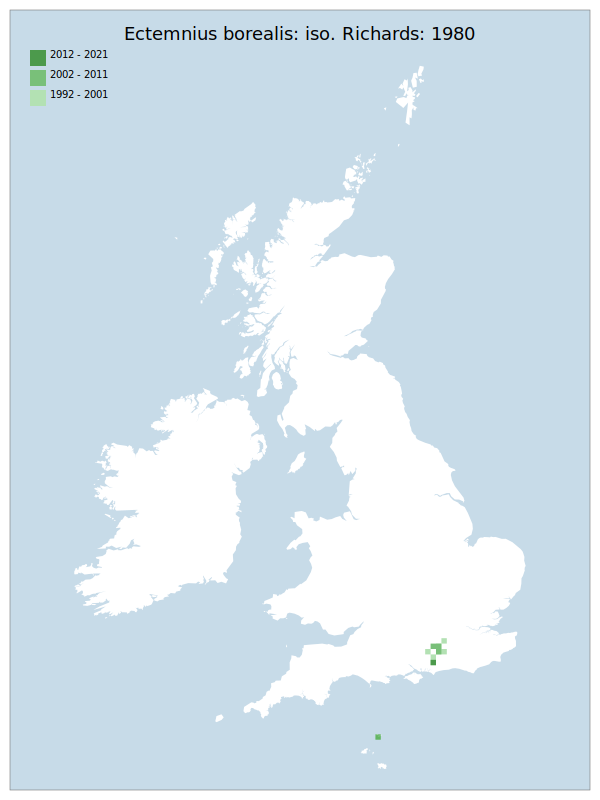

---
    parent: wasp
    ---

    # Ectemnius borealis: iso. Richards: 1980

## Provisional Red List status: LC
- A2 b,c
- B1 a,b, 
- B2 a,b, 
- D2

## Red List Justification
*N/A*
### Narrative
The most restricted species of this genus of solitary wasps (which often nest in dead wood or stems and hunt Diptera); discovered in 1972 and known only from east Hampshire (north to the Surrey border) and West Sussex. No threat could be established to warrant the use of threat criteria under assessment. However, expert inference suggests a level of decline that matches their experiences.

The are insufficient data to statistically assess this taxon under Criterion A. Expert inference assessed this taxon as LC in the absence of specific decline metrics. The EoO (2,200 km²) is below the 20,000 km² VU threshold for criterion B1 but does not satisfy sufficient subcriteria to reach a threat status, and the AoO (72 km²) is below the 500 km² EN threshold for criterion B2 but does not satisfy sufficient subcriteria to reach a threat status. For Criterion D2, the number of locations was greater than 5 and there is no plausible threat that could drive the taxon to CR or RE in a very short time. No information was available on population size to inform assessments against Criteria C and D1; nor were any life-history models available to inform an assessment against Criterion E.

This taxon was moderated to NT during peer review where the majority of respondants agreed that this taxon had become far harder to find during field survey.
### Quantified Attributes
|Attribute|Result|
|---|---|
|Synanthropy|No|
|Vagrancy|No|
|Colonisation|No|
|Nomenclature|No|

## National Rarity
Nationally Rare (*NR*)

## National Presence
|Country|Presence
|---|:-:|
|England|Y|
|Scotland|N|
|Wales|N|

## Distribution map

## Red List QA Metrics
### Decade
| Slice | # Records | AoO (sq km) | dEoO (sq km) |BU%A |
|---|---|---|---|---|
|1992 - 2001|37|52|12165|81%|
|2002 - 2011|3|12|8305|55%|
|2012 - 2021|3|12|10348|69%|
### 5-year
| Slice | # Records | AoO (sq km) | dEoO (sq km) |BU%A |
|---|---|---|---|---|
|2002 - 2006|3|12|8305|55%|
|2007 - 2011|0|0|0|0%|
|2012 - 2016|1|4|6694|45%|
|2017 - 2021|2|8|10348|69%|
### Criterion A2 (Statistical)
|Attribute|Assessment|Value|Accepted|Justification
|---|---|---|---|---|
|Raw record count|LC|100%|No|Insufficient data|
|AoO|LC|100%|No|Insufficient data|
|dEoO|LC|55%|No|Insufficient data|
|Bayesian|DD|*NaN*%|Yes||
|Bayesian (Expert interpretation)|DD|*N/A*|Yes||
### Criterion A2 (Expert Inference)
|Attribute|Assessment|Value|Accepted|Justification
|---|---|---|---|---|
|Internal review|LC||Yes||
### Criterion A3 (Expert Inference)
|Attribute|Assessment|Value|Accepted|Justification
|---|---|---|---|---|
|Internal review|DD||Yes||
### Criterion B
|Criterion| Value|
|---|---|
|Locations|>10|
|Subcriteria||
|Support||
#### B1
|Attribute|Assessment|Value|Accepted|Justification
|---|---|---|---|---|
|MCP|LC|2200|Yes||
#### B2
|Attribute|Assessment|Value|Accepted|Justification
|---|---|---|---|---|
|Tetrad|LC|72|Yes||
### Criterion D2
|Attribute|Assessment|Value|Accepted|Justification
|---|---|---|---|---|
|D2|LC|*N/A*|Yes||
### Wider Review
|  |  |
|---|---|
|**Action**|Moderated|
|**Reviewed Status**|NT|
|**Justification**|No threat could be established to warrant the use of threat criteria under assessment. However, expert inference suggests a level of decline that matches their experiences.|

## National Rarity QA Metrics
|Attribute|Value|
|---|---|
|Hectads|9|
|Calculated|NR|
|Final|NR|
|Moderation support||

