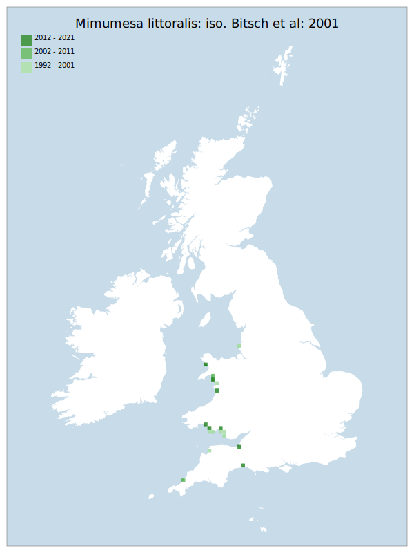

# Mimumesa littoralis: iso. Bitsch et al: 2001

## Provisional Red List status: VU
- B2 a,b, iii

## Red List Justification
The major part of population lives in areas at risk of damage by major storm surges
### Narrative
Since the early assessment nomenclatural split of M. littoralis and M. unicolor, the distribution of this stem / root / ground nesting wasp is more clearly defined. Most British records originate from dune systems, where the species is associated with the dry marram zone of  “white dune” areas. The more recently found Charmouth-Lyme Regis population appears to be associated with typical undercliff habitats: damp, bare clay with sparse vegetation and seepages supporting common reed. The major (west coast – particularly Wales) population lives in areas at risk of damage by major storm surges.

The most threatening accepted population change estimate is -20.0% (tetrad area), which does not exceed the 30% decline required for qualification as VU under Criterion A. The EoO (43,550 km²) exceeds the 20,000 km² VU threshold for criterion B1 and does not satisfy sufficient subcriteria to reach a threat status, and the AoO (108 km²) is below the 500 km² EN threshold for criterion B2. There are assessed to be fewer or equal to 10 locations (VU) and there is continuing decline observed & projected to the area/extent/quality of habitat. The end result is an assessment of VU under B. For Criterion D2, the number of locations was greater than 5 and there is no plausible threat that could drive the taxon to CR or RE in a very short time. No information was available on population size to inform assessments against Criteria C and D1; nor were any life-history models available to inform an assessment against Criterion E.
### Quantified Attributes
|Attribute|Result|
|---|---|
|Synanthropy|No|
|Vagrancy|No|
|Colonisation|No|
|Nomenclature|No|

## National Rarity
Nationally Scarce (*NS*)

## National Presence
|Country|Presence
|---|:-:|
|England|Y|
|Scotland|N|
|Wales|Y|

## Distribution map

## Red List QA Metrics
### Decade
| Slice | # Records | AoO (sq km) | dEoO (sq km) |BU%A |
|---|---|---|---|---|
|1992 - 2001|21|64|38614|72%|
|2002 - 2011|16|40|23838|44%|
|2012 - 2021|11|36|34424|64%|
### 5-year
| Slice | # Records | AoO (sq km) | dEoO (sq km) |BU%A |
|---|---|---|---|---|
|2002 - 2006|8|20|20082|37%|
|2007 - 2011|8|24|17143|32%|
|2012 - 2016|6|20|24059|45%|
|2017 - 2021|5|16|16243|30%|
### Criterion A2 (Statistical)
|Attribute|Assessment|Value|Accepted|Justification
|---|---|---|---|---|
|Raw record count|LC|-17%|Yes||
|AoO|LC|-20%|Yes||
|dEoO|VU|-32%|No|Insufficient data|
|Bayesian|DD|*NaN*%|Yes||
|Bayesian (Expert interpretation)|DD|*N/A*|Yes||
### Criterion A2 (Expert Inference)
|Attribute|Assessment|Value|Accepted|Justification
|---|---|---|---|---|
|Internal review|LC||Yes||
### Criterion A3 (Expert Inference)
|Attribute|Assessment|Value|Accepted|Justification
|---|---|---|---|---|
|Internal review|NT|Major part of population lives in areas at risk of damage by major storm surges|Yes||
### Criterion B
|Criterion| Value|
|---|---|
|Locations|<=10|
|Subcriteria|iii|
|Support|Major part of population lives in areas at risk of damage by major storm surges. (Dune/slumping cliff - coastal edges)|
#### B1
|Attribute|Assessment|Value|Accepted|Justification
|---|---|---|---|---|
|MCP|LC|43550|Yes||
#### B2
|Attribute|Assessment|Value|Accepted|Justification
|---|---|---|---|---|
|Tetrad|VU|108|Yes||
### Criterion D2
|Attribute|Assessment|Value|Accepted|Justification
|---|---|---|---|---|
|D2|LC|*N/A*|Yes||
### Wider Review
|  |  |
|---|---|
|**Action**|Maintained|
|**Reviewed Status**|VU|
|**Justification**||

## National Rarity QA Metrics
|Attribute|Value|
|---|---|
|Hectads|19|
|Calculated|NS|
|Final|NS|
|Moderation support||

