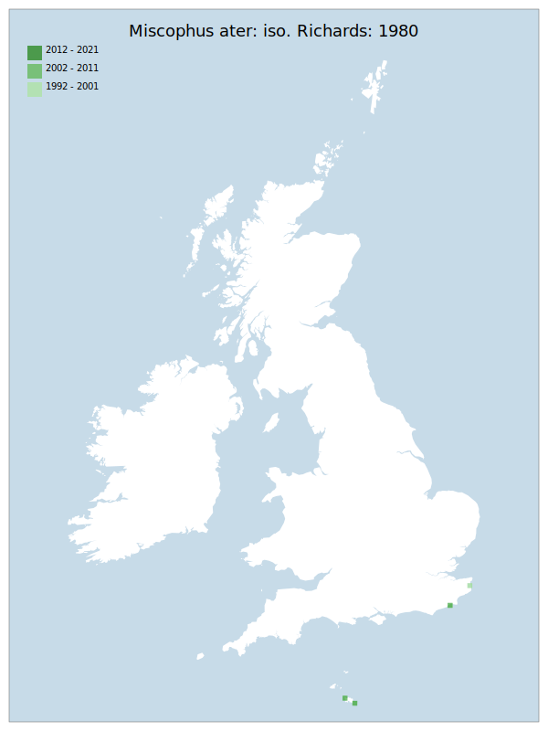

# Miscophus ater: iso. Richards: 1980

## Provisional Red List status: NT
- D2

## Red List Justification
Both populations exist on narrow strips of coastal land. Both locations are highly vulnerable to the same large storm surge, with little potential surrounding habitat to retreat to.

### Narrative
This small, spider-hunting wasp black wasp - not a pompilid wasp but a crabronid wasp predator of smaller spiders than pompilids – is restricted to two populations on coastal dunes in Kent and East Sussex.  Both populations exist on narrow strips of coastal land. Both locations are highly vulnerable to the same large storm surge, with little potential surrounding habitat to retreat to.

No assessment was possible under Criterion A due insufficient data. The EoO (900 km²) is below the 5,000 km² EN threshold for criterion B1 and the AoO (8 km²) is below the 10 km² CR threshold for criterion B2. There are fewer or equal to 5 locations, but no evidence of any specific threats to area, extent, or habitat. This may be a lack of knowledge rather than a true absence. For Criterion D2, the number of locations was fewer or equal to 5, but there is no plausible threat of rapid habitat loss that could drive the taxon to CR or RE in a very short time. No information was available on population size to inform assessments against Criteria C and D1; nor were any life-history models available to inform an assessment against Criterion E.

This taxon was moderated from LC to NT during peer review, with multiple reviewers believing that the taxon should be assessed at a higher threat status than it currently is. However, under the Red List guidance and current knowledge, a higher threat status is impossible to obtain.

### Quantified Attributes
|Attribute|Result|
|---|---|
|Synanthropy|No|
|Vagrancy|No|
|Colonisation|No|
|Nomenclature|No|

## National Rarity
Nationally Rare (*NR*)

## National Presence
|Country|Presence
|---|:-:|
|England|Y|
|Scotland|N|
|Wales|N|

## Distribution map

## Red List QA Metrics
### Decade
| Slice | # Records | AoO (sq km) | dEoO (sq km) |BU%A |
|---|---|---|---|---|
|1992 - 2001|5|8|11591|100%|
|2002 - 2011|1|4|6694|57%|
|2012 - 2021|0|0|0|0%|

### 5-year
| Slice | # Records | AoO (sq km) | dEoO (sq km) |BU%A |
|---|---|---|---|---|
|2002 - 2006|0|0|0|0%|
|2007 - 2011|1|4|6694|57%|
|2012 - 2016|0|0|0|0%|
|2017 - 2021|0|0|0|0%|

### Criterion A2 (Statistical)
|Attribute|Assessment|Value|Accepted|Justification
|---|---|---|---|---|
|Raw record count|LC|?%|No|Insufficient data|
|AoO|LC|?%|No|Insufficient data|
|dEoO|LC|?%|No|Insufficient data|
|Bayesian|DD|*NaN*%|Yes||
|Bayesian (Expert interpretation)|DD|*N/A*|Yes||

### Criterion A2 (Expert Inference)
|Attribute|Assessment|Value|Accepted|Justification
|---|---|---|---|---|
|Internal review|DD||Yes||

### Criterion A3 (Expert Inference)
|Attribute|Assessment|Value|Accepted|Justification
|---|---|---|---|---|
|Internal review|NT|Both populations exist on narrow strips of coastal land. Both locations are highly vulnerable to the same large storm surge, with little potential surrounding habitat to retreat to.|Yes||

### Criterion B
|Criterion| Value|
|---|---|
|Locations|<=5|
|Subcriteria||
|Support||

#### B1
|Attribute|Assessment|Value|Accepted|Justification
|---|---|---|---|---|
|MCP|LC|900|Yes||

#### B2
|Attribute|Assessment|Value|Accepted|Justification
|---|---|---|---|---|
|Tetrad|LC|8|Yes||

### Criterion D2
|Attribute|Assessment|Value|Accepted|Justification
|---|---|---|---|---|
|D2|VU|*N/A*|Yes||

### Wider Review
|  |  |
|---|---|
|**Action**|Maintained|
|**Reviewed Status**|NT|
|**Justification**||

## National Rarity QA Metrics
|Attribute|Value|
|---|---|
|Hectads|2|
|Calculated|NR|
|Final|NR|
|Moderation support||
