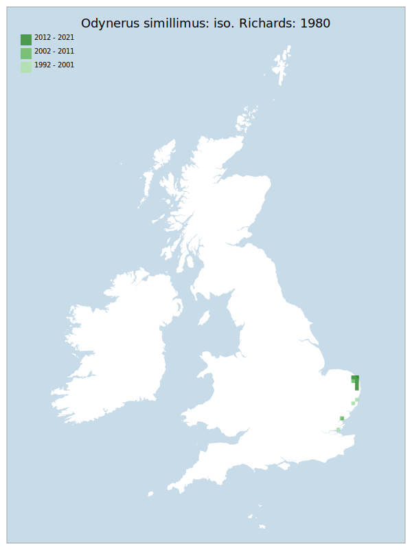

# Odynerus simillimus: iso. Richards: 1980

## Provisional Red List status: VU
- B1 a,b, iii
- B2 a,b, iii

## Red List Justification
Feeds on a weevil associated with aquatic Apium, which is a freshwater plant. Multiple adjacent sites are at risk of a single storm surge bringing a saline inundation, which would damage the prey's host plant.
### Narrative
 V. little is known about the biology of this very localised eumenine wasp. It has always been entirely restricted to marshy areas of East Anglia and was regarded as extinct between some historic Essex records and its rediscovery in 1986. It has been recorded in East Anglia in the assessment period – however, it feeds on a weevil associated with aquatic Apium, which is a genus of freshwater plants. The multiple, adjacent, East Anglian sites are at risk of a single storm surge bringing saline inundation, which would damage the prey's host plant. This species is also rare in Europe generally, with few records in addition to the GB records.

No assessment was possible under Criterion A due insufficient data. The EoO (4,250 km2) is below the 5,000 km2 EN threshold for criterion B1 and the AoO (84 km2) is below the 500 km2 EN threshold for criterion B2. There are fewer or equal to 10 locations (VU), and continuing decline observed/projected in area, extent & quality of habitat. For Criterion D2, the number of locations was greater than 10, and there is no plausible threat of rapid habitat loss that could drive the taxon to CR or RE in a very short time. No information was available on population size to inform assessments against Criteria C and D1; nor were any life-history models available to inform an assessment against Criterion E.
### Quantified Attributes
|Attribute|Result|
|---|---|
|Synanthropy|No|
|Vagrancy|No|
|Colonisation|No|
|Nomenclature|No|

## National Rarity
Nationally Rare (*NR*)

## National Presence
|Country|Presence
|---|:-:|
|England|Y|
|Scotland|N|
|Wales|N|

## Distribution map

## Red List QA Metrics
### Decade
| Slice | # Records | AoO (sq km) | dEoO (sq km) |BU%A |
|---|---|---|---|---|
|1992 - 2001|11|20|20386|93%|
|2002 - 2011|78|52|16188|74%|
|2012 - 2021|52|48|10071|46%|
### 5-year
| Slice | # Records | AoO (sq km) | dEoO (sq km) |BU%A |
|---|---|---|---|---|
|2002 - 2006|10|24|14288|65%|
|2007 - 2011|68|40|8594|39%|
|2012 - 2016|25|32|8305|38%|
|2017 - 2021|27|32|10069|46%|
### Criterion A2 (Statistical)
|Attribute|Assessment|Value|Accepted|Justification
|---|---|---|---|---|
|Raw record count|LC|8%|No|Insufficient data|
|AoO|LC|0%|No|Insufficient data|
|dEoO|LC|21%|No|Insufficient data|
|Bayesian|LC|0%|No|Insufficient data|
|Bayesian (Expert interpretation)|DD|*N/A*|Yes||
### Criterion A2 (Expert Inference)
|Attribute|Assessment|Value|Accepted|Justification
|---|---|---|---|---|
|Internal review|DD||Yes||
### Criterion A3 (Expert Inference)
|Attribute|Assessment|Value|Accepted|Justification
|---|---|---|---|---|
|Internal review|DD||Yes||
### Criterion B
|Criterion| Value|
|---|---|
|Locations|<=10|
|Subcriteria|iii|
|Support|Feeds on a weevil associated with aquatic Apium, which is freshwater. Multiple adjacent sites are at risk of a single storm surge bringing a saline inundation.|
#### B1
|Attribute|Assessment|Value|Accepted|Justification
|---|---|---|---|---|
|MCP|VU|4250|Yes||
#### B2
|Attribute|Assessment|Value|Accepted|Justification
|---|---|---|---|---|
|Tetrad|VU|84|Yes||
### Criterion D2
|Attribute|Assessment|Value|Accepted|Justification
|---|---|---|---|---|
|D2|LC|*N/A*|Yes||
### Wider Review
|  |  |
|---|---|
|**Action**|Maintained|
|**Reviewed Status**|VU|
|**Justification**||

## National Rarity QA Metrics
|Attribute|Value|
|---|---|
|Hectads|11|
|Calculated|NR|
|Final|NR|
|Moderation support||

