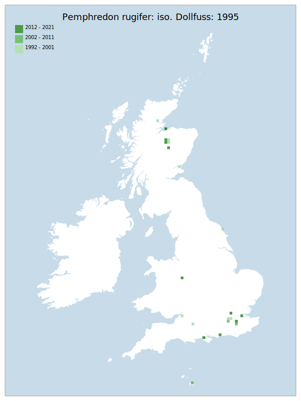

# Pemphredon rugifer: iso. Dollfuss: 1995

## Provisional Red List status: NE

## Red List Justification
Now considered to be three species based on genetics work (Schmidt-Egger et al). Current taxonomic work in progress to evaluate British taxa in light of new information.
### Quantified Attributes
|Attribute|Result|
|---|---|
|Synanthropy|No|
|Vagrancy|No|
|Colonisation|No|
|Nomenclature|Peri-assessment change|

## National Rarity
Nationally Scarce (*NS*)

## National Presence
|Country|Presence
|---|:-:|
|England|Y|
|Scotland|Y|
|Wales|N|

## Distribution map

## Red List QA Metrics
### Decade
| Slice | # Records | AoO (sq km) | dEoO (sq km) |BU%A |
|---|---|---|---|---|
|1992 - 2001|18|60|50240|67%|
|2002 - 2011|5|16|17565|23%|
|2012 - 2021|12|48|47134|63%|
### 5-year
| Slice | # Records | AoO (sq km) | dEoO (sq km) |BU%A |
|---|---|---|---|---|
|2002 - 2006|0|0|0|0%|
|2007 - 2011|5|16|17565|23%|
|2012 - 2016|3|12|19574|26%|
|2017 - 2021|9|36|38390|51%|
### Criterion A2 (Statistical)
|Attribute|Assessment|Value|Accepted|Justification
|---|---|---|---|---|
|Raw record count|LC|200%|||
|AoO|LC|200%|||
|dEoO|LC|96%|||
|Bayesian|DD|*NaN*%|||
|Bayesian (Expert interpretation)||*N/A*|||
### Criterion A2 (Expert Inference)
|Attribute|Assessment|Value|Accepted|Justification
|---|---|---|---|---|
|Internal review|||||
### Criterion A3 (Expert Inference)
|Attribute|Assessment|Value|Accepted|Justification
|---|---|---|---|---|
|Internal review|DD||||
### Criterion B
|Criterion| Value|
|---|---|
|Locations||
|Subcriteria||
|Support||
#### B1
|Attribute|Assessment|Value|Accepted|Justification
|---|---|---|---|---|
|MCP|LC|137400|||
#### B2
|Attribute|Assessment|Value|Accepted|Justification
|---|---|---|---|---|
|Tetrad|LC|120|||
### Criterion D2
|Attribute|Assessment|Value|Accepted|Justification
|---|---|---|---|---|
|D2|LC|*N/A*|Yes||
### Wider Review
|  |  |
|---|---|
|**Action**|Maintained|
|**Reviewed Status**|NE|
|**Justification**|Alterations post 2021 do not have evidence or data available yet to assess. Genetic analysis from European mainland supports the existence of multiple species within this Understanding.|

## National Rarity QA Metrics
|Attribute|Value|
|---|---|
|Hectads|24|
|Calculated|NS|
|Final|NS|
|Moderation support||

