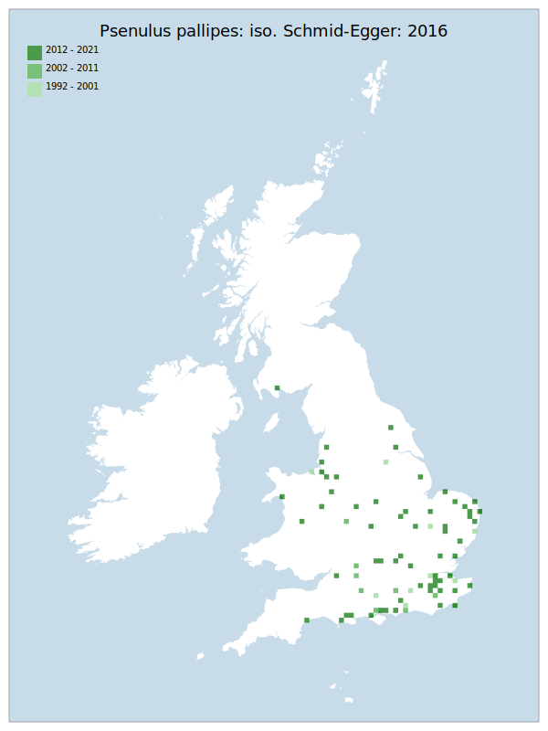

# Psenulus pallipes: iso. Schmid-Egger: 2016

## Provisional Red List status: LC
- A2 b
- A3 b
- D2

## Red List Justification
*N/A*
### Quantified Attributes
|Attribute|Result|
|---|---|
|Synanthropy|No|
|Vagrancy|No|
|Colonisation|No|
|Nomenclature|Peri-assessment change|

## National Rarity
Insufficient Data (*ID*)

## National Presence
|Country|Presence
|---|:-:|
|England|Y|
|Scotland|Y|
|Wales|Y|

## Distribution map

## Red List QA Metrics
### Decade
| Slice | # Records | AoO (sq km) | dEoO (sq km) |BU%A |
|---|---|---|---|---|
|1992 - 2001|12|44|52209|33%|
|2002 - 2011|13|44|42535|27%|
|2012 - 2021|72|240|148563|94%|
### 5-year
| Slice | # Records | AoO (sq km) | dEoO (sq km) |BU%A |
|---|---|---|---|---|
|2002 - 2006|5|16|22008|14%|
|2007 - 2011|8|32|33450|21%|
|2012 - 2016|18|60|58523|37%|
|2017 - 2021|54|184|132237|84%|
### Criterion A2 (Statistical)
|Attribute|Assessment|Value|Accepted|Justification
|---|---|---|---|---|
|Raw record count|LC|200%|No|Low data volume|
|AoO|LC|207%|No|Low data volume|
|dEoO|LC|126%|No|Low data volume|
|Bayesian|DD|*NaN*%|Yes||
|Bayesian (Expert interpretation)|DD|*N/A*|Yes||
### Criterion A2 (Expert Inference)
|Attribute|Assessment|Value|Accepted|Justification
|---|---|---|---|---|
|Internal review|LC|Very widespread, can be found in many places. A lot of information found in the aggregate (P. pallipes agg: iso. Schmid-Egger: 2016) is suspected to be of this taxon. This taxon has ~6x the number of records as P. chevrieri: iso. Schmid-Egger: 2016. Has been observed becoming more common towards the north of its range, suggesting an expansion under climate change.|Yes||
### Criterion A3 (Expert Inference)
|Attribute|Assessment|Value|Accepted|Justification
|---|---|---|---|---|
|Internal review|LC||Yes||
### Criterion B
|Criterion| Value|
|---|---|
|Locations|DD|
|Subcriteria||
|Support||
#### B1
|Attribute|Assessment|Value|Accepted|Justification
|---|---|---|---|---|
|MCP|DD|145350|No|Low data volume|
#### B2
|Attribute|Assessment|Value|Accepted|Justification
|---|---|---|---|---|
|Tetrad|DD|328|No|Low data volume|
### Criterion D2
|Attribute|Assessment|Value|Accepted|Justification
|---|---|---|---|---|
|D2|LC|*N/A*|Yes||
### Wider Review
|  |  |
|---|---|
|**Action**|Maintained|
|**Reviewed Status**|LC|
|**Justification**||

## National Rarity QA Metrics
|Attribute|Value|
|---|---|
|Hectads|74|
|Calculated|NS|
|Final|ID|
|Moderation support|Recent split|

