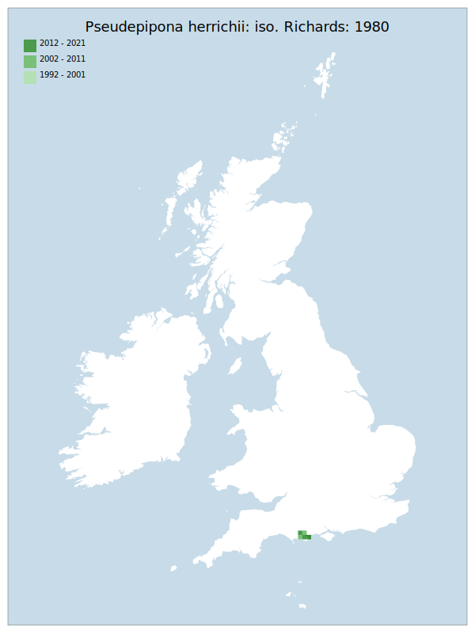

# Pseudepipona herrichii: iso. Richards: 1980

## Provisional Red List status: EN
- B1 a,b, iii
- B2 a,b, iii

## Red List Justification
Land management practices within the sole known location are proving unfavourable, leading to decline in available habitat. This is backed up with transect data.
### Narrative
This eumenine wasp is the only member of its genus in GB and has been regarded as a rarity from the 19th century to the present, with little change in population status. It is found entirely on heathland. The species has complex requirements, needing exposed ground with a clay content (as a nesting site), open water (to assist in nest building) and heathland rich in bell heather (for both nectar and prey foraging). The nest cells are provisioned with paralysed larvae of the moth Acleris hyemana (Lepidoptera: Tortricidae). No other prey species has been recorded in Britain. Land management practices within the sole known, proximal locations - a few heathland sites in the Poole Basin of south-east Dorset - are proving unfavourable, leading to decline in available habitat. This is backed up with transect data.

The most threatening accepted population change estimate is 0.0% (discrete Extent of Occurrence), which does not exceed the 30% decline required for qualification as VU under Criterion A. The EoO (550 km^2) is below the 5,000 km^2 EN threshold for criterion B1 and the AoO (52 km^2) is below the 500 km^2 EN threshold for criterion B2. There are fewer or equal to 5 locations, and continuing/projected decline in the area, extent & quality of habitat. For Criterion D2, the number of locations was equal to or less than 5 and there is a plausible threat that could drive the taxon to CR or RE in a very short time. No information was available on population size to inform assessments against Criteria C and D1; nor were any life-history models available to inform an assessment against Criterion E.
### Quantified Attributes
|Attribute|Result|
|---|---|
|Synanthropy|No|
|Vagrancy|No|
|Colonisation|No|
|Nomenclature|No|

## National Rarity
Nationally Rare (*NR*)

## National Presence
|Country|Presence
|---|:-:|
|England|Y|
|Scotland|N|
|Wales|N|

## Distribution map

## Red List QA Metrics
### Decade
| Slice | # Records | AoO (sq km) | dEoO (sq km) |BU%A |
|---|---|---|---|---|
|1992 - 2001|79|44|9305|100%|
|2002 - 2011|14|20|9015|96%|
|2012 - 2021|12|20|8494|91%|
### 5-year
| Slice | # Records | AoO (sq km) | dEoO (sq km) |BU%A |
|---|---|---|---|---|
|2002 - 2006|9|16|8494|91%|
|2007 - 2011|5|12|8305|89%|
|2012 - 2016|5|12|7594|81%|
|2017 - 2021|7|16|7594|81%|
### Criterion A2 (Statistical)
|Attribute|Assessment|Value|Accepted|Justification
|---|---|---|---|---|
|Raw record count|LC|40%|No|Insufficient data|
|AoO|LC|33%|Yes||
|dEoO|LC|0%|Yes||
|Bayesian|LC|0%|Yes||
|Bayesian (Expert interpretation)|DD|*N/A*|Yes||
### Criterion A2 (Expert Inference)
|Attribute|Assessment|Value|Accepted|Justification
|---|---|---|---|---|
|Internal review|VU|Land management practices within the sole known location are proving unfavourable, leading to decline in available habitat. This is backed up with transect data.|Yes||
### Criterion A3 (Expert Inference)
|Attribute|Assessment|Value|Accepted|Justification
|---|---|---|---|---|
|Internal review|DD||Yes||
### Criterion B
|Criterion| Value|
|---|---|
|Locations|<=5|
|Subcriteria|iii|
|Support|Land management practices within the sole known location are proving unfavourable, leading to decline in available habitat. This is backed up with transect data.|
#### B1
|Attribute|Assessment|Value|Accepted|Justification
|---|---|---|---|---|
|MCP|EN|550|Yes||
#### B2
|Attribute|Assessment|Value|Accepted|Justification
|---|---|---|---|---|
|Tetrad|EN|52|Yes||
### Criterion D2
|Attribute|Assessment|Value|Accepted|Justification
|---|---|---|---|---|
|D2|VU|*N/A*|Yes||
### Wider Review
|  |  |
|---|---|
|**Action**|Maintained|
|**Reviewed Status**|EN|
|**Justification**||

## National Rarity QA Metrics
|Attribute|Value|
|---|---|
|Hectads|5|
|Calculated|NR|
|Final|NR|
|Moderation support||

