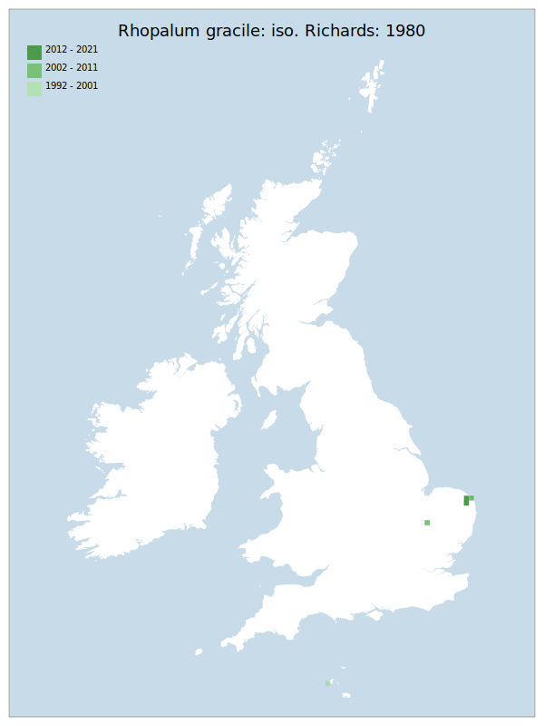

# Rhopalum gracile: iso. Richards: 1980

## Provisional Red List status: DD
- A2bc
- A3b
- D2

## Red List Justification
*N/A*

### Narrative
This rare solitary wasp has a restricted distribution, being infrequently recorded from a few wetland localities in East Anglia, with very few modern records. However, The overall distribution of the records suggests that there may be multiple undiscovered sites

Insufficient data were available to reach a supportable conclusion on the threat status for this taxon.

### Quantified Attributes
|Attribute|Result|
|---|---|
|Synanthropy|No|
|Vagrancy|No|
|Colonisation|No|
|Nomenclature|No|

## National Rarity
Nationally Rare (*NR*)

## National Presence
|Country|Presence
|---|:-:|
|England|Y|
|Scotland|N|
|Wales|N|

## Distribution map

## Red List QA Metrics
### Decade
| Slice | # Records | AoO (sq km) | dEoO (sq km) |BU%A |
|---|---|---|---|---|
|1992 - 2001|1|4|6694|44%|
|2002 - 2011|3|12|14653|98%|
|2012 - 2021|2|8|7594|50%|

### 5-year
| Slice | # Records | AoO (sq km) | dEoO (sq km) |BU%A |
|---|---|---|---|---|
|2002 - 2006|0|0|0|0%|
|2007 - 2011|3|12|14653|98%|
|2012 - 2016|0|0|0|0%|
|2017 - 2021|2|8|7594|50%|

### Criterion A2 (Statistical)
|Attribute|Assessment|Value|Accepted|Justification
|---|---|---|---|---|
|Raw record count|LC|?%|No|Insufficient data|
|AoO|LC|?%|No|Insufficient data|
|dEoO|LC|?%|No|Insufficient data|
|Bayesian|DD|*NaN*%|Yes||
|Bayesian (Expert interpretation)|DD|*N/A*|Yes||

### Criterion A2 (Expert Inference)
|Attribute|Assessment|Value|Accepted|Justification
|---|---|---|---|---|
|Internal review|DD|Insufficient data|Yes||

### Criterion A3 (Expert Inference)
|Attribute|Assessment|Value|Accepted|Justification
|---|---|---|---|---|
|Internal review|DD||Yes||

### Criterion B
|Criterion| Value|
|---|---|
|Locations|>10|
|Subcriteria||
|Support||

#### B1
|Attribute|Assessment|Value|Accepted|Justification
|---|---|---|---|---|
|MCP|LC|1950|No|Insufficient data|

#### B2
|Attribute|Assessment|Value|Accepted|Justification
|---|---|---|---|---|
|Tetrad|LC|20|No|Insufficient data|

### Criterion D2
|Attribute|Assessment|Value|Accepted|Justification
|---|---|---|---|---|
|D2|DD|*N/A*|Yes||

### Wider Review
|  |  |
|---|---|
|**Action**|Maintained|
|**Reviewed Status**|DD|
|**Justification**|With the ability of this taxon to survive saline inundation, there is determined to be a lack of a suitable risk to support moving this taxon to a threatened status. The overall distribution of the records suggests that there may be multiple undiscovered sites, which supports a status of DD over LC.|

## National Rarity QA Metrics
|Attribute|Value|
|---|---|
|Hectads|4|
|Calculated|NR|
|Final|NR|
|Moderation support||
