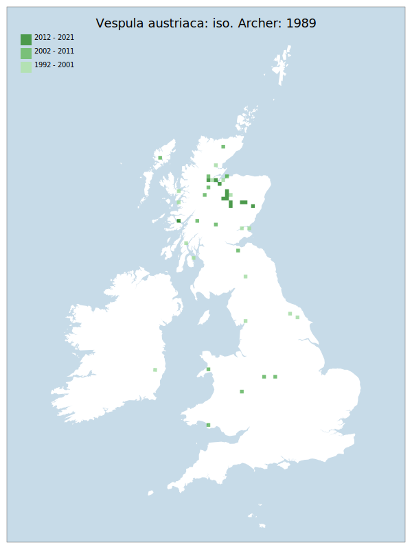

# Vespula austriaca: iso. Archer: 1989

## Provisional Red List status: VU
- B1ab
- B2ab
- D2

## Red List Justification
Moderated to VU on the basis of the host taxon's (Vespula rufa: iso. Archer: 1989) regional status.

### Narrative
This is the only parasitic wasp in the subfamily Vespinae, being associated with Vespula rufa. It has always been scarcer than its host, very rare south of the Severn – Wash line and with v. few early assessment records for England and Wales (where it is likely extinct in many places). Populations are probably stable in the Scottish Highlands, but it would be reasonable to expect that this species is unlikely to recover lost populations further south in the future.

There is insufficient data to perform any assessment under Criterion A. The EoO (171,550 km²) exceeds the 20,000 km² VU threshold for criterion B1 and does not satisfy sufficient subcriteria to reach a threat status, and the AoO (232 km²) is below the 500 km² EN threshold for criterion B2 and does not satisfy sufficient subcriteria to reach a threat status. For Criterion D2, the number of locations was greater than 5 and there is no plausible threat that could drive the taxon to CR or RE in a very short time. No information was available on population size to inform assessments against Criteria C and D1; nor were any life-history models available to inform an assessment against Criterion E.

This taxon has a complete dependency upon *Vespula rufa*: iso. Archer: 1989, which is assessed as VU. A host with a singular dependency may be no less threatened than that dependency, and so this taxon is assessed as VU.

### Quantified Attributes
|Attribute|Result|
|---|---|
|Synanthropy|No|
|Vagrancy|No|
|Colonisation|No|
|Nomenclature|No|

## National Rarity
Nationally Scarce (*NS*)

## National Presence
|Country|Presence
|---|:-:|
|England|Y|
|Scotland|Y|
|Wales|Y|

## Distribution map

## Red List QA Metrics
### Decade
| Slice | # Records | AoO (sq km) | dEoO (sq km) |BU%A |
|---|---|---|---|---|
|1992 - 2001|25|76|68869|53%|
|2002 - 2011|22|76|79136|61%|
|2012 - 2021|25|84|37137|28%|

### 5-year
| Slice | # Records | AoO (sq km) | dEoO (sq km) |BU%A |
|---|---|---|---|---|
|2002 - 2006|8|32|49189|38%|
|2007 - 2011|14|44|38009|29%|
|2012 - 2016|6|20|14237|11%|
|2017 - 2021|19|68|37137|28%|

### Criterion A2 (Statistical)
|Attribute|Assessment|Value|Accepted|Justification
|---|---|---|---|---|
|Raw record count|LC|217%|No|Insufficient data|
|AoO|LC|240%|No|Insufficient data|
|dEoO|LC|161%|No|Insufficient data|
|Bayesian|DD|*NaN*%|Yes||
|Bayesian (Expert interpretation)|DD|*N/A*|Yes||

### Criterion A2 (Expert Inference)
|Attribute|Assessment|Value|Accepted|Justification
|---|---|---|---|---|
|Internal review|DD||Yes||

### Criterion A3 (Expert Inference)
|Attribute|Assessment|Value|Accepted|Justification
|---|---|---|---|---|
|Internal review|DD||Yes||

### Criterion B
|Criterion| Value|
|---|---|
|Locations|>10|
|Subcriteria||
|Support||

#### B1
|Attribute|Assessment|Value|Accepted|Justification
|---|---|---|---|---|
|MCP|LC|171550|Yes||

#### B2
|Attribute|Assessment|Value|Accepted|Justification
|---|---|---|---|---|
|Tetrad|LC|232|Yes||

### Criterion D2
|Attribute|Assessment|Value|Accepted|Justification
|---|---|---|---|---|
|D2|LC|*N/A*|Yes||

### Wider Review
|  |  |
|---|---|
|**Action**|Maintained|
|**Reviewed Status**|VU|
|**Justification**||

## National Rarity QA Metrics
|Attribute|Value|
|---|---|
|Hectads|47|
|Calculated|NS|
|Final|NS|
|Moderation support||
