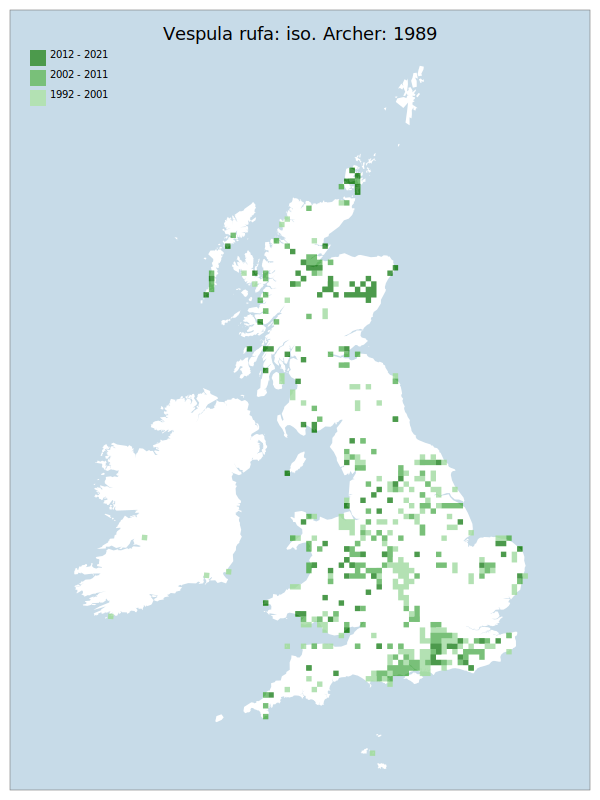

# Vespula rufa: iso. Archer: 1989

## Provisional Red List status: VU
- A2 b,c

## Red List Justification
Noted as having declined at least 30% in VC 59 and 60. Has declined heavily ( >50% ) from areas south of London. Still common in Scotland.
### Narrative
A vespine wasp of open situations, most common in open woodlands, moorland and hedge banks, less commonly in urban situations and other habitats. This species was historically widespread and locally common throughout GB but has heavily declined in Southern and Central England ( more than 50% from areas south of London). As with V. austriaca - the parasite of this species – the strongest modern populations are in Scotland and the VU status has been applied to both the host and the parasite.

The most threatening accepted population change estimate is -13.0% (discrete Extent of Occurrence), which does not exceed the 30% decline required for qualification as VU under Criterion A. However, expert inference assesses this taxon at VU (30% decline via index of abundance appropriate to the taxon) based on the lack of data from the south and middle of England in very recent years. Examination of data from BWARS and iRecord shows a very strong picture of decline in frequency of recording within this region whilst other regions to the north remain relatively steady.  The clarity of this result is extremely surprising, given the convoluted nature of aculeate hymenoptera data, which provides the confidence to assess this taxon as VU rather than NT. The EoO (403,650 km^2) exceeds the 20,000 km^2 VU threshold for criterion B1 and does not satisfy sufficient subcriteria to reach a threat status, and the AoO (3,184 km^2) exceeds the 2,000 km^2 VU threshold for criterion B2 and does not satisfy sufficient subcriteria to reach a threat status. For Criterion D2, the number of locations was greater than 5 and there is no plausible threat that could drive the taxon to CR or RE in a very short time. No information was available on population size to inform assessments against Criteria C and D1; nor were any life-history models available to inform an assessment against Criterion E.

### Quantified Attributes
|Attribute|Result|
|---|---|
|Synanthropy|No|
|Vagrancy|No|
|Colonisation|No|
|Nomenclature|No|

## National Rarity
Nationally Frequent (*NF*)

## National Presence
|Country|Presence
|---|:-:|
|England|Y|
|Scotland|Y|
|Wales|Y|

## Distribution map

## Red List QA Metrics
### Decade
| Slice | # Records | AoO (sq km) | dEoO (sq km) |BU%A |
|---|---|---|---|---|
|1992 - 2001|749|1640|296659|80%|
|2002 - 2011|469|1112|300673|81%|
|2012 - 2021|257|672|266099|71%|
### 5-year
| Slice | # Records | AoO (sq km) | dEoO (sq km) |BU%A |
|---|---|---|---|---|
|2002 - 2006|228|616|249894|67%|
|2007 - 2011|241|552|227016|61%|
|2012 - 2016|111|272|185481|50%|
|2017 - 2021|146|436|209620|56%|
### Criterion A2 (Statistical)
|Attribute|Assessment|Value|Accepted|Justification
|---|---|---|---|---|
|Raw record count|LC|32%|Yes||
|AoO|LC|60%|Yes||
|dEoO|LC|13%|Yes||
|Bayesian|DD|*NaN*%|Yes||
|Bayesian (Expert interpretation)|DD|*N/A*|Yes||
### Criterion A2 (Expert Inference)
|Attribute|Assessment|Value|Accepted|Justification
|---|---|---|---|---|
|Internal review|VU|Noted as having declined at least 30% in VC 59 and 60. Has declined heavily ( >50% ) from areas south of London. Still common in Scotland.|Yes||
### Criterion A3 (Expert Inference)
|Attribute|Assessment|Value|Accepted|Justification
|---|---|---|---|---|
|Internal review|DD||Yes||
### Criterion B
|Criterion| Value|
|---|---|
|Locations|>10|
|Subcriteria||
|Support||
#### B1
|Attribute|Assessment|Value|Accepted|Justification
|---|---|---|---|---|
|MCP|LC|403650|Yes||
#### B2
|Attribute|Assessment|Value|Accepted|Justification
|---|---|---|---|---|
|Tetrad|LC|3184|Yes||
### Criterion D2
|Attribute|Assessment|Value|Accepted|Justification
|---|---|---|---|---|
|D2|LC|*N/A*|Yes||
### Wider Review
|  |  |
|---|---|
|**Action**|Maintained|
|**Reviewed Status**|VU|
|**Justification**||

## National Rarity QA Metrics
|Attribute|Value|
|---|---|
|Hectads|500|
|Calculated|NF|
|Final|NF|
|Moderation support||

