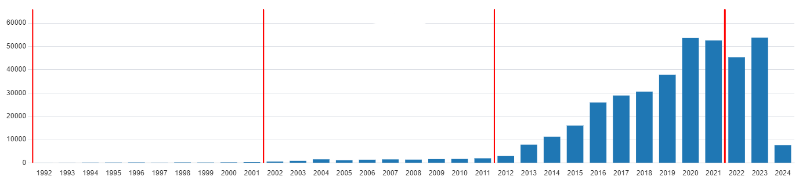

# iRecord data inclusion comparison <!-- omit in toc -->
- [1. Introduction](#1-introduction)
- [2. Comparison of difference using model taxa](#2-comparison-of-difference-using-model-taxa)
- [3. Absolute value changes](#3-absolute-value-changes)
- [4. Percentage value changes](#4-percentage-value-changes)
- [5. Baseline data changes](#5-baseline-data-changes)
- [6. Discussion](#6-discussion)
- [7. Conclusion](#7-conclusion)

## 1. Introduction
This document details the impact of the inclusion of all `Correct` and `Considered correct` records to the combined BWARS & Essex Field Club (EFC) dataset.

In order to make the comparison reasonable, all three datasets were extracted at the same general time. This means that the BWARS & EFC data used for this comparison is *not* the same as that used in the Red List. Notably, since the Red List dataset was compiled:

- A number of taxa have been subject to nomenclatural adjustment
- Some records have been removed from consideration with BWARS due to lack of supporting evidence

The datasets used in this document are defined as follows:

| Dataset   | Description                                                                                                                                                                          |
| ---------- | ------------------------------------------------------------------------------------------------------------------------------------------------------------------------------------ |
| *Red List* | The original Red List dataset, formed of BWARS and EFC data. This dataset is the basis for the current Red List assessment, including the statistical models developed by CEH/BRC. |
| *Combined* | Modern BWARS, EFC, and iRecord's `Correct` and `Considered correct` data                                                                                                             |
| *iRecord*  | iRecord's `Correct` and `Considered correct` data                                                                                                                                    |

## 2. Comparison of difference using model taxa
15 model taxa have been selected to investigate the variance between these datasets. The 15 taxa are composed of 5 sets of 3. The 5 major groupings are designed to break up iRecord data into rough recording groups. These groups are:

- Bumblebee
- Other bee
- Social wasp
- Other wasp
- Ant

Each major group is then subdivided into three groups. Each group must be clear of significant nomenclatural change or extreme recording difficulty. The three categories used are:

- Common, whole region
- Rarer, whole region
- Common, identifiable geographic restriction

Taxa were selected by taxon experts to meet these criteria. All taxa must also be as recordable as possible from the widest range of data sources possible. The intent behind this requirement is to capture the best possible response from iRecord, which incorporates a large amount of data from sources of unknown taxonomic experience.

## 3. Absolute value changes
This table shows the absolute change (Δ) between the *Red List* and *Combined* datasets. The number of records in the *iRecord* dataset is shown to indicate where changes records are coming from. Note that there are data overlaps between iRecord, BWARS, and the EFC. Numbers will not add up perfectly - this is expected and a known feature of working with these datasets.

| Group       | Purpose    | Taxon                                               | Δ Number of records | Records in iRecord | Δ Tetrad (km^2) | Δ Buffer Union (km^2) | Δ MCP (km^2) |
| ----------- | ---------- | --------------------------------------------------- | :-----------------: | :----------------: | :-------------: | :-------------------: | :----------: |
| Bumblebee   | Common     | Bombus pascuorum: iso. Cameron et al: 2007          |       14,082        |       17,869       |     10,884      |         5,210         |    1,000     |
| Bumblebee   | Rarer      | Bombus monticola: iso. Cameron et al: 2007          |         672         |        955         |      1,088      |        18,955         |    7,400     |
| Bumblebee   | Restricted | Bombus humilis: iso. Cameron et al: 2007            |         544         |        762         |       348       |         9,075         |    9,700     |
| Other bee   | Common     | Andrena haemorrhoa: iso. Amiet et al: 2010          |        1,825        |       2,454        |      3,144      |         6,096         |      0       |
| Other bee   | Rarer      | Halictus tumulorum: iso. Amiet et al: 2001          |         191         |        601         |       404       |          629          |     100      |
| Other bee   | Restricted | Andrena hattorfiana: iso. Perkins: 1919             |         305         |        338         |       288       |         5,436         |    4,750     |
| Social wasp | Common     | Vespula germanica: iso. Archer: 1989                |         988         |       1,197        |      1,944      |        11,018         |     -900     |
| Social wasp | Rarer      | Dolichovespula norwegica: iso. Archer: 1989         |         -49         |        119         |       -12       |         5,412         |      0       |
| Social wasp | Restricted | Vespa crabro: iso. Archer: 1989                     |        7,879        |       8,421        |     16,412      |        32,646         |    6,650     |
| Other wasp  | Common     | Ectemnius continuus: iso. Richards: 1980            |         127         |        243         |       256       |         1,226         |      0       |
| Other wasp  | Rarer      | Ammophila sabulosa: iso. Richards: 1980             |         130         |        198         |       160       |          673          |     100      |
| Other wasp  | Restricted | Gorytes laticinctus: iso. Richards: 1980            |         141         |        168         |       412       |        22,014         |    20,400    |
| Ant         | Common     | Myrmica ruginodis: iso. Bolton & Collingwood: 1975  |         383         |        474         |       724       |         1,122         |      0       |
| Ant         | Rarer      | Lasius fuliginosus: iso. Bolton & Collingwood: 1975 |         124         |        166         |       288       |         3,229         |      0       |
| Ant         | Restricted | Formica sanguinea: iso. Bolton & Collingwood: 1875  |         36          |         49         |       20        |           0           |      0       |

## 4. Percentage value changes
This table shows the percentage change (Δ%) between the *Red List* and *Combined* datasets. It is the majority of the previous table, expressed in terms of percentages where it is supportable to do so.

| Group       | Purpose    | Taxon                                               | Δ% Number of records | Δ% Tetrad | Δ% Buffer Union | Δ% MCP |
| ----------- | ---------- | --------------------------------------------------- | :------------------: | :-------: | :-------------: | :----: |
| Bumblebee   | Common     | Bombus pascuorum: iso. Cameron et al: 2007          |          35          |    27     |        1        |   0    |
| Bumblebee   | Rarer      | Bombus monticola: iso. Cameron et al: 2007          |          43          |    35     |        8        |   3    |
| Bumblebee   | Restricted | Bombus humilis: iso. Cameron et al: 2007            |          13          |    12     |        5        |   7    |
| Other bee   | Common     | Andrena haemorrhoa: iso. Amiet et al: 2010          |          21          |    21     |        2        |   0    |
| Other bee   | Rarer      | Halictus tumulorum: iso. Amiet et al: 2001          |          3           |     4     |        0        |   0    |
| Other bee   | Restricted | Andrena hattorfiana: iso. Perkins: 1919             |          54          |    47     |        4        |   5    |
| Social wasp | Common     | Vespula germanica: iso. Archer: 1989                |          26          |    29     |        3        |   0    |
| Social wasp | Rarer      | Dolichovespula norwegica: iso. Archer: 1989         |          -7          |    -1     |        2        |   0    |
| Social wasp | Restricted | Vespa crabro: iso. Archer: 1989                     |         143          |    190    |       15        |   2    |
| Other wasp  | Common     | Ectemnius continuus: iso. Richards: 1980            |          3           |     4     |        0        |   0    |
| Other wasp  | Rarer      | Ammophila sabulosa: iso. Richards: 1980             |          5           |     5     |        0        |   0    |
| Other wasp  | Restricted | Gorytes laticinctus: iso. Richards: 1980            |          44          |    55     |       13        |   16   |
| Ant         | Common     | Myrmica ruginodis: iso. Bolton & Collingwood: 1975  |          6           |     7     |        0        |   0    |
| Ant         | Rarer      | Lasius fuliginosus: iso. Bolton & Collingwood: 1975 |          13          |    14     |        2        |   0    |
| Ant         | Restricted | Formica sanguinea: iso. Bolton & Collingwood: 1875  |          5           |     2     |        0        |   0    |

## 5. Baseline data changes
iRecord has not been running at an even record volume for 10 years. As a result, iRecord data is still highly skewed by initial uptake of the system - even when attempting to use the shortest time period (10 years) in the Red List assessment (Criterion A2). The following graph shows the number of aculeate hymenoptera records in iRecord, per year. The 10 year regions utilised by the Red List are denoted by red lines.

As can be seen, the number of records in each section is not at all uniform. As a result, any attempts to establish a 30 year trend would be *heavily* distorted by the background trend in record volume. Similarly, the final 10 year period experiences high variance between record numbers at the start and at the end. Given that the intent of the Red List is to discover *declines*, starting from an increase of unknown magnitude makes the use of this data in a Red List, without moderation, extremely difficult. The pattern of overall increase is repeated in the `Correct & Considered Correct` subset, as well as subsetting that into various taxon groups. There is no acceptable method for controlling for this level of recorder bias, and the development of a novel method at this point in time is considered unfeasible.

The level of bias from this dataset is also on a per-taxon basis, with more charismatic or easy-to-identify taxa potentially showing more record volume. This effect of 'charismatic recording' has been noted by the UK Hoverfly Recording Scheme (Roger Morris, pers comm), with a very clear divide between the most charismatic and the most difficult-to-identify taxa. In the aculeate hymenoptera dataset we see the divide at group level with the *Bombus* vs all other taxa, and at the species level with records of *Bombus pascuorum* being incredibly high (43,094 in the raw data) against *Lasioglossum albipes*, a very common yet difficult to ID species, at 581 records in the raw data.

## 6. Discussion
Examination of records on percentage change is, at first glance, more informative than absolute values. The ~ 17,000 records added for *Bombus pascuorum* are far less impressive when the result is a ~1% chance in buffer-union and ~0% change in MCP.

The majority of additional records from iRecord appear to represent a 'filling in' of known range, without major expansion of that range. *Bombus pascuorum* demonstrates this well, with a 35% increase in records - with the majority likely deriving from iRecords - resulting in ~1% increase in Buffer Union area.

Record taxon distribution is, as expected, very heavily weighted towards the *Bombus* and common social wasps. Data on *Vespa crabro* in the iRecord dataset should be viewed with considerable suspicion, as this taxon is known to suffer from consistent and frequent misidentification.

The 'restricted range' taxa selected are generally climate restricted. Climate restricted taxa are showing across-the-board increases in their abundance and distribution, on average, due to the warming climate of the region. The inclusion of iRecord data highlights this range spread, with more sampling points relating to finer resolution of results. When assessing taxa for threat status however, none of these taxa would be candidates for any threat status due to their current trend of increasing abundance and discrete extent of occurrence.

Taxa where the `Δ Number of records` is negative, in here *Dolichovespula norwegica*, are the result of where BWARS has removed larger volumes of data from the pool of records. These suspensions are typically performed on the basis of lack of trust in a record once that record is queried by an expert.Similarly, the negative MCP change in *Vespula germanica* is likely a 'real' change, resulting from the removal of suspect data.

These tests reveal baseline data for the inclusion of a large dataset of unknown confidence. The baseline very much follows predictions, demonstrated especially by the similar responses in the 'Purpose' classes.

## 7. Conclusion
Incorporating the `Correct` and `Considered correct` data has not caused any change in how the model taxa would be assessed under the Red List assessment. With the current background trends of increasing population, the use of the expanded *Combined* dataset is most likely of use when attempting to assess taxa with very low volume. However, taxa with low volume are frequently those with significantly problematic identification, leading to a requirement to check records carefully.