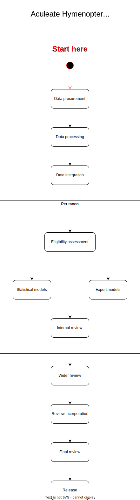

# The Plan
Terrible internet means I have to write this in VS Code and then use git to share/manage things. Oh well, it'll make versions easier to manage. Will need to make a decent formatted output at the end though.

## Stage 1
Get an outline of the overall process together

