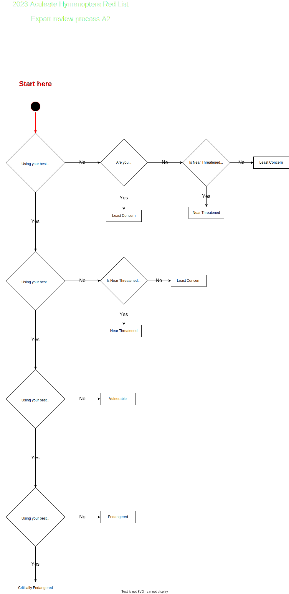

# Walkthrough of the Internal Stage assessment
This process assumes the user has a copy of the GUI in front of them. It is possible to follow this process without the GUI, but will be much harder.

## Raw Data
The only thing that requires attention here is to assign the correct supporting evidence to B2 AoO.

## Buffer Union
Assign the correct supporting evidence to B1 EoO

## Bayesian Model Assessment
Based *purely* on the model, what does a human interpret the decline to be? **No expert knowledge is allowed to be applied at this step!**

## Expert Opinion A2

### Thresholds
| Status | Decline required (estimation) |
|---|---|
| CR | <=80% |
| EN | <=50% |
| VU | <=30% |

Follow the [Expert Review Process flow chart for A2](../../diagrams/expert_a2.drawio.svg). Remember to document any rationale. You may use data from any other model, but should **not** focus on comparing or evaluating the accuracy of other models at this point.

## Expert Opinion A3

### Thresholds
| Status | Decline required (estimation) |
|---|---|
| CR | <=80% |
| EN | <=50% |
| VU | <=30% |

Follow the [Expert Review Process flow chart for A3](../../diagrams/expert_a3.drawio.svg). Remember to document any rationale.

