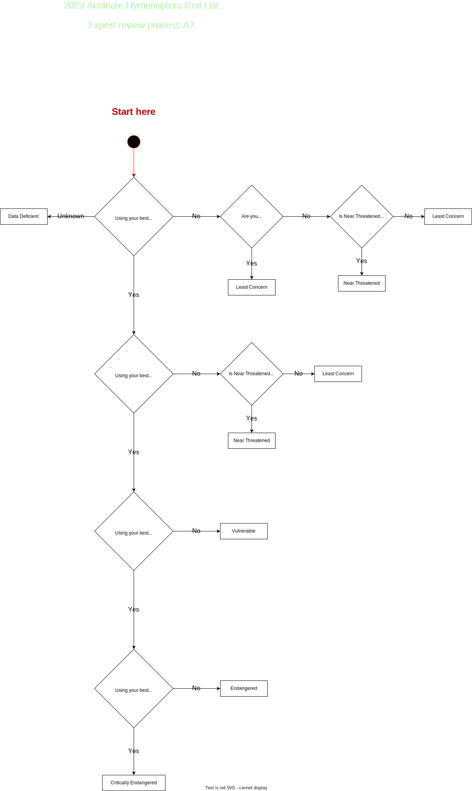

# Walkthrough of the Internal Stage assessment
This walkthrough covers the the internal assessment stage, which has the responsibility of:
- assessing eligibility for assessment
- identifying potential nomenclatural issues
- assessing eligible taxa in a variety of ways, including statistical methods

## Establish Eligibility
Is the taxon a vagrant, recent colonist, or synanthropic? Follow the [eligibility process](./eligibility.md)

## Identify nomenclatural changes
[Nomenclatural changes](../../glossary.md#nomenclatural-change) frequently create and propagate confusion in biological recording. This confusion persists, often for multiple years. Taxa which have been subject to a nomenclatural change frequently see a drop in their recording volume post-change as people get to grips with the impact of said change. The duration of this drop is unknown, predominantly as there has not been a means to examine said change until very recently. For these reasons, flags have been created to mark taxa accordingly:

| Flag | Time period | Reason |
|---|---|---|
| Pre-assessment change | 50 - 30 years ago | These are changes which are expected to influence recording up to the end of [slice](../../glossary.md#slice) 1 (1992) |
| Early-assessment change | 30 - 10 years ago | These are changes which are expected to influence recording in all time slices |
| Peri-assessment change | 10 - 0 years ago | These are changes which are expected to influence recording in the main 10 year assessment period |

Note that taxa may be subject to multiple changes and may be assigned multiple tags. Follow the [nomenclatural stability assessment procedure](../../diagrams/nomenclatural_process.drawio.svg)

## Raw Data
Assign the correct supporting evidence to B2 AoO.

## Buffer Union
No action required

## Bayesian Model Assessment
Based *purely* on the model, what does a human interpret the decline to be? **No expert knowledge is allowed to be applied at this step!**

## Expert Opinion A2

### Thresholds
| Status | Decline required (estimation) |
|---|---|
| CR | <=80% |
| EN | <=50% |
| VU | <=30% |

Follow the [Expert Review Process flow chart for A2](../../diagrams/expert_a2.drawio.svg). Remember to document any rationale. You may use data from any other model, but should **not** focus on comparing or evaluating the accuracy of other models at this point.

## Expert Opinion A3

### Thresholds
| Status | Decline required (estimation) |
|---|---|
| CR | <=80% |
| EN | <=50% |
| VU | <=30% |

Follow the [Expert Review Process flow chart for A3](../../diagrams/expert_a3.drawio.svg). Remember to document any rationale.

